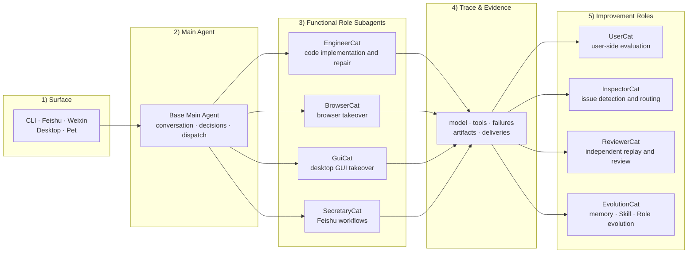

<div align="center">
  

  # XiaoBa-CLI

  **An IM-native AI coworker runtime that delivers work, preserves evidence, and evolves behind explicit gates.**

  Send work from the CLI, an IM surface, or the desktop. Base owns conversation and dispatch, specialist Roles take over execution, and XiaoBa returns files, messages, and inspectable evidence. Real traces may produce candidate capabilities, but they enter production only after Arena review and explicit human promotion.

  <em>Works like a teammate. Evolves like reviewed software.</em>

  [](https://github.com/fightheyyy/xiaobaOS/releases)
  [](https://github.com/fightheyyy/xiaobaOS/releases/tag/v0.2.2)
  [](package.json)
  [](LICENSE)

  [Quick Start from Source](#quick-start) · [Desktop v0.2.2 Preview](https://github.com/fightheyyy/xiaobaOS/releases/tag/v0.2.2) · [How It Works](#work-and-evolution) · [Governed Evolution](#governed-evolution) · [简体中文](README.md)

  <sub>The v0.2.2 Preview provides a macOS Apple Silicon (arm64) DMG and a Windows x64 installer, including the procedural XiaoBa visual system, nine default agents, and the lightweight Assurance & Evolution path. The macOS build is ad-hoc signed and not notarized; the Windows build is unsigned. Desktop child services still require system Node.js 18.19+.</sub>
</div>

---

## Work and Evolution

XiaoBa connects a user-visible work loop to an internal improvement loop on one Agent Runtime, without turning “self-evolution” into unbounded automatic rewriting.



This is an ownership topology, not a claim that all four improvement Roles run sequentially on every trace. The governed workflow selects participants through typed routes.

| Work loop | Evolution loop |
| --- | --- |
| Message → Base dispatch → specialist Role takeover → tool execution → file / message delivery | Real trace → Inspector diagnosis → candidate Skill / Role → Arena replay and scorecard → explicit human promotion |

- **Evidence first**: model calls, tool results, artifacts, deliveries, and failures enter traces; a Role claiming success is not completion evidence.
- **Separated responsibilities**: diagnosis, candidate generation, engineering repair, formal replay, and Arena review have distinct owners.
- **Candidates never auto-deploy**: weak evidence may end in `no_op`, failed evaluation may block a candidate, and even an Arena `pass` does not mutate production assets automatically.

## What XiaoBa Can Take Over

| Task | Owner | Delivery |
| --- | --- | --- |
| Change code, fix a bug, verify a build | EngineerCat | Code changes, test results, and artifact evidence |
| Browse sites, collect research, verify a page | BrowserCat | Structured results, sources, and page evidence |
| Operate macOS desktop applications | GuiCat | Action results and GUI evidence |
| Work with Feishu messages, calendars, tasks, and docs | SecretaryCat | Feishu results, files, and delivery evidence |

Runtime state, traces, and artifact evidence stay local by default. Models can be configured through OpenAI-compatible, Anthropic, Ollama, or other compatible endpoints.

## Runtime Dashboard

<p align="center">
  
</p>

<p align="center"><sub>The Electron Dashboard brings runtime services, roles, skills, configuration, the store, and Chat into one entry point.</sub></p>

## Quick Start

> **Desktop Preview**: [XiaoBa v0.2.2](https://github.com/fightheyyy/xiaobaOS/releases/tag/v0.2.2) provides a macOS Apple Silicon (arm64) DMG and a Windows x64 installer with the procedural XiaoBa visual system and Base plus eight default Roles. The macOS build is ad-hoc signed and not notarized; the Windows installer is unsigned. CLI / Pet / IM child services started by the desktop app require system Node.js 18.19+.

Node.js 18.19 or newer is required to run from source:

```bash
git clone https://github.com/fightheyyy/xiaobaOS.git
cd xiaobaOS
npm install
cp .env.example .env
```

Configure a model in `.env`:

```env
XIAOBA_LLM_PROVIDER=openai
XIAOBA_LLM_API_BASE=https://api.openai.com/v1
XIAOBA_LLM_API_KEY=your_api_key
XIAOBA_LLM_MODEL=your_model
```

```bash
# Check model, Role, driver, permission, and surface readiness
npm run dev -- doctor

# Interactive CLI
npm run dev -- chat -i

# Development / debugging: bypass Base and start with a specific Role
npm run dev -- chat -r engineer-cat -i

# Electron Dashboard
npm run electron:dev
```

See [`requirement.txt`](requirement.txt) for the external CLIs and platform dependencies used by BrowserCat, GuiCat, and SecretaryCat. Install and authorize them only when you need the corresponding Role.

## Eight Default Roles

The Base Main Agent is the only user-facing conversation and dispatch layer. All eight Roles reuse the same XiaoBa Agent loop. Base ships with no default Skills; standalone Skills are installed explicitly or mounted into Arena.

| Type | Role | Responsibility |
| --- | --- | --- |
| Execution | EngineerCat | XiaoBa's native coding Role on the shared Agent loop; owns code, repositories, builds, and engineering repairs |
| Execution | BrowserCat | Bounded, verifiable browser takeover |
| Execution | GuiCat | macOS desktop GUI takeover |
| Execution | SecretaryCat | Feishu workflows; `FeishuCat` is an alias and official `lark-cli` supplies domain capabilities |
| Improvement | UserCat | Pressures candidate capabilities through low-information, realistic interactions and produces traces |
| Improvement | InspectorCat | Diagnoses trace, tool, and artifact evidence and emits a typed route |
| Improvement | EvolutionCat | Turns reusable patterns into candidate Skills / Roles; owns `remember` and publishing workflows |
| Improvement | ReviewerCat | Formally replays one Replay Case in a clean session and returns a terminal decision |

Browser, GUI, and Feishu drivers provide deterministic capabilities without starting a second Chat, Agent, or MCP loop. See the [Roles Guide](roles/README.md) and [Skills Guide](skills/README.md) for detailed usage.

EngineerCat likewise does not wrap a second coding-agent runtime. Base owns its SubAgent lifecycle externally, while EngineerCat implements and verifies changes through a narrow coding / Skill tool boundary and the child-side `ask_parent` uplink.

## Governed Evolution

The nightly workflow starts with InspectorCat. It scans real session traces, preserves evidence, and routes findings to `evolution`, `repair`, `replay`, or `no_op`. Internal Roles participate by route; XiaoBa does not run a fixed eight-agent pipeline every night.

<p align="center">
  
</p>

| Route | Execution | Review terminal |
| --- | --- | --- |
| `evolution` | EvolutionCat creates an isolated candidate Skill / Role | Arena runs multi-case, multi-attempt review in a clean runtime and emits a scorecard; human promotion is still required |
| `repair` | EngineerCat implements an engineering repair | ReviewerCat formally replays it and returns `closed / next_run / blocked` |
| `replay` | ReviewerCat directly reruns the frozen Replay Case | Returns `closed / next_run / blocked`; the same DAG run cannot jump back into repair |
| `no_op` | No improvement is produced when evidence is insufficient | Terminates explicitly instead of pretending that “nothing found” is evolution |

```bash
# Run one nightly evolution cycle
xiaoba evolution sleep

# Review an installed or imported skill in an isolated Arena
xiaoba arena skill <skill-name>

# After Arena passes, explicitly promote the immutable Candidate bound to that day's DAG
xiaoba evolution promote --date YYYY-MM-DD --confirm <candidate-name>
```

Arena supports exactly three review modes: `base + skill`, `role + skill`, and `role`. A candidate may remain a candidate or be blocked; production promotion always requires an explicit human action.
A candidate declaring a fixed line contract can pass only when every native and replay turn is bound to the same subject and the full contract passes.

## Evidence and Verification

| Evidence layer | Purpose |
| --- | --- |
| Trace | Records model, tool, failure, delivery, and runtime-event facts for one request |
| Artifact / Delivery Evidence | Records files, messages, external receipts, and actual delivery outcomes |
| Trace Replay | Drives the current runtime from historical user intent to observe behavioral changes |
| Live Agent Eval | Fresh-runs the current runtime on curated cases and applies hard verifiers |
| Arena | Reviews candidate capabilities in a clean runtime and emits an auditable scorecard |

```bash
npm test
npm run replay:trace
npm run eval:base-runtime
npm run check:benchmarks
```

XiaoBa can export the same session / model / tool span topology through OTLP/HTTP protobuf to Barena, LangWatch, or a standard OTel Collector. Export is disabled by default, local `traces.jsonl` remains authoritative, and prompts, tool arguments, file contents, and free-form error text are excluded from external spans.

```bash
XIAOBA_OBSERVABILITY_ENABLED=true \
OTEL_EXPORTER_OTLP_ENDPOINT=http://127.0.0.1:4318 \
xiaoba chat
```

The current claim boundary, recent results, and open risks live in the [Project PLAN](docs/PLAN.md). See the [Evaluation SPEC](docs/evaluation/SPEC.md) and [Arena SPEC](docs/arena/SPEC.md) for contract details.

## Current Boundaries

- The macOS Electron DMG is an Apple Silicon arm64 Preview with an ad-hoc signature and no notarization.
- The Windows Electron installer targets x64 and is currently unsigned, so SmartScreen may warn on first install.
- Desktop child services do not embed Node and currently require system Node.js 18.19 or newer; if Finder cannot discover Homebrew / nvm Node, set `XIAOBA_NODE_EXE` to its absolute executable path.
- BrowserCat, GuiCat, and SecretaryCat depend on their corresponding drivers / CLIs and the required installation, permissions, or login state; run `xiaoba doctor` first.
- The Preview keeps the not-yet-verified automatic update channel disabled; install updates manually from GitHub Releases.
- Dashboard, Pet, and Bridge primarily target local use and do not yet provide complete authentication and Owner authorization for untrusted networks.
- Trace Replay can execute current real side effects. Do not batch-replay arbitrary historical traces without review until isolation is complete.

## Docs and Community

- [Architecture](docs/SPEC.md) · [Status / Plan](docs/PLAN.md)
- [Roles](roles/README.md) · [Skills](skills/README.md)
- [Releases](https://github.com/fightheyyy/XiaoBa-CLI/releases) · [Discussions](https://github.com/fightheyyy/XiaoBa-CLI/discussions) · [Issues](https://github.com/fightheyyy/XiaoBa-CLI/issues)

## License

[Apache-2.0](LICENSE)
