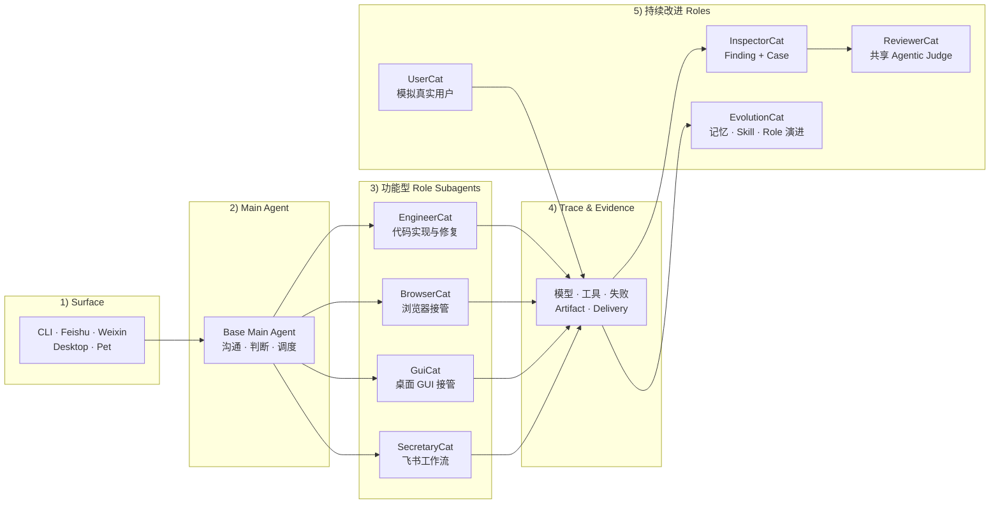
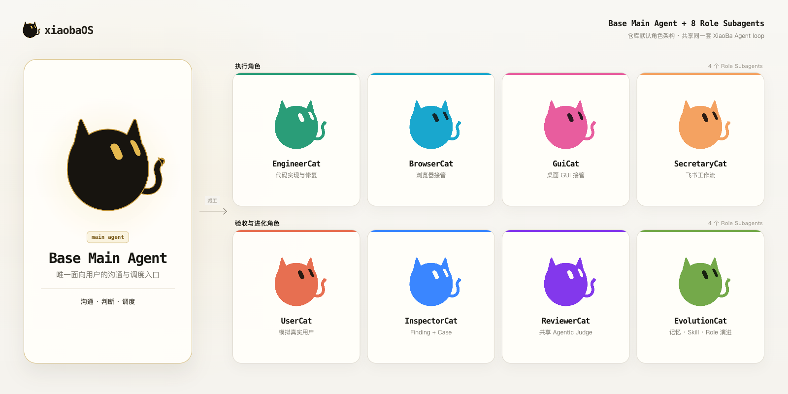
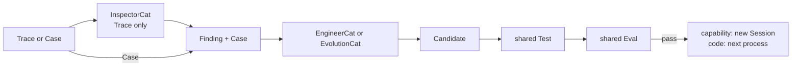

<div align="center">
  

  # xiaobaOS

  **会交付、可复盘、能受控进化的 IM-native AI 同事 Runtime。**

  把任务发进 CLI、IM 或桌面端。Base 负责沟通与派工，专业 Role 接管执行，再把文件、消息和可检查证据交付回来；真实 Trace 可以回归成 Case，候选能力复用 Test + Eval 验收。

  <em>像同事一样完成工作，像软件一样验收进化。</em>

  [](https://github.com/fightheyyy/xiaobaOS/releases)
  [](https://github.com/fightheyyy/xiaobaOS/releases/tag/v0.2.2)
  [](package.json)
  [](LICENSE)

  [源码快速开始](#快速开始) · [Desktop v0.2.2 Preview](https://github.com/fightheyyy/xiaobaOS/releases/tag/v0.2.2) · [工作方式](#工作与进化) · [受控进化](#受控进化) · [English](README.en.md)

  <sub>v0.2.2 Preview 提供 macOS Apple Silicon（arm64）DMG 与 Windows x64 安装包，并包含程序化 XiaoBa 视觉系统、九个默认角色与轻量 Assurance & Evolution 主线。macOS 包采用 ad-hoc 签名且未 notarize，Windows 包未签名；桌面子服务仍需要系统 Node.js 18.19+。</sub>
</div>

---

## 工作与进化

XiaoBa 把用户可见的工作闭环和系统内部的改进闭环接在同一套 Agent Runtime 上，但不把“自进化”变成无边界的自动改写。



这张图表达责任拓扑，不表示四个改进 Role 每次都会顺序执行。

| 工作闭环 | 进化闭环 |
| --- | --- |
| 消息 → Base 派工 → 专业 Role 接管 → 工具执行 → 文件 / 消息交付 | Trace / Case → Candidate → shared Test + Eval → capability 新 Session / code 下一进程激活 |

- **证据优先**：模型调用、工具结果、artifact、delivery 和失败进入 trace；角色自述不等于完成证据。
- **职责分离**：Inspector 发现问题，Engineer/Evolution 生成 Candidate，Verifier/Reviewer 负责裁决。
- **单一真相**：一次 Case execution 只有一个 `pass / fail / blocked` Outcome；Report 只展示。

## 能做什么

| 任务 | 接管者 | 交付 |
| --- | --- | --- |
| 修改代码、修复问题、验证构建 | EngineerCat | 代码改动、测试结果和 artifact evidence |
| 浏览网页、收集资料、核验页面 | BrowserCat | 结构化结果、来源和页面证据 |
| 操作 macOS 桌面应用 | GuiCat | 操作结果和 GUI evidence |
| 处理飞书消息、日历、任务和文档 | SecretaryCat | 飞书侧结果、文件和 delivery evidence |

运行状态、trace 和 artifact evidence 默认保存在本地；模型可以按配置连接 OpenAI-compatible、Anthropic、Ollama 或其他兼容端点。

## 运行界面

<p align="center">
  
</p>

<p align="center"><sub>Electron Dashboard 把运行服务、角色、技能、配置、商店和 Chat 收在同一个入口。</sub></p>

## 快速开始

> **Desktop Preview**：可下载 [XiaoBa v0.2.2](https://github.com/fightheyyy/xiaobaOS/releases/tag/v0.2.2)。Release 同时提供 macOS Apple Silicon（arm64）DMG 与 Windows x64 安装包，包含程序化 XiaoBa 视觉系统及 Base + 八个默认 Role。macOS 包采用 ad-hoc 签名且未 notarize，Windows 安装包未签名；桌面启动的 CLI / Pet / IM 子服务需要系统 Node.js 18.19+。

源码运行需要 Node.js 18.19 或更高版本：

```bash
git clone https://github.com/fightheyyy/xiaobaOS.git
cd xiaobaOS
npm install
cp .env.example .env
```

在 `.env` 中配置模型：

```env
XIAOBA_LLM_PROVIDER=openai
XIAOBA_LLM_API_BASE=https://api.openai.com/v1
XIAOBA_LLM_API_KEY=your_api_key
XIAOBA_LLM_MODEL=your_model
```

```bash
# 检查模型、角色、Driver、权限和平台配置
npm run dev -- doctor

# 交互式 CLI
npm run dev -- chat -i

# 开发 / 调试：绕过 Base，直接启动指定角色
npm run dev -- chat -r engineer-cat -i

# Electron Dashboard
npm run electron:dev
```

BrowserCat、GuiCat 和 SecretaryCat 的外部 CLI / 平台依赖见 [`requirement.txt`](requirement.txt)；只在使用对应角色时安装和授权。

## 八个默认角色

Base Main Agent 是唯一面向用户的沟通和调度入口。八个 Role 复用同一套 XiaoBa Agent loop；Base 不预装默认 Skills，独立 Skill 需要显式安装或挂载到 Arena。

<p align="center">
  
</p>

| 类型 | Role | 责任 |
| --- | --- | --- |
| 执行 | EngineerCat | 共享 XiaoBa Agent loop 的 coding owner；实质性编码可经窄适配器委托 Codex，原生工具作为小修改和降级路径 |
| 执行 | BrowserCat | 受限、可验证的浏览器接管 |
| 执行 | GuiCat | macOS 桌面 GUI 接管 |
| 执行 | SecretaryCat | 飞书工作流；`FeishuCat` 是别名，领域能力来自官方 `lark-cli` |
| 改进 | UserCat | 在 Arena 中像普通用户一样与被测 Agent 互动；缺省时生成 Scenario |
| 改进 | InspectorCat | 把 Trace 中的问题变成有证据的 Finding + executable Case |
| 改进 | EvolutionCat | 生成 Role / Skill / Memory Candidate；持有 `remember` |
| 改进 | ReviewerCat | 作为共享 Agentic Judge 判断通过硬检查的 Case runs |

Browser、GUI 和飞书 driver 只提供确定性能力，不启动第二套 Chat、Agent 或 MCP loop。详细用法见 [Roles Guide](roles/README.md) 和 [Skills Guide](skills/README.md)。

EngineerCat 仍使用 XiaoBa 的 SubAgent 生命周期，但多一个受限 `codex_run` Tool 作为外部 coding executor。XiaoBa 不复制 Codex loop，也不保存第二套 job/session 状态；详细的安全边界和登录要求见 [Roles Guide](roles/README.md)。

## 受控进化

Evolution 是轻量控制 DAG，不拥有另一套评测系统：



Arena 是独立的 Agentic Eval：从 Scenario 开始，UserCat 与 Subject 产生普通 Trace，InspectorCat 把反例回归成 Case，再交给同一个 Eval。它不是 Candidate promotion gate。

```bash
# 运行一次夜间演化
xiaoba evolution sleep

# 在隔离 Arena 中验收一个已安装或已导入的 skill
xiaoba arena skill <skill-name>

# 新的轻量 Arena：可传 Scenario，也可让 UserCat 自动生成
xiaoba arena evaluate --role engineer-cat --scenario "帮我修好这个项目"

```

`evolution sleep`、`arena evaluate`、`arena skill` 和 `arena run execute` 已进入共享轻量核心；旧 Arena scorecard worker、typed Evolution DAG、manual Promote、patch regression 以及 Dashboard/loader capability lifecycle 均已删除。真实进度见 [Project PLAN](docs/PLAN.md)。

## 证据与验收

| 证据层 | 作用 |
| --- | --- |
| Trace | 保存一次请求中的模型、工具、失败、交付和 runtime event |
| Conversation Journal | 保存用户输入与实际成功交付的文本/文件；不包含 thinking、system prompt 或工具内部数据 |
| Artifact / Delivery Evidence | 记录文件、消息、外部回执和实际交付结果 |
| Replay | 执行 Case，重新驱动当前 Agent，并产生 fresh Trace；本身不裁决 |
| Eval | Verifier 做硬检查，ReviewerCat 做语义判断，产生唯一 Outcome |
| Arena | UserCat 场景探索 → Inspector Finding+Case → shared Eval |

```bash
npm test
npm run replay:trace
npm run test:base-runtime
npm run test:check-scripted-runtime

# 维护中的真实 Agent 行为评测（默认只读 Replay）
xiaoba eval run --case-set eval/case-sets/xiaoba-core-readonly.json
```

XiaoBa 可以把同一组 session / model / tool span 通过 OTLP/HTTP protobuf 发给 Barena、LangWatch 或普通 OTel Collector。导出默认关闭，本地 `traces.jsonl` 仍是权威证据；prompt、tool args、file content 和自由文本错误不会进入外部 span。

```bash
XIAOBA_OBSERVABILITY_ENABLED=true \
OTEL_EXPORTER_OTLP_ENDPOINT=http://127.0.0.1:4318 \
xiaoba chat
```

用户实际可见的对话另存为本地 append-only Journal：`data/conversations/<surface>/<conversation-hash>.jsonl`。它与 provider transcript、Trace 和 Pet SSE history 相互独立；本地记录在非测试运行时默认开启，可显式关闭。只有同时配置 Catena 地址和 API key 时才会 best-effort 导出，网络失败不会改变消息处理或交付结果。

```bash
XIAOBA_CONVERSATION_RECORDING_ENABLED=true \
CATENA_BASE_URL=https://catena.example.com \
CATENA_API_KEY=barena_pat_your_api_key \
XIAOBA_CONVERSATION_AGENT_ID=my_xiaoba_agent \
xiaoba chat
```

可验证范围、最近结果和风险只维护在 [Project PLAN](docs/PLAN.md)；合同边界见 [Evaluation SPEC](docs/evaluation/SPEC.md) 与 [Arena SPEC](docs/arena/SPEC.md)。

## 当前边界

- macOS Electron DMG 是 Apple Silicon arm64 Preview，采用 ad-hoc 签名且尚未 notarize。
- Windows Electron 安装包面向 x64，当前未做代码签名，首次安装可能触发 SmartScreen 提示。
- 桌面子服务不内嵌 Node，当前需要系统 Node.js 18.19 或更高版本；若 Finder 无法发现 Homebrew / nvm 的 Node，请用 `XIAOBA_NODE_EXE` 指向绝对可执行路径。
- BrowserCat、GuiCat 和 SecretaryCat 依赖对应 driver / CLI，以及必要的安装、权限或登录状态；可先运行 `xiaoba doctor` 检查。
- Preview 默认关闭尚未完成端到端验证的自动更新通道，新版本通过 GitHub Release 手动安装。
- Dashboard、Pet 和 Bridge 主要面向本机使用，尚未完成不可信网络下的完整认证与 Owner 授权。
- Case Replay 默认只允许读取；需要写入的 Case 必须显式声明 `workspace_write`，且只能在 enforced clean runtime 中运行。当前原生写沙箱只支持 macOS，其他平台 fail closed。

## 文档与社区

- [Architecture](docs/SPEC.md) · [Status / Plan](docs/PLAN.md)
- [Roles](roles/README.md) · [Skills](skills/README.md)
- [Releases](https://github.com/fightheyyy/xiaobaOS/releases) · [Discussions](https://github.com/fightheyyy/xiaobaOS/discussions) · [Issues](https://github.com/fightheyyy/xiaobaOS/issues)

## License

[Apache-2.0](LICENSE)
