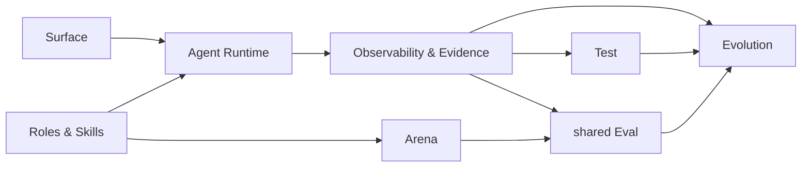

# XiaoBa-CLI PLAN

状态：Active
最后更新：2026-07-29
Owner：XiaoBa maintainers

本文只维护仓库级当前状态和收敛顺序。模块细节进入六份模块 PLAN。

## Current Status

XiaoBa-CLI 已形成共享 Agent Runtime、一个 Base Main Agent 和八个默认 Role：

- EngineerCat、BrowserCat、GuiCat、SecretaryCat 负责执行接管。
- UserCat、InspectorCat、ReviewerCat、EvolutionCat 负责共享 Assurance & Evolution。
- 所有角色复用 AgentSession / ConversationRunner / ToolManager；driver 不是第二个 Agent loop。
- CLI、Feishu、Weixin、Pet、Dashboard 和 Electron 共用 Runtime 主链。
- 本地 Trace、artifact、delivery evidence 和可选 OTLP projection 已有稳定边界。
- Test / Eval / Trace / Case / Replay 的概念已收敛。
- 轻量 Evaluation、Arena 和 Evolution orchestration core 已实现并测试。
- `xiaoba eval run --case-set` 已把 shared Eval core 接成真实 Agent CLI。
- `xiaoba arena evaluate` 已把轻量 Arena 接到已安装 Role/Skill，并只消费标准 AgentSession Trace。
- `arena skill`、`arena run execute/worker` 已复用同一轻量 Arena service 与 clean runtime。
- `evolution sleep` 已切到轻量 control DAG，并复用 Candidate Test、shared Eval 与 capability new-Session / code next-process activation。
- 首个维护中的 `xiaoba-core-readonly-v1` CaseSet 已加入；三条真实 Agent Case 覆盖 Base、EngineerCat 与 ReviewerCat。
- Case Replay 默认只暴露只读工具；需要写入的 Case 必须显式声明 `workspace_write`，并且只能在 enforced clean runtime 中执行。
- source-code Finding 已通过一次性 `delegate_code` 交给隔离 EngineerCat Source Candidate；候选副本通过完整 Test + shared Eval 后才事务性替换 source + dist，并只影响下一进程。
- BaseRuntime 预写响应的入口、实现和默认产物已迁到 Scripted Runtime Test 边界。
- UserCat、InspectorCat、ReviewerCat、EvolutionCat runtime assets 已瘦身；dead Inspector 服务、冗余 Reviewer Tools 和实验 Arena scorers 已删除。
- 旧 Arena scorecard worker、typed Evolution DAG、manual promotion、patch regression 和专用 Reviewer replay Tool 已删除。
- Dashboard/loader capability lifecycle、Promote/Unblock API 和状态 UI 已删除；发行目录中的 package 即当前可用版本。

## Milestones

| Milestone | Status | Current meaning |
| --- | --- | --- |
| M0 Documentation baseline | Completed | 固定 14 份 SPEC/PLAN |
| M1 Shared runtime | Completed | AgentSession、ConversationRunner、ToolManager 与 providers |
| M2 Base + eight roles | Completed | 一个 Base、八个默认 Role、零个 Base Skill |
| M3 Surface integration | Partial | 入口共享 Runtime；网络权限与 Owner identity 未完整 |
| M4 Evidence system | Partial | Trace/artifact/delivery 可用；durable recovery 未完整 |
| M5 Test / Eval split | Completed | Scripted Runtime Test 已移出 Eval 公共语义与物理目录 |
| M6 Shared Evaluation core | Completed | CaseSet CLI、Case Replay、Verifier veto、Reviewer Judge、Outcome |
| M7 Lightweight Arena core | Completed | Scenario CLI → UserCat → standard Trace → Inspector → Case → Eval |
| M8 Lightweight Evolution core | Completed | Trace/Case → Candidate → Test + Eval → capability new-Session / code next-process activation |
| M9 Default workflow migration | Completed | Arena clean-runtime CLI 与 nightly Evolution 已切到共享核心 |
| M10 Legacy state removal | Completed | 旧 runner/DAG/promotion/regression 与 Dashboard/loader capability lifecycle 均已删除 |
| M11 Browser/GUI/Secretary readiness | Partial | typed adapters 可用，外部依赖与授权仍不完整 |

## Next Steps

1. 用真实失败和回归逐步扩充 `xiaoba-core-readonly-v1`；只按实际 Case 需要增加 hard Verifier。
2. 在有真实平台需求时补非 macOS 的 enforced `workspace_write` adapter；无沙箱的平台继续 fail closed。
3. 内部 `Eval*` 兼容名只随相关维护逐步收敛。
4. 不增加新的 schema、report、role 或 workflow subsystem。

## Owners

- Surface：`src/commands/**`, `src/feishu/**`, `src/weixin/**`, `src/pet/**`, `src/dashboard/**`, `desktop/**`
- Agent Runtime：`src/core/**`, `src/providers/**`, `src/tools/**`, `src/types/**`
- Roles & Skills：`roles/**`, `src/roles/**`, `skills/**`, `src/skills/**`
- Observability & Evidence：`src/observability/**`, `logs/**`, `data/**`, `memory/**`, `output/**`
- Evaluation：`src/testing/**`, `test/**`, `src/replay/**`, `src/eval/**`
- Arena：`src/arena/**`, `src/commands/arena.ts`, `arena/**`

## Acceptance Criteria

- 只有固定 14 份 SPEC/PLAN 定义架构与状态。
- Base 是唯一 user-facing Main Agent；八个 Role 共用一个 Agent loop。
- Test 只验证 implementation correctness；预写模型响应永远不叫 Agent Eval。
- Eval 的唯一链是 Case → Replay → Trace → Verifier → ReviewerCat → Outcome。
- 每次 execution 只有一个 `pass | fail | blocked` Outcome。
- Arena 只做 UserCat 场景探索、Inspector Finding+Case 和 shared Eval。
- Evolution 只做控制编排，不拥有 Replay、Judge、Scorecard、Regression 或 promotion。
- EngineerCat 负责 code Candidate；EvolutionCat 负责 Role/Skill/Memory Candidate。
- pass Role/Skill Candidate 只为新 Session 激活；pass code Candidate 只为下一进程激活；其他结果不改变当前版本。
- Report 只展示 canonical Result。

## Risks / Open Questions

- `workspace_write` Replay 依赖 enforced clean runtime；当前原生写沙箱只支持 macOS，其他平台 fail closed。
- source + dist 激活需要保持简单、事务性、可回滚，不能演化成新 lifecycle subsystem。
- 当前维护 CaseSet 只有三条只读 Case，证明核心链可维护，不代表广泛 Agent 能力。
- Dashboard/Pet/Bridge 的 Owner identity 与高风险确认尚不一致。
- Browser/GUI/Secretary 外部 driver 和凭据可用性仍受环境约束。

## Recent Verification

- `npm run build` passed。
- 清理后 `npm test` passed 556/556 across 100 suites。
- Scripted Runtime Test focused tests passed 45/45。
- BaseRuntime Scripted Runtime Test passed 11/11。
- Contract smoke passed 23/23。
- `npm run test:check-scripted-runtime` passed 1 manifest / 11 cases。
- Source Candidate、Replay isolation 与 maintained CaseSet focused tests passed 22/22 across 6 suites。
- 真实 Source Candidate 验收完成完整 build、普通仓库测试与独立 native-sandbox contract phase，结果为 pass；未激活生产源码。
- Lightweight Evaluation、Arena、Evolution、Inspector、Reviewer、UserCat 和 Case Replay coverage 全部通过。
- 七份 maintained SPEC 均恰好包含 Current / Target 两张 Mermaid；`git diff --check` passed。
