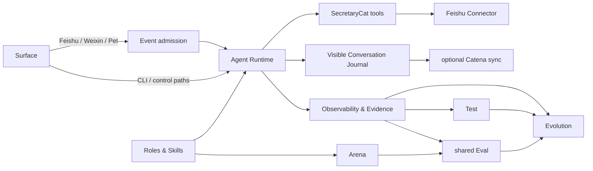

# XiaoBa-CLI PLAN

状态：Active
最后更新：2026-10-08
Owner：XiaoBa maintainers

本文只维护仓库级当前状态和收敛顺序。模块细节进入六份模块 PLAN。

## Current Status

XiaoBa-CLI 已形成共享 Agent Runtime、一个 Base Main Agent 和八个默认 Role：

- EngineerCat、BrowserCat、GuiCat、SecretaryCat 负责执行接管。
- UserCat、InspectorCat、ReviewerCat、EvolutionCat 负责共享 Assurance & Evolution。
- 所有角色复用 AgentSession / ConversationRunner / ToolManager；Browser/GUI/Feishu driver 不是第二个 Agent loop。EngineerCat 是显式例外，只能经单一 `codex_run` Tool 调用外部 Codex executor，不保存第二套 job/session 状态。
- CLI、Feishu、Weixin、Pet、Dashboard 和 Electron 共用 Runtime 主链。
- 本地 Trace、artifact、delivery evidence 和可选 OTLP projection 已有稳定边界。
- CLI、Feishu、Weixin、Pet 的用户可见消息进入独立 append-only
  Conversation Journal；配置 Catena 地址和个人 API 密钥后可选同步，且不把
  system prompt、reasoning、Tool 内部数据或未交付 final text 当作聊天记录。
- Test / Eval / Trace / Case / Replay 的概念已收敛。
- 轻量 Evaluation、Arena 和 Evolution orchestration core 已实现并测试。
- `xiaoba eval run --case-set` 已把 shared Eval core 接成真实 Agent CLI。
- `xiaoba arena evaluate` 已把轻量 Arena 接到已安装 Role/Skill，并只消费标准 AgentSession Trace。
- `arena skill`、`arena run execute/worker` 已复用同一轻量 Arena service 与 clean runtime。
- `evolution sleep` 已切到轻量 control DAG，并复用 Candidate Test、shared Eval 与 capability new-Session / code next-process activation。
- 首个维护中的 `xiaoba-core-readonly-v1` CaseSet 已加入；三条真实 Agent Case 覆盖 Base、EngineerCat 与 ReviewerCat。
- Case Replay 默认只暴露只读工具；需要写入的 Case 必须显式声明 `workspace_write`，并且只能在 enforced clean runtime 中执行。
- source-code Finding 已通过一次性 `delegate_code` 交给隔离 EngineerCat Source Candidate；候选副本通过完整 Test + shared Eval 后才事务性替换 source + dist，并只影响下一进程。
- EngineerCat 已接入官方 `@openai/codex-sdk` 窄适配器；只暴露 task/access/thread resume，原生 coding tools 保留为小修改和失败降级。
- BaseRuntime 预写响应的入口、实现和默认产物已迁到 Scripted Runtime Test 边界。
- UserCat、InspectorCat、ReviewerCat、EvolutionCat runtime assets 已瘦身；dead Inspector 服务、冗余 Reviewer Tools 和实验 Arena scorers 已删除。
- 旧 Arena scorecard worker、typed Evolution DAG、manual promotion、patch regression 和专用 Reviewer replay Tool 已删除。
- Dashboard/loader capability lifecycle、Promote/Unblock API 和状态 UI 已删除；发行目录中的 package 即当前可用版本。

## Milestones

| Milestone | Status | Current meaning |
| --- | --- | --- |
| M0 Documentation baseline | Completed | 固定 14 份 SPEC/PLAN |
| M1 Shared runtime | Completed | AgentSession、ConversationRunner、ToolManager 与 providers |
| M2 Base + eight roles | Completed | 一个 Base、八个默认 Role、零个 Base Skill |
| M3 Surface integration | Partial | 入口共享 Runtime 和 Conversation Journal；网络权限与 Owner identity 未完整 |
| M4 Evidence system | Partial | Trace/artifact/delivery/visible Conversation 可用；durable recovery 未完整 |
| M5 Test / Eval split | Completed | Scripted Runtime Test 已移出 Eval 公共语义与物理目录 |
| M6 Shared Evaluation core | Completed | CaseSet CLI、Case Replay、Verifier veto、Reviewer Judge、Outcome |
| M7 Lightweight Arena core | Completed | Scenario CLI → UserCat → standard Trace → Inspector → Case → Eval |
| M8 Lightweight Evolution core | Completed | Trace/Case → Candidate → Test + Eval → capability new-Session / code next-process activation |
| M9 Default workflow migration | Completed | Arena clean-runtime CLI 与 nightly Evolution 已切到共享核心 |
| M10 Legacy state removal | Completed | 旧 runner/DAG/promotion/regression 与 Dashboard/loader capability lifecycle 均已删除 |
| M11 Browser/GUI/Secretary readiness | Partial | typed adapters 可用，外部依赖与授权仍不完整 |
| M12 EngineerCat Codex adapter | Completed | 官方 SDK 收敛为一个 role-scoped Tool，保留原生 coding fallback，不恢复 job manager/supervisor |
| M13 Shared sandbox execution | Completed | XiaoBa-owned process/file isolation uses Anthropic SDK; Linux verified, macOS packaging pending, Windows blocked |

## Integration migration

The first Surface / Connector / Event separation is implemented inside
the existing module set. Surface PLAN owns its acceptance and rollout. Existing
Base/Role execution, tool confirmation and evidence boundaries remain canonical.
Event is independently exported with a Surface adapter and injectable storage;
nightly memory maintenance is now a persistent timer/runtime producer; other connector completion producers remain future work.
File memory now feeds bounded indexes into requests and supports role-owned
correction/forget/archive and incremental nightly maintenance; sessionKey remains the identity/memory boundary; cross-surface person merging is out of scope.

## Next Steps

1. 用真实失败和回归逐步扩充 `xiaoba-core-readonly-v1`；只按实际 Case 需要增加 hard Verifier。
2. 验收 macOS 发行构建中的统一 SDK 沙箱；Linux 写隔离已接入，无沙箱的平台继续 fail closed。
3. 内部 `Eval*` 兼容名只随相关维护逐步收敛。
4. 在 Windows / Linux Electron 发行构建中验证 SDK 的 optional native binary；macOS arm64 已完成打包态验证。
5. 不增加新的 schema、report、role 或 workflow subsystem。

## Owners

- Surface：`src/commands/**`, `src/feishu/**`, `src/weixin/**`, `src/pet/**`, `src/dashboard/**`, `src/events/**`, `src/connectors/**`, `desktop/**`
- Agent Runtime：`src/core/**`, `src/providers/**`, `src/tools/**`, `src/types/**`
- Roles & Skills：`roles/**`, `src/roles/**`, `skills/**`, `src/skills/**`
- Observability & Evidence：`src/observability/**`, `logs/**`, `data/**`, `memory/**`, `output/**`
- Evaluation：`src/testing/**`, `test/**`, `src/replay/**`, `src/eval/**`
- Arena：`src/arena/**`, `src/commands/arena.ts`, `arena/**`

## Acceptance Criteria

- 只有固定 14 份 SPEC/PLAN 定义架构与状态。
- Base 是唯一 user-facing Main Agent；八个 Role 共用一个 Agent loop。
- Test 只验证 implementation correctness；预写模型响应永远不叫 Agent Eval。
- Eval 的唯一链是 Case → Replay → Trace → Verifier → ReviewerCat → Outcome。
- 每次 execution 只有一个 `pass | fail | blocked` Outcome。
- Arena 只做 UserCat 场景探索、Inspector Finding+Case 和 shared Eval。
- Evolution 只做控制编排，不拥有 Replay、Judge、Scorecard、Regression 或 promotion。
- EngineerCat 负责 code Candidate；EvolutionCat 负责 Role/Skill/Memory Candidate。
- pass Role/Skill Candidate 只为新 Session 激活；pass code Candidate 只为下一进程激活；其他结果不改变当前版本。
- Report 只展示 canonical Result。

## Risks / Open Questions

- `workspace_write` Replay 依赖 enforced clean runtime；统一 SDK 后端支持 macOS/Linux；缺少依赖或 user namespace 时 fail closed。
- source + dist 激活需要保持简单、事务性、可回滚，不能演化成新 lifecycle subsystem。
- 当前维护 CaseSet 只有三条只读 Case，证明核心链可维护，不代表广泛 Agent 能力。
- Dashboard/Pet/Bridge 的 Owner identity 与高风险确认尚不一致。
- Browser/GUI/Secretary 外部 driver 和凭据可用性仍受环境约束。

## Recent Verification

- 2026-10-08: `npm run build` passed; Event-focused integration passed 59/59 and
  file-memory-focused integration passed 33/33; repository regression passed 591/592.
  The sole failure is the unchanged Evolution process-group timeout test: this
  cloud container retains killed descendants as zombies, so PID existence is
  reported after termination. The same failure existed before this change.
  Scripted base runtime passed 11/11; contract smoke passed 23/23 on 2026-10-07.

- XiaoBaOS Conversation slice passes `npm test` 575/575 across 104 suites and
  `npm run build`; focused coverage passes 52/52. A real local Journal → Catena
  PostgreSQL → React round trip displayed an ordered user/assistant exchange,
  file delivery, Role name, and shared Trace ID.
- `npm run build` passed。
- `npm test` passed 561/561 across 102 suites。
- EngineerCat 相关 focused tests passed 31/31 across 5 suites；真实官方 SDK read-only start/resume smoke 返回固定标记，两轮均为 zero changes / zero external tools。
- EngineerCat production-path E2E passed：真实 `AgentSession → ConversationRunner → ToolManager → codex_run → official SDK` 连续完成 start + 指定 `thread_id` resume，保持同一 thread，zero changes / commands / external tools / errors。
- macOS arm64 Electron directory build passed；从 `/tmp` 加载 `XiaoBa.app` 内 adapter 并续接同一 thread 的 packaged smoke 返回固定标记，zero changes / commands / external tools / errors，且包内没有旧 Engineer supervisor 编译残留或重复 Codex native binary。
- Scripted Runtime Test focused tests passed 45/45。
- BaseRuntime Scripted Runtime Test passed 11/11。
- Contract smoke passed 23/23。
- `npm run test:check-scripted-runtime` passed 1 manifest / 11 cases。
- Source Candidate、Replay isolation 与 maintained CaseSet focused tests passed 22/22 across 6 suites。
- 真实 Source Candidate 验收完成完整 build、普通仓库测试与独立 native-sandbox contract phase，结果为 pass；未激活生产源码。
- Lightweight Evaluation、Arena、Evolution、Inspector、Reviewer、UserCat 和 Case Replay coverage 全部通过。
- 七份 maintained SPEC 均恰好包含 Current / Target 两张 Mermaid；`git diff --check` passed。

## Proactive memory maintenance

Completed: Base proactive EvolutionCat dispatch guidance and Event-driven filesystem memory maintenance, now using the shared Linux/macOS Scheduler. Detailed acceptance and remaining risks live in the relevant module plans.

Verification: build passed; proactive memory/journal/role/security 39/39; full regression 605/606 with the existing cloud Evolution descendant-process assertion as the sole failure.

## Shared scheduled events

Owner: Surface / Runtime. Completed: one workspace Scheduler/cron, two Event consumers, compatibility entries and legacy cron migration. Consumers retain their original execution boundaries. Focused verification: 45/46; only the existing cloud descendant-process SIGKILL assertion fails. Full regression: 615/616 passed; the sole failure is the existing cloud descendant-process SIGKILL assertion.

## Session timed wakeups

Owner: Surface / Runtime / Evidence. Completed: session-owned one-shot user reminders and Agent-created checks through the shared Event architecture. See module plans for contracts and operational limits. Verification: build and focused reminder/scheduler/CLI/clock/session checks 47/47 passed; full regression 630/631 passed; the sole failure remains the pre-existing cloud Evolution descendant-process SIGKILL assertion.

## Agent-owned app connections

Owner: Surface / Runtime. Completed: Agent-owned native Gmail, Notion and GitHub Connectors, shared credential/transport boundary, Base tools, default full main-session access and local management CLI. Feishu stays compatible. Module contracts and operational limits are in the Surface/Runtime/Evidence specs; user setup is in roles/README.md. Dashboard connection/token management and Google OAuth are implemented via the shared service; app subscriptions and authenticated remote administration remain next.

Verification: TypeScript build and focused native connector / Feishu boundary / role-tool tests 39/39 passed, including real AgentSession confirmed-write execution with mocked official HTTP. Full regression 650/651 passed; the only failure remains the pre-existing cloud Evolution descendant-process SIGKILL assertion. Live app accounts are not yet verified.

## Dashboard connection management

Owner: Surface / Evidence. Completed: Agent-scoped connection page, write-only private credentials, local management boundaries, Gmail OAuth, account verification, enable/disable/disconnect and default full main-session operation access. See module plans for contracts. Verification: build and focused 34/34 passed; actual Chromium desktop/mobile flows passed with mocked provider HTTP and Google callback; full regression 658/659 passed with only the existing cloud Evolution process-group assertion. Real provider authorization still requires user-owned tokens/OAuth client configuration.

Dashboard simplification: completed. Three authorization-only cards reuse existing Skills/Store components and the shared modal/config fields; no requester/scope/Feishu/control panel remains. Token connection and Google callback verify accounts automatically. All configured/enabled app operations are available by default to valid main sessions; retired grants are ignored/removed on the next write. Google OAuth covers all implemented mail operations through gmail.modify. Write confirmation and existing role/child boundaries remain intact.

Verification: build and focused 50/50 passed, including cross-surface default reads/writes, old-config migration, retired API absence and exact write-confirmation tests. Real Chromium validated shared computed card styles, token/OAuth connection, all-operation defaults, disconnect, mobile modal and Electron renderer external authorization with mocked providers and no page errors. Full regression 658/659 passed; the sole failure remains the pre-existing cloud Evolution descendant-process SIGKILL assertion. Real provider credentials/consent and native OS browser launch remain user-host checks.

## Unified sandbox execution

Owner: Runtime. Completed: XiaoBa-owned Shell/file/SubAgent/Arena/Evolution sandbox paths use one pinned Anthropic SDK adapter. See `agent-runtime/PLAN.md` for acceptance and operational limits. Build and 10/10 real SDK contracts passed; full regression 669/670 passed, with only the unchanged cloud Evolution descendant PID assertion failing.

## Personal Agent continuity

Runtime/Surface: request cancellation, durable native Connector write receipts, interrupted-child inspection and opt-in Gmail history → Event → existing session check are implemented. Final focused integration 98/98 passed (serial final integration); full regression 692/693 passed before the final per-request identity refinement, with only the existing cloud Evolution descendant PID/zombie assertion failing. Full automatic cursor recovery, GitHub/Notion change producers and remote administrator authentication remain separate work. Live account consent, original-channel delivery, macOS packaged SDK execution and proactive interaction quality require user-host acceptance; they are not inferred from mocked provider tests.

Current priority: asynchronous conversation and natural interaction. Connector setup stays user-provided credentials; public OAuth applications/hosted authorization and real-account Connector acceptance are deferred. Shared lifecycle/feedback and Base delivery-policy acceptance are maintained in the Runtime, Surface and Roles plans.
