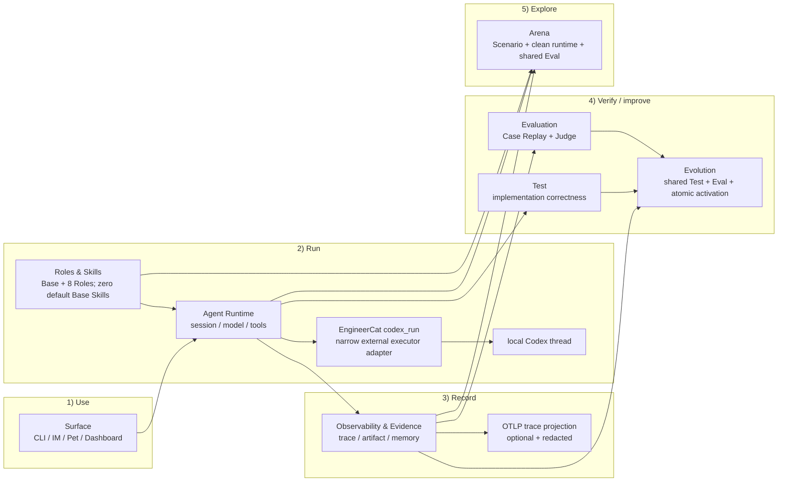
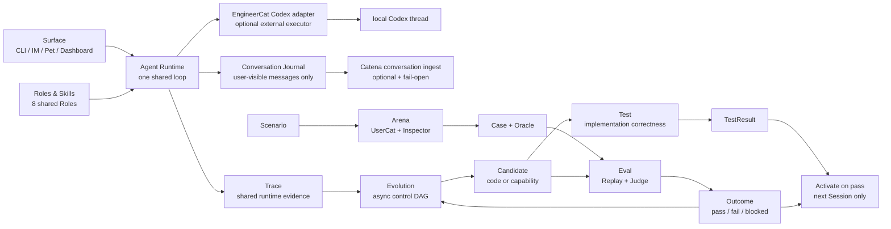

# XiaoBa-CLI SPEC

状态：Active
最后更新：2026-08-03
适用范围：`XiaoBa-CLI` 整体架构、agent harness 边界、核心状态机、运行证据和评测闭环。

本文是 `XiaoBa-CLI` 的项目级架构真相源。项目只维护本文和六个模块 SPEC；角色、benchmark、desktop、test 和实验实现不再各自复制架构文档。

## 顶层架构模块索引

XiaoBa-CLI 的稳定文档结构是一个项目级大 SPEC 加六个顶层模块 SPEC。六个模块是架构介绍和代码 review 的统一口径：Surface、Agent Runtime、Roles & Skills、Observability & Evidence、Evaluation、Arena。每个模块只有一份 SPEC 和一份 PLAN；Trace Replay、state/evidence、live eval、benchmark、desktop、test 和逐角色实现直接写入所属模块文档，不再创建 supporting SPEC/PLAN。

| 模块 | SPEC | PLAN | 覆盖范围 |
| --- | --- | --- | --- |
| Surface：入口层 | [`surface/SPEC.md`](surface/SPEC.md) | [`surface/PLAN.md`](surface/PLAN.md) | `src/commands`、`src/feishu`、`src/weixin`、`src/pet`、`src/dashboard`、`desktop` |
| Agent Runtime：会话与工具编排层 | [`agent-runtime/SPEC.md`](agent-runtime/SPEC.md) | [`agent-runtime/PLAN.md`](agent-runtime/PLAN.md) | `src/core`、`src/providers`、`src/tools`、runtime 类型、session lifecycle 和 agent loop |
| Roles & Skills：Base + 八角色策略层 | [`roles-skills/SPEC.md`](roles-skills/SPEC.md) | [`roles-skills/PLAN.md`](roles-skills/PLAN.md) | Base Main Agent、八个默认 Role Subagent、`roles`、`src/roles`、`skills`、`src/skills` |
| Observability & Evidence：观测证据层 | [`observability-evidence/SPEC.md`](observability-evidence/SPEC.md) | [`observability-evidence/PLAN.md`](observability-evidence/PLAN.md) | `src/observability`、`logs`、`data`、`memory`、`output`、trace projection 和 artifact evidence |
| Evaluation：Test 与 Agent Eval | [`evaluation/SPEC.md`](evaluation/SPEC.md) | [`evaluation/PLAN.md`](evaluation/PLAN.md) | `src/testing`、`test/scripted-runtime`、`src/replay`、`src/eval`、Case Replay、Verifier、ReviewerCat Judge |
| Arena：Agentic Eval 工作流 | [`arena/SPEC.md`](arena/SPEC.md) | [`arena/PLAN.md`](arena/PLAN.md) | Scenario、UserCat、Subject Trace、InspectorCat Finding+Case 与 shared Eval |

本地 JSONL 和 artifact evidence 是运行事实；Outcome 是一次 Case execution 的唯一裁决；EvaluationResult、ArenaResult 和 Report 都不能再创造第二份真相。Observability 允许显式启用脱敏、fail-open 的 OTLP trace 投影，但该投影不拥有 pass/fail。

## 1. 核心定位

XiaoBa-CLI 是一个本地优先、message-native、可治理自进化的 agent harness runtime。它把模型、工具、角色、Skill、memory、context、artifact、Trace、Test、Eval 和 Arena 组织成一个可控、可观测、可恢复的运行时。

关键判断：

```text
Model is not the runtime.
Harness is the runtime.
```

核心运行术语：

- `session`：一个长期会话，可跨多次用户请求和进程重启恢复。
- `conversation`：一个 surface 上用户实际可见的长期消息流；只包含用户输入、成功交付的 Agent 文本/文件和显式可见的 Runtime 回复，不等同于 provider transcript 或 trace。
- `trace`：一次用户请求从进入 runtime 到本次 `ConversationRunner` while loop 截止的闭环，是产品、观测、eval 和 benchmark 的最小用户意图单元。
- `turn`：`ConversationRunner` 内部 while loop 的一次 model request / tool result 推进一步。`turn` 不再指完整用户请求。
- `span`：trace 内可计时的子操作，例如 model、tool、provider、delivery。
- `event`：trace 内的离散事实，例如 `session_started`、`session_completed`、`provider_error`；新日志默认嵌在 trace 主记录里。
- `metric`：token、latency、count 等数值事实，由 trace/event/tool facts 投影产生。
- `case`：trace 清洗、裁剪、补充 rubric 后进入 eval/benchmark 的评测样本。
- session-log-v2 里的 `entry_type="turn"`、`turn_id`、`turn` 是历史兼容字段；session-log-v3 新写入使用 `entry_type="trace"`、`trace_id`、`trace_index`。

模型负责下一步推理，harness 负责工程边界：

- provider transcript 必须合法。
- tool execution 必须闭环。
- session state 必须隔离、可恢复、可清理。
- context compression 不能丢当前任务和硬约束。
- context compression 必须留下结构化断点证据，并把 compact 后 working memory 作为同 session snapshot 关联到 trace。
- artifact 生成与发送必须有 evidence。
- 日志必须可解析、可投影、可 replay。
- 失败必须能归因到 runtime、skill、role 或外部系统。
- self-evolution 产出的变更先形成 immutable Candidate artifact；Candidate 复用 shared Test + Eval，通过后按 capability 新 Session / code 下一进程边界原子激活，失败或 blocked 不改变当前版本。

## Current Architecture

项目级 spec 的最外层图只表达当前已经存在的 durable module 和职责边界。细节放到对应模块 spec；顶层 Mermaid 节点优先使用模块名，避免把项目级地图画成实现细节图。



## Target Architecture

目标架构保留同一套本地优先 Runtime，把质量体系收敛为四条共享
Evidence Primitive 的轻量工作流。`Assurance` 是这套关系的名称，不是新
module、service 或 runner。Scenario 用于开放探索，Trace 保存运行事实，
Case 把问题变成可执行实验，Outcome 是一次真实执行的唯一裁决。



这四条工作流的稳定边界是：

- Test 验证代码、Runtime、Tool、协议和安全约束；预写模型响应的真实
  Runtime 执行属于 Scripted Runtime Test，不属于 Agent Eval。
- Eval 只执行 Case：Replay 驱动真实 Agent 产生新 Trace，Verifier 先做硬
  检查，通过后 ReviewerCat 依据 Oracle 作语义裁决；EvaluationResult 只
  聚合事实，不再产生第二套总裁决。
- Arena 从 Scenario 开始。UserCat 与 Subject 产生普通 Trace，InspectorCat
  只产出零个或多个 `Finding + Case` 对；Case 进入共享 Eval。Arena 不拥有
  Replay、Judge 或 Scorecard 实现，也不直接给 Scenario Trace 生成 Outcome。
- Evolution 可以从 Trace 或失败 Case 开始，但 Repair 前必须已有可 Replay
  Case。EngineerCat 修改代码，EvolutionCat 修改 Role / Skill / Memory；
  Candidate 复用 Test + Eval，通过后按 capability 新 Session / code 下一进程边界自动激活。
- EngineerCat 保留 XiaoBa 原生 coding tools 作为小修改和降级路径，并可通过一个 role-scoped
  `codex_run` Tool 把实质性编码委托给本机 Codex。XiaoBa 只提供固定工作区、只读/可写模式、
  AbortSignal 和结构化 ToolResult；不复制 Codex 的 agent loop，不保存第二套 job/session 状态。

## 核心组件边界

| 组件 | 职责 | 不能承担的职责 |
| --- | --- | --- |
| `AgentSession` | 管 session 生命周期、busy/interrupt、上下文压缩触发、skill 激活、session log、context restore 和长期 memory 落盘触发 | 不直接实现 tool 业务；不直接适配某个平台 API；不默认把长期 memory 注入 provider prompt |
| `ConversationRunner` | 管 agent loop：model call -> tool calls -> tool results -> next model call；保证 transcript 合法 | 不保存长期 session；不决定角色配置 |
| `ToolManager` | 管三层工具注册、可见性、参数解析、执行边界、结果归一化、错误码和 retryable 信号；工具层级包括 base tool、role tool 和 surface tool | 不参与模型推理；不维护多轮对话状态；不把平台交付工具伪装成角色工具 |
| `ContextCompressor` | 管长上下文状态迁移，在压缩后保留任务目标、约束、artifact 状态和最近上下文 | 不做业务总结；不替代 memory |
| `SessionTurnLogger` | 管运行证据：trace、legacy turn alias、tool call、tool result、tokens、embedded runtime events、artifact clues；`traces.jsonl` append 后投影到 observability local summary，普通 runtime 文本写入 `runtime.log` | 不做最终质量评分；不作为业务数据库 |
| `Observability` | 管 session log 投影后的 local summary、本地 span/metric helper、hash-only trace continuity，以及可选的脱敏 OTLP trace 投影 | 不替代本地 JSONL、artifact evidence 或 canonical Result；不拥有 pass/fail；不创建或修改 Case；不外发 prompt/tool/file 内容 |
| `roles/*` | 定义角色身份、职责、工具注入和验收边界 | 不复制 runtime loop |
| `skills/*` | 定义领域流程和操作策略 | 不保存 runtime 状态；不绕过工具边界 |
| `Arena` | 从 Scenario 开始，让 UserCat 与 Subject 产生普通 Trace，再由 InspectorCat 生成 Finding+Case 并调用 shared Eval | 不拥有 Replay、Judge、Scorecard、Regression 或 Candidate activation |
| `test/*`, `src/testing/*` | 定义代码正确性、集成测试、contract smoke 和 Scripted Runtime Test | 不把预写模型响应当成 Agent 行为能力 |
| `src/replay/*` | 执行 Case 或兼容历史 Trace 输入，驱动当前 Runtime 并产生 fresh Trace | 不输出 pass/fail；不做 Judge |
| `src/eval/*` public API | 定义 Case、Oracle、Outcome、EvaluationResult 和 ReviewerCat Judge | 不保存第二套 overall verdict；不拥有 Arena 或 Evolution |

## Agent Loop 状态机

Agent harness 的核心是状态机，不是单次请求。

```text
user message -> prepare context -> provider request -> assistant decision
                                      ^                    |
                                      |                    +-> final reply / delivery
                                      +-- transcript <- tool result <- tool execution
```

状态机不变量：

- 每个 assistant tool call 必须进入一个合法终态：success、failure、timeout、cancelled 或 blocked。
- 每个 tool call id 必须有 matching tool result，不能把 dangling tool call 送进下一轮 provider request。
- 模型可见工具必须由 `ToolManager` 根据 role policy 和 surface context 计算；隐藏工具即使被模型硬调也必须返回 forbidden tool result。
- provider-visible transcript、runtime-visible trace、user-visible message 三者可以不同，但必须可关联。
- outbound tools 例如 `send_text` / `send_file` 的成功必须进入 structured delivery evidence，并能被 `delivery_evidence_contract` 验证；channel-backed tools 和 surface runtime replay 还可以记录 `external_delivery_receipts`，用于保存平台 message/file/upload ack 的结构化事实。
- 已经对用户可见的消息不能因为后续 provider 失败而被 runtime 当作未发生。

## 四层状态模型

XiaoBa 的状态不能只用一个 `messages[]` 描述。需要区分四层：

| 层 | 内容 | 作用 |
| --- | --- | --- |
| Durable Session | surface、session key、`data/sessions/<surface>` 持久化上下文、active skill、按需读取的长期 memory 笔记 | 跨 trace / restart 恢复 |
| Conversation Journal | 用户输入、成功交付的 `send_text` / `send_file`、CLI direct reply 和显式可见 Runtime 回复 | 用户历史、Prompt/Memory/Role 进化；append-only，不参与 provider restore |
| Trace | 当前用户请求的 user input、runner turns、tool calls、tool results、artifacts、runtime events | debug、Replay、Test/Eval 证据 |
| Provider Transcript | 真正发送给模型 provider 的 system/user/assistant/tool messages | 保证 provider 协议合法和 token budget |

设计原则：

- Durable session 不能直接等同于 provider transcript。
- Conversation Journal 不能从 provider transcript 反推；未交付的 final text、system/developer prompt、thinking 和 tool internals 不得进入用户可见历史。
- Trace 是事实证据，不一定全部进入下一次 provider request。
- Context compression 应该迁移状态，而不是简单裁剪文本。
- Session log 是 Replay/Eval 的输入资产；新写入应带 `trace_id` / `trace_index`，而 `case_id` 与 Outcome 属于后处理或评测产物。

## Memory Contract

`data/sessions/<surface>/<session-key>.jsonl` 是会话恢复主路径：保存 provider-visible transcript 和 compact system messages，用于同一个入口里的同一个 session 断开、TTL cleanup 或进程重启后继续上下文。迁移期兼容读取旧的 `data/sessions/<session-key>.jsonl`，但新写入必须落到 surface 子目录。

`memory/sessions/<session-key-hash>/MEMORY.md` 是按 session/person 维度维护的长期记忆笔记：只保存稳定偏好、习惯、称呼、默认工作方式和用户明确要求记住的事实。它是 Markdown 主存储，便于人类阅读、diff、编辑和删除。

长期 memory 不默认加载进 provider prompt。恢复会话时只恢复对应 surface 下的 `data/sessions`；长期 memory 只能通过显式 recall、后续工具或用户请求按需注入，并且注入内容必须小而相关。当前任务进度、刚失败的命令、下一步待办和临时文件路径属于 `data/sessions` / `[session_memory]`，不能自动固化为长期 memory。

## Conversation Contract

`data/conversations/<surface>/<conversation-hash>.jsonl` 是 XiaoBaOS 专属的 append-only 用户可见历史。每行使用 `xiaoba.conversation_message.v1`，至少包含稳定 `message_id`、`conversation_id`、单调 `sequence`、`occurred_at`、`surface`、`agent_id`、`role`、可见 `content[]`、delivery 状态和可选 `trace_id`。

Conversation 明确排除 system/developer prompt、thinking/reasoning、未交付的模型 final text、tool args/result、Judge 和内部 subagent 消息。Catena 同步使用 `xiaoba.conversation_batch.v1` 通过普通 HTTPS JSON + API key 幂等导入；它不是 OTLP 信号，上传失败不得改变本地消息交付或删除本地 Journal。

## Message-Native Runtime

XiaoBa 面向 IM、桌宠和 CLI 多入口，但 runtime 统一收敛到 `AgentSession`。

入口边界：

- CLI 可以直接返回文本；CLI 不注入 `send_text` / `send_file`。
- Feishu / Weixin / Pet / Dashboard 是 channel-delivered surface：平台层必须显式传入 `surface` 和 `channel callbacks`，不能从 `session key` 猜入口类型。
- Channel surface 以用户可见消息和文件交付为准；正常路径只有 `send_text` / `send_file` 产生用户可见输出。
- Channel surface 默认不把最终直接文本回复外发给用户；模型要让用户看到回复，必须调用 `send_text` / `send_file`。`ConversationRunner` 的 `delivery_fallback_final_reply` 只是一项显式 opt-in 兼容策略，默认关闭；一旦入口选择开启，fallback 外发仍必须记录 synthetic `send_text` ToolResult 和 structured `delivery_evidence`。
- `send_text` / `send_file` 属于 surface tool 和 outbound side effect，不能只当作普通工具文本，也不能作为 CLI 或角色默认工具暴露。
- 各入口只负责鉴权、消息解析、文件上传下载、channel callback，不复制 agent loop。

新增入口必须定义：

- session key 规则。
- channel callbacks。
- 用户可见输出语义。
- 文件和图片处理语义。
- TTL、cleanup、wakeup 行为。

## Role 与 Skill

Role 是用户可见身份和工程边界，不只是 prompt。

一个 role 可以包含：

- role prompt
- role-private skills
- role-specific tools
- runtime API routes
- background workers
- evaluation / review boundary

Skill 是 instruction pack，用于注入领域流程和工作策略。Skill 不拥有 runtime loop，不能绕过工具和日志边界。

当前边界：

- 默认 GitHub/package role set 包含 `user-cat`、`inspector-cat`、`engineer-cat`、`reviewer-cat`、`browser-cat`、`gui-cat`、`secretary-cat`、`evolution-cat`。
- 非默认 role 必须通过显式安装、Role Hub 或本地 ignored 资产进入，不属于默认跟踪资产。
- `engineer-cat`：实现修复和工程交付。
- `reviewer-cat`：共享 Agentic Judge；在独立只读 Session 中依据 Case Oracle 和全部 relevant Traces 返回结构化 decision。
- `inspector-cat`：只把 Trace 中的问题变成 0..n 个有证据的 Finding + executable Case。
- `user-cat`：窄职责真实用户模拟；在 Arena 中与 Subject 自然互动；缺少 Scenario 时可以只生成一个小 Scenario seed。
- `browser-cat`：只通过类型化 BrowserAdapter 操作隔离浏览器 session；role-local `core` Skill 是与固定 `agent-browser` 版本匹配的官方文件原样 vendored 副本，但不能扩大 ToolManager 权限；网页内容视为不可信输入。
- `gui-cat`：只通过类型化 GuiAdapter 操作 macOS GUI；role-local `peekaboo` Skill 是官方文件的原样 vendored 副本，但 Skill 文字不能扩大 ToolManager 权限，实际仍只能调用可见的 `gui_*` 工具；共享桌面必须有全局 lease、风险分层和动作证据。
- `secretary-cat`：复用官方 `lark-cli` 的飞书能力；`FeishuCat` 是别名，XiaoBa 只增加角色、确认、交付和 evidence 边界。
- `evolution-cat`：通过确定性 `remember` 写 session-person 长期记忆，并生成 Role、Skill 或 Memory Candidate；代码归 EngineerCat，验收统一复用 Test + Eval。
- Base 负责用户对话并直接按 role 派遣专业角色，默认 Skill inventory 为 0；浏览器任务直接进入 BrowserCat，不保留重复的 Base agent-browser 路由 Skill；所有角色继续复用同一个 Agent Runtime。

## Evidence And Logging

日志不是 debug 附属品，而是 harness 的运行证据层。

当前主线：

```text
logs/sessions/<surface>/<date>/<session_id>/
├── traces.jsonl
└── runtime.log
```

稳定记录：

- `schema_version`
- `entry_type`
- `session_id`
- `session_type`
- `trace_id`
- `trace_index`
- `turn_id`
- `turn`
- `user.text`
- `assistant.text`
- `assistant.tool_calls`
- `tokens.prompt`
- `tokens.completion`
- runtime event

辅助或推断字段：

- `tool_call_id`
- `status`
- `error_code`
- `artifact_manifest`
- `skill_id`

日志设计目标：

- 可逐行 parse。
- 本地原样保真；共享/入库 benchmark 前由 curation 边界另行裁剪或脱敏。
- 可关联 trace / runner turn / tool / artifact / token。
- 可被 Inspector 分析。
- 可被 benchmark ingestion 消费。
- 可反哺 runtime schema。

## Evaluation System

XiaoBa 只保留 Test 与 Eval 两种质量语义：

```text
Test = Implementation Correctness
Eval = Agent Behavioral Capability
Trace = shared runtime evidence
Case = shared executable input
Replay = execute Case and produce a fresh Trace
```

Test 包含 unit、integration、contract smoke 和 Scripted Runtime Test。后者可以让真实 Runtime 执行预写模型动作，但产物只能叫 TestResult。当前 BaseRuntime 11 条用例已迁到 `test/scripted-runtime/base-runtime`，命令是 `test:base-runtime`。

Eval 的固定顺序：

```text
Case + Oracle
  -> Replay real Agent
  -> fresh Trace
  -> Verifier hard checks
  -> ReviewerCat semantic Judge
  -> one Outcome: pass | fail | blocked
  -> EvaluationResult facts
```

Verifier hard failure 直接形成 Outcome。通过硬检查的运行由 ReviewerCat 在 fresh、只读、结构化 Session 中判断；一次 Judge 可以看到同一 Case 的全部 runs。Report 只展示 canonical Result。

Arena 从 Scenario 探索未知问题，InspectorCat 把问题回归成 Case，再调用同一个 Eval。Evolution 从 Trace 或 Case 生成 Candidate，也调用同一个 Test + Eval。三者不复制 Replay、Judge、Scorecard 或 Regression。

真实 CaseSet 的 `xiaoba eval run`、Arena clean-runtime 默认链和 nightly Evolution 都已接入共享核心。维护中的 `xiaoba-core-readonly-v1` 提供首批 Base / EngineerCat / ReviewerCat 行为 Case；Case Replay 默认只暴露读取工具，只有显式 `workspace_write` Case 才能在 enforced clean runtime 中获得候选工作区写工具，外部消息、Browser、GUI 和 Secretary 工具始终不进入 Replay。

source-code Finding 现在由 EvolutionCat 返回一次性 `delegate_code`，再由共享 Agent loop 中的 EngineerCat 修改隔离源码副本。Source Candidate 在同一副本中完成完整 Test 和 shared Eval，只有通过的 source + dist 才事务性替换生产版本并于下一进程生效；Role/Skill Candidate 仍于新 Session 生效。这个委派不是新状态机或第二条工作流。

旧 Arena scorecard worker、typed Evolution DAG、manual promotion、patch regression 及其专用 Reviewer replay Tool 已删除；subject snapshot 与 clean runtime 只作为隔离 adapter 保留。

## Agent Harness Contracts

这些 contract 是 release hard gate，不是业务加分项：

- Transcript completeness：每个 tool call 必须有 matching tool result。
- Failure observability：timeout、cancelled、throw 必须转成可观测 `status/error_code`。
- Retry budget：失败重试必须有上限，重复失败后要变更策略或报告 blocked reason。
- Privacy boundary：reply、log、artifact、Result/Report 不得泄漏 credential、token、私有 host；release fixtures 在进入共享 Test/Eval evidence 前必须通过隐私预检；`data/sessions` durable restore store 属于私有恢复状态，不等同于可发布 evidence。
- Artifact evidence：生成、更新、发送用户文件必须有 manifest 或 delivery evidence。
- Context continuity：restore/compaction 后保留当前任务目标、硬约束、关键路径和 artifact 状态。
- JSONL compatibility：session log 必须逐行可解析，schema 变更必须兼容 ingestion；release suite `inputs.jsonl` 必须声明 `session-log-v2` schema 或 explicit non-session contract，且 non-session contract 必须有 dedicated shape + semantic gate。

## Extension Rules

新增 runtime 能力时，必须回答四个问题：

- 它接入哪一层：surface、control plane、agent session、runner、tool、state/evidence、eval？
- 它改变哪个状态机边界？
- 它产生什么证据，能否进入 `logs/sessions/**/*.jsonl`？
- 它应该由 trace-derived、requirement-driven 还是 contract eval 覆盖？

新增工具必须定义：

- tool name / description / args schema。
- tool layer：`base`、`role` 或 `surface`。
- visibility policy：base tool 是否受 role 继承/allowlist/denylist 控制，surface tool 需要哪些 surface context。
- transcript mode。
- side effect 边界。
- error code。
- retryable 语义。
- blocked / cancelled 终态与 bounded failure 语义。
- artifact evidence。
- 如果工具调用外部 driver，还必须定义固定版本、binary trust/discovery、argv allowlist、timeout/abort、输出信任级别、Arena 行为和打包边界；不得把任意 driver 参数或 Shell 暴露给模型。

新增角色必须定义：

- 用户可见职责。
- runtime 权限。
- skills / tools。
- 验收边界。
- 与 Engineer / Reviewer / Inspector 的协作方式。

## 文档边界

- `docs/SPEC.md` / `docs/PLAN.md` 是项目级总文档。
- `docs/surface`、`docs/agent-runtime`、`docs/roles-skills`、`docs/observability-evidence`、`docs/evaluation`、`docs/arena` 各自只维护一份 `SPEC.md` 和一份 `PLAN.md`。
- `roles/`、`skills/`、`desktop/`、`eval/`、`test/` 和 benchmark 目录不再维护重复 SPEC/PLAN；设计和进展回写所属模块。
- `prompts/**/*.md` 和 `**/SKILL.md` 是运行时源文件，不计入架构文档集合。
- 如果实现改变了本文定义的组件边界、状态机、日志格式或 live eval 边界，必须同步更新本文。
