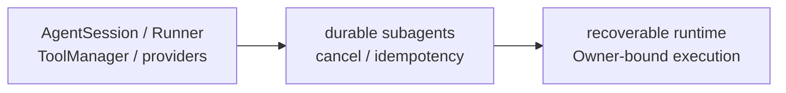

# Agent Runtime PLAN

状态：Active
最后更新：2026-10-08
Owner：Runtime maintainers

## Current Status

- 连续协作 Replay 的 trusted factory 支持注入受控子会话 ToolManager/turn budget；主会话支持显式 maxTurns，AIService 可禁用模型主备切换。普通 Role dispatch 缺省路径不变。异步、记忆和提醒集成工程验证已通过；真实模型验收由 Evaluation PLAN 跟踪。

- `AgentSession` + `ConversationRunner` is the single model-driven loop for Base and all roles.
- ToolManager enforces base / role / surface layers, role visibility and confirmed-tool gates.
- Tool results, delivery evidence, artifact manifests, provider failures and context compaction have structured runtime facts.
- OpenAI-compatible、Anthropic and Ollama adapters share normalized message/tool boundaries.
- Subagent role dispatch works through shared sessions; bounded status/progress/question/output metadata is durable, while execution cursors remain memory-backed.
- BrowserCat/GuiCat drivers are deterministic adapters and do not run a second Agent/Chat/MCP loop.
- EngineerCat consumes the shared loop with a narrow coding/Skill allowlist, child-side `ask_parent`, and one role-scoped `codex_run` external executor adapter; parent-side controls and XiaoBa-owned nested job/session layers remain absent.
- EvolutionCat `remember` is a deterministic role tool over the existing session-person memory contract.
- Terminal SubAgentSession runs persist standard child `traces.jsonl` with parent, role, selected-skill, tool-result and artifact lineage for nightly evolution and debugging.
- `evolution sleep` uses the lightweight Evolution control workflow; the old typed-route runner is deleted.
- Narrow SubAgent workflows can enforce `allowedWriteRoot` across shared SDK file and Shell execution; unavailable native sandbox execution fails closed.
- Case Replay defaults to an isolated child with a read-only ToolManager; workspace writes require an enforced clean runtime and never expose delivery / Browser / GUI / Secretary tools.
- EngineerCat Source Candidate runs in a secret-free source copy；build and ordinary tests run under a native sandbox, while the two sandbox-in-sandbox contract files run separately with their own native sandbox；source + dist activation is scoped to the next process.
- XiaoBa is a product runtime with a reusable harness core, not yet a public general-purpose Harness SDK.
- Session/model/tool spans can be exported through the default-off OTLP/HTTP bridge; graceful runtime shutdown flushes spans while collector failure remains fail-open.
- One-shot CLI execution forwards an incoming `TRACEPARENT` into `AgentSession`, preserving
  an external Barena turn as the parent of XiaoBa's native session/model/tool spans.

## Milestones

1. Shared AgentSession/ConversationRunner loop：completed。
2. Layered ToolManager and canonical ToolResult：completed for maintained paths。
3. Provider adapter normalization：completed for current adapters。
4. Structured failure/delivery/artifact/compaction evidence：completed for current paths。
5. Role-only subagent dispatch：completed。
6. Durable in-flight subagent recovery and action receipts：partial; interrupted-child inspection and native Connector write receipts implemented, automatic cursor resume remains absent。
7. Provider/Shell end-to-end cancellation：completed for maintained model adapters, compression, retry waits and SDK tools; independent background children require explicit stop。
8. Public Harness SDK extraction：not a current product milestone。
9. Standard `traces.jsonl` for terminal SubAgentSession runs：completed。
10. Lightweight Evolution control：completed；old typed-route runner removed。
11. Bounded SubAgent write root：completed through shared SDK file/Shell execution on supported Linux/macOS hosts; missing sandbox fails closed。
12. Native EngineerCat fallback：completed；small changes and external-executor failure continue through the shared SubAgentSession/ConversationRunner coding tools。
13. OTel trace bridge：completed for session/model/tool spans, W3C parent continuity, redacted OTLP/HTTP export and graceful flushing；metrics/logs export remains out of scope。
14. Replay effect boundary：completed for default read-only and SDK clean-runtime workspace-write; unsupported hosts fail closed。
15. Source Candidate runtime boundary：completed for isolated EngineerCat, full Test and next-process source + dist activation。
16. Narrow EngineerCat Codex adapter：completed；one role-scoped Tool, no job manager/supervisor, native coding fallback retained。

## File-system memory migration

- Owner: Runtime with Observability & Evidence for Markdown layout.
- Completed: bounded per-request index loading, role-owned replacement/forget,
  preservation of manual Markdown and non-resurrection after archive.
- Acceptance: a new Session instance sees saved preferences; unrelated sessions
  stay isolated; manual edits refresh; memory is absent from stored transcript.
- Next: task-follow-up integration within the existing sessionKey boundary; cross-surface person binding is out of scope.

## Next Steps

- Persist exact resume/tool cursors and pending confirmations; extend action continuity beyond native app connectors.
- Carry authenticated principal and Owner authority through ToolExecutionContext.
- Observe maintained cancellation in live use; custom/external adapters must consume the trusted AbortSignal.
- Reduce remaining prose-based legacy ToolResult/artifact inference.
- Package and release-verify BrowserCat/GuiCat adapters without adding driver-side model loops.
- Release-build the optional native Codex package on Windows and Linux; runtime source/build plus macOS arm64 packaged start/resume are verified.

## Owners

- Session lifecycle：`src/core/agent-session.ts`
- Agent loop：`src/core/conversation-runner.ts`
- Subagents：`src/core/sub-agent-*`
- Providers：`src/providers/**`
- Tools and execution types：`src/tools/**`, `src/types/**`

## Acceptance Criteria

- Every assistant tool call has a matching terminal tool result.
- Failure, timeout, cancel and blocked states are structured and auditable.
- Provider transcript, working trace and durable session remain distinct boundaries.
- Confirmed tools are hidden or blocked unless confirmation matches actor and payload.
- Base and all eight roles use the same runtime loop.
- EngineerCat coding tasks use the shared tool contract through an explicit allowlist; Base externally owns SubAgent lifecycle, EngineerCat may only use `ask_parent` as the child uplink, and the only external model loop is the bounded `codex_run` Tool. It has no parent-side controls or role-local job manager/supervisor.
- External drivers are fixed, bounded capability adapters with version, timeout and trust evidence.
- A SubAgent with `allowedWriteRoot` cannot use file tools or Shell to write outside that root; workflows must hide any separate write control plane that can choose another cwd.
- A default Case Replay cannot call write, Shell, delivery, Browser, GUI or Secretary tools; explicit write Cases require an enforced clean runtime.
- A Source Candidate cannot read production source or write outside its candidate/test roots during Test; passing code activates only for the next process.
- Runtime architecture changes update this PLAN and [`SPEC.md`](SPEC.md) only.
- Enabling OTLP export does not change Agent outcomes or expose prompt, tool argument, file-content or free-form error attributes.

## Risks / Open Questions

- Process crashes preserve child inspection metadata but can still lose exact tool/resume cursors.
- Native Connector receipts block lost-response replay; other external-effect adapters still need their own durable outcome/reconciliation contract.
- Cancellation cannot undo an already completed external effect; supervised SDK process cleanup and provider transport cancellation have contract coverage.
- Tool processes that deliberately detach from the supervised worker group can still require tool-specific cancellation evidence.
- Owner identity is not yet a first-class runtime authorization fact.
- SDK-backed workspace_write Replay and Source Candidate Test require a supported macOS/Linux host; other platforms fail closed.

## Recent Verification

- 2026-10-08: build passed; file-memory/runtime/Role focused tests passed 33/33;
  repository regression passed 591/592. The sole failure remains the existing
  Evolution descendant-process timeout assertion in this cloud container.
  Coverage proves fresh Session recall, edit refresh, root consistency, bounded
  and scoped reads, correction/forget, archive exclusion, legacy Markdown upgrade,
  managed-block integrity and non-persistence of injected memory.

- SubAgent boundary tests include traversal, absolute-path and symlink rejection plus an actual Seatbelt attempt outside `allowedWriteRoot`; `npm test` passed 561/561 tests across 102 suites and `npm run build` passed.
- OTel runtime tests verify session/model/tool-compatible parent topology, incoming W3C ancestry, graceful flushing and fail-open collector errors without changing local span evidence.
- EngineerCat runtime tests verify the coding/Skill/`ask_parent` allowlist, one `codex_run` role tool, the absence of parent-side controls and nested job/session/supervisor tools, plus start/resume, access mode, AbortSignal, secret filtering and artifact evidence.
- A production-path E2E drove `codex_run` through the real AgentSession, ConversationRunner and ToolManager, then resumed the returned thread id on the next user turn with zero changes, commands, external tools or errors.
- Real official-SDK read-only start/resume smoke kept one thread id and produced zero file changes and zero external tool calls; macOS arm64 Electron packaging and an App-contained adapter resume from `/tmp` also passed with no old supervisor payload or duplicate native binary.
- Terminal child trace tests cover success, failure, stop, selected-skill, parent lineage and real tool/artifact results.
- Lightweight Evolution tests cover deterministic Candidate packaging, shared Test/Eval control, fail-closed code Findings, atomic Role/Skill activation and rollback.
- A real Source Candidate validation completed build, ordinary repository tests and the separate native-sandbox contract phase inside the candidate boundary; it passed without activating production source.
- A real-provider Arena `base_skill` proof exposed and fixed Base aliases being resolved as missing Role packages; focused ToolManager/Arena tests now cover the Base tool set without a role package.
- UserCat now hashes the overflow of long Arena run ids instead of truncating away scenario identity, so multi-case pressure keeps distinct native Pet sessions.
- Isolated Arena Role profiles now reuse the production ToolManager with an explicit snapshot-derived role policy: registered tools, provider-visible tools, role-native adapters, allow/deny rules and surface delivery tools are computed rather than hard-coded, without mutating global role resolution state.

## Proactive memory maintenance

Owner: Runtime. Completed: scoped Event admission, proposal-only EvolutionCat on the shared loop with an empty Tool allowlist and one-turn budget, parent isolation, stale-plan rejection, CLI and timezone schedule. Next: operational installation on the user host and continuity within the existing sessionKey boundary. Cancellation is cooperative, not an OS-enforced worker deadline. Verification: build and focused memory/journal/role/security 39/39 passed, including a real EvolutionCat loop and CLI entry.

## Shared scheduled events

Owner: Runtime. Completed: manual/scheduled Event admission for both jobs, failure isolation, no minute retry of failed/in-flight work, preserved supervised Evolution worker and memory proposal/cursor boundaries. Worker entry remains internal and does not recursively admit Events. Next: operational observation; no automatic interrupted-work recovery introduced. Focused 45/46 and full regression 615/616; the sole failure in both is the pre-existing cloud descendant-process assertion.

## Session timed wakeups

Owner: Runtime. Completed: trusted Base timer tool and child denial; original session restoration; direct reminder vs shared-loop check; quiet outcomes; CLI failure propagation; transient per-request clock and memory-finalizer exclusion. Acceptance verified through a real AgentSession plus lifecycle/owner/revision/concurrency tests. No cross-surface person binding. Remaining: a busy transition after admission can fail a check; interrupted work requires inspection. Next: observe proactive-check quality and frequency in real use. Build and focused 47/47 passed; full regression 630/631 passed; the sole failure remains the pre-existing cloud Evolution descendant-process SIGKILL assertion.

## Agent-owned app connections

Owner: Runtime. Completed: Base operation discovery/read/write tools, trusted main-session validation during discovery and execution, exact nested payload confirmation and successful channel delivery evidence. New app tools do not inherit authority in children or bypass role allowlists. Next: optional constrained delegation if needed. Limits: Connector policy does not sandbox other Shell/file tools; hostile tenant isolation remains separate runtime work.

Verification: TypeScript build and focused native connector / Feishu boundary / role-tool tests 39/39 passed, including real AgentSession confirmed-write execution with mocked official HTTP. Full regression 650/651 passed; the only failure remains the pre-existing cloud Evolution descendant-process SIGKILL assertion. Live app accounts are not yet verified.

Dashboard credential integration: default Connector service reads the shared Agent credential file, so new calls in running sessions use newly saved/revoked authorization without changing session scope. Existing injectable AgentCredentials and environment configuration stay supported; no new Agent loop or chat credential tool. Verification is owned by Surface/Evidence plans.

Dashboard simplification: completed. Three authorization-only cards reuse existing Skills/Store components and the shared modal/config fields; no requester/scope/Feishu/control panel remains. Token connection and Google callback verify accounts automatically. All configured/enabled app operations are available by default to valid main sessions; retired grants are ignored/removed on the next write. Google OAuth covers all implemented mail operations through gmail.modify. Write confirmation and existing role/child boundaries remain intact.

Verification: build and focused 50/50 passed, including cross-surface default reads/writes, old-config migration, retired API absence and exact write-confirmation tests. Real Chromium validated shared computed card styles, token/OAuth connection, all-operation defaults, disconnect, mobile modal and Electron renderer external authorization with mocked providers and no page errors. Full regression 658/659 passed; the sole failure remains the pre-existing cloud Evolution descendant-process SIGKILL assertion. Real provider credentials/consent and native OS browser launch remain user-host checks.

## Unified sandbox execution

Owner: Runtime. Completed: pinned Anthropic Sandbox Runtime 0.0.79, one SDK worker per invocation, trusted policies, bounded output/time/cancellation, private HOME/TMP, credential/session-memory exclusions and proxy filtering. Shell and file tools share the boundary; native Seatbelt generators and unsandboxed options are removed. Arena/Evolution reuse policy JSON; provider transports explicitly use the SDK proxy. Source Candidate native-contract tests remain inside SDK isolation. Codex internal sandbox and capability drivers retain their separate external contracts.

Verification: build, Electron JS syntax and frozen npm ci passed. Acceptance 48/48 passed; all 10 real SDK contract tests passed without skips, covering missing dependencies, subprocess/symlink writes, file/env secrets, concurrent policies, allowed/denied/direct network, output limits, timeout descendants, cancellation, file tools, current-session memory and three model provider transports with local mocked HTTP. CLI `sandbox check` returned available=true on Linux. Full regression 669/670 passed with only the unchanged cloud Evolution descendant PID/zombie assertion failing. SDK vendor binaries and .mjs/.cjs resources are included by Electron packaging filters; desktop Node selection/Doctor now require the SDK's exact >=22.12 floor.

Remaining: macOS packaged execution and Windows support are not verified here; Windows adapter execution explicitly blocks. CPU/memory/PID quotas and crash recovery remain separate work. This cloud installs signed Debian socat into a user directory; setup/start instructions export its PATH. npm ci skips the optional Electron binary download because its direct GitHub DNS route is unavailable; native Electron launch/build was not validated.

## Cancellation and external action continuity

Owner: Runtime. Implemented: request-owned cancellation through provider transports, compression and retry waits, preserving completed tool evidence and suppressing late replies; Connector receipts protect same-call replay and uncertain identical writes. Interrupted child metadata is visible to the original parent after process termination, without automatic replay or transcript resume. Final focused integration 98/98 passed (serial final integration), including actual local HTTP cancellation, per-request action identity and killed-process recovery. Full regression before the final action-scope refinement: 692/693 passed, zero skips; sole failure remains the existing cloud Evolution descendant PID/zombie assertion.

## Asynchronous conversation

Implemented: lifecycle-owned callback refresh, session-idle turn serialization (IM feedback and Weixin inbound), active-task TTL protection and conversational prompt guidance. Focused 85/85 passed, including actual shared-loop acknowledgement → dispatch → intervening chat → result delivery, owner replacement, shutdown, queue isolation/error recovery and internal approval denial. Full regression 700/701 passed (zero skips); sole failure remains the existing cloud Evolution descendant PID/zombie assertion. Final shutdown-order/route guard refinement passed 20/20 focused lifecycle/reminder tests; build passed. Natural tone/proactive relevance still need live-model use; scripted tests establish transport/lifecycle behavior only. Connector live-account work is deferred by user preference.
