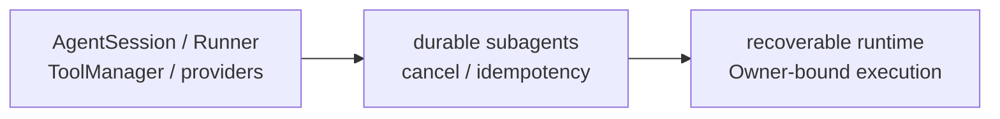

# Agent Runtime PLAN

状态：Active
最后更新：2026-08-03
Owner：Runtime maintainers

## Current Status

- `AgentSession` + `ConversationRunner` is the single model-driven loop for Base and all roles.
- ToolManager enforces base / role / surface layers, role visibility and confirmed-tool gates.
- Tool results, delivery evidence, artifact manifests, provider failures and context compaction have structured runtime facts.
- OpenAI-compatible、Anthropic and Ollama adapters share normalized message/tool boundaries.
- Subagent role dispatch works through shared sessions; in-flight state remains mainly memory-backed.
- BrowserCat/GuiCat drivers are deterministic adapters and do not run a second Agent/Chat/MCP loop.
- EngineerCat consumes the shared loop with a narrow coding/Skill allowlist, child-side `ask_parent`, and one role-scoped `codex_run` external executor adapter; parent-side controls and XiaoBa-owned nested job/session layers remain absent.
- EvolutionCat `remember` is a deterministic role tool over the existing session-person memory contract.
- Terminal SubAgentSession runs persist standard child `traces.jsonl` with parent, role, selected-skill, tool-result and artifact lineage for nightly evolution and debugging.
- `evolution sleep` uses the lightweight Evolution control workflow; the old typed-route runner is deleted.
- Narrow SubAgent workflows can enforce `allowedWriteRoot` across file tools and macOS Seatbelt-confined Shell; unavailable native sandbox execution fails closed.
- Case Replay defaults to an isolated child with a read-only ToolManager; workspace writes require an enforced clean runtime and never expose delivery / Browser / GUI / Secretary tools.
- EngineerCat Source Candidate runs in a secret-free source copy；build and ordinary tests run under a native sandbox, while the two sandbox-in-sandbox contract files run separately with their own native sandbox；source + dist activation is scoped to the next process.
- XiaoBa is a product runtime with a reusable harness core, not yet a public general-purpose Harness SDK.
- Session/model/tool spans can be exported through the default-off OTLP/HTTP bridge; graceful runtime shutdown flushes spans while collector failure remains fail-open.

## Milestones

1. Shared AgentSession/ConversationRunner loop：completed。
2. Layered ToolManager and canonical ToolResult：completed for maintained paths。
3. Provider adapter normalization：completed for current adapters。
4. Structured failure/delivery/artifact/compaction evidence：completed for current paths。
5. Role-only subagent dispatch：completed。
6. Durable in-flight subagent recovery and action receipts：partial/not started。
7. Provider/Shell end-to-end cancellation：partial。
8. Public Harness SDK extraction：not a current product milestone。
9. Standard `traces.jsonl` for terminal SubAgentSession runs：completed。
10. Lightweight Evolution control：completed；old typed-route runner removed。
11. Bounded SubAgent write root：completed for file tools and macOS Seatbelt Shell；other platforms fail closed when a bounded workflow requests Shell。
12. Native EngineerCat fallback：completed；small changes and external-executor failure continue through the shared SubAgentSession/ConversationRunner coding tools。
13. OTel trace bridge：completed for session/model/tool spans, W3C parent continuity, redacted OTLP/HTTP export and graceful flushing；metrics/logs export remains out of scope。
14. Replay effect boundary：completed for default read-only and macOS clean-runtime workspace-write；other platforms fail closed。
15. Source Candidate runtime boundary：completed for isolated EngineerCat, full Test and next-process source + dist activation。
16. Narrow EngineerCat Codex adapter：completed；one role-scoped Tool, no job manager/supervisor, native coding fallback retained。

## Next Steps

- Persist existing parent/child status, pending confirmations, resume cursor and action receipts.
- Carry authenticated principal and Owner authority through ToolExecutionContext.
- Complete AbortSignal propagation through providers, child processes and retry waits.
- Reduce remaining prose-based legacy ToolResult/artifact inference.
- Package and release-verify BrowserCat/GuiCat adapters without adding driver-side model loops.
- Release-build the optional native Codex package on Windows and Linux; runtime source/build plus macOS arm64 packaged start/resume are verified.

## Owners

- Session lifecycle：`src/core/agent-session.ts`
- Agent loop：`src/core/conversation-runner.ts`
- Subagents：`src/core/sub-agent-*`
- Providers：`src/providers/**`
- Tools and execution types：`src/tools/**`, `src/types/**`

## Acceptance Criteria

- Every assistant tool call has a matching terminal tool result.
- Failure, timeout, cancel and blocked states are structured and auditable.
- Provider transcript, working trace and durable session remain distinct boundaries.
- Confirmed tools are hidden or blocked unless confirmation matches actor and payload.
- Base and all eight roles use the same runtime loop.
- EngineerCat coding tasks use the shared tool contract through an explicit allowlist; Base externally owns SubAgent lifecycle, EngineerCat may only use `ask_parent` as the child uplink, and the only external model loop is the bounded `codex_run` Tool. It has no parent-side controls or role-local job manager/supervisor.
- External drivers are fixed, bounded capability adapters with version, timeout and trust evidence.
- A SubAgent with `allowedWriteRoot` cannot use file tools or Shell to write outside that root; workflows must hide any separate write control plane that can choose another cwd.
- A default Case Replay cannot call write, Shell, delivery, Browser, GUI or Secretary tools; explicit write Cases require an enforced clean runtime.
- A Source Candidate cannot read production source or write outside its candidate/test roots during Test; passing code activates only for the next process.
- Runtime architecture changes update this PLAN and [`SPEC.md`](SPEC.md) only.
- Enabling OTLP export does not change Agent outcomes or expose prompt, tool argument, file-content or free-form error attributes.

## Risks / Open Questions

- Process crashes can still lose in-flight child state.
- A successful external side effect followed by a lost response can still be repeated.
- Full provider/Shell cancellation is incomplete.
- Tool processes that deliberately detach from the supervised worker group can still require tool-specific cancellation evidence.
- Owner identity is not yet a first-class runtime authorization fact.
- Native `workspace_write` Replay and Source Candidate Test currently fail closed outside macOS.

## Recent Verification

- SubAgent boundary tests include traversal, absolute-path and symlink rejection plus an actual Seatbelt attempt outside `allowedWriteRoot`; `npm test` passed 561/561 tests across 102 suites and `npm run build` passed.
- OTel runtime tests verify session/model/tool-compatible parent topology, incoming W3C ancestry, graceful flushing and fail-open collector errors without changing local span evidence.
- EngineerCat runtime tests verify the coding/Skill/`ask_parent` allowlist, one `codex_run` role tool, the absence of parent-side controls and nested job/session/supervisor tools, plus start/resume, access mode, AbortSignal, secret filtering and artifact evidence.
- A production-path E2E drove `codex_run` through the real AgentSession, ConversationRunner and ToolManager, then resumed the returned thread id on the next user turn with zero changes, commands, external tools or errors.
- Real official-SDK read-only start/resume smoke kept one thread id and produced zero file changes and zero external tool calls; macOS arm64 Electron packaging and an App-contained adapter resume from `/tmp` also passed with no old supervisor payload or duplicate native binary.
- Terminal child trace tests cover success, failure, stop, selected-skill, parent lineage and real tool/artifact results.
- Lightweight Evolution tests cover deterministic Candidate packaging, shared Test/Eval control, fail-closed code Findings, atomic Role/Skill activation and rollback.
- A real Source Candidate validation completed build, ordinary repository tests and the separate native-sandbox contract phase inside the candidate boundary; it passed without activating production source.
- A real-provider Arena `base_skill` proof exposed and fixed Base aliases being resolved as missing Role packages; focused ToolManager/Arena tests now cover the Base tool set without a role package.
- UserCat now hashes the overflow of long Arena run ids instead of truncating away scenario identity, so multi-case pressure keeps distinct native Pet sessions.
- Isolated Arena Role profiles now reuse the production ToolManager with an explicit snapshot-derived role policy: registered tools, provider-visible tools, role-native adapters, allow/deny rules and surface delivery tools are computed rather than hard-coded, without mutating global role resolution state.
