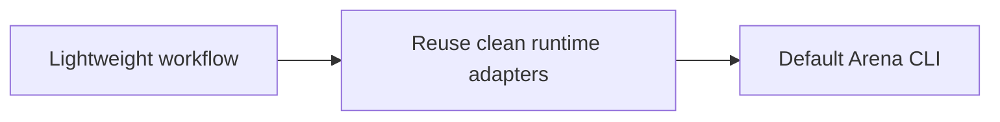

# Arena PLAN

状态：Active
最后更新：2026-07-29
Owner：Arena maintainers

## Current Status

- Arena 的定位已收敛为“UserCat 模拟用户的 Agentic Eval”。
- `Scenario → UserCat↔Subject → Trace → InspectorCat → Finding+Case → shared Eval` 已实现为轻量 workflow。
- 用户可提供 Scenario；缺省时 UserCat proposer 生成一个。
- InspectorCat 输出严格配对的 Finding+Case；无 Case 直接 pass。
- ArenaResult decision 已统一为 `pass | fail | blocked`。
- `xiaoba arena evaluate` 已接通已安装 Role/Skill 的轻量 Scenario workflow。
- `arena skill` 与 `arena run execute/worker` 已切到同一个 Arena service。
- Subject interaction adapter 返回标准 AgentSession Trace，而不是 UserCat package trace。
- imported subject 的 snapshot 与 clean runtime 已收敛为隔离 adapter。
- SkillsBench/effectiveness 实验 scorer 已删除。
- 旧 scorecard worker、run index、promotion、patch regression 和专用 Reviewer replay Tool 已删除。

## Milestones

1. Arena 产品语义收敛：completed。
2. Scenario / ArenaResult 最小 contract：completed。
3. UserCat Scenario fallback：completed。
4. Inspector Finding+Case adapter：completed。
5. Shared Eval integration：completed at orchestration boundary。
6. 删除实验 effectiveness scorers：completed。
7. 新轻量 CLI：completed；installed/imported Role/Skill 均进入同一 service。
8. 删除旧 scorecard / promotion / patch regression：completed。
9. 可选 A/B compare：not started；非默认路径。

## Next Steps

- 从真实 Arena Trace 回归高价值 Finding+Case，并逐步纳入共享 CaseSet。
- 只有真实副作用 Case 需要时，才扩展非 macOS 的 enforced Replay adapter。
- 核心单 Subject 流程稳定后，再决定是否增加最小 A/B compare。

## Owners

- Workflow：`src/arena/arena-workflow.ts`
- Scenario：`src/roles/user-cat/scenario.ts`
- Inspection：`src/roles/inspector-cat/finding-case.ts`
- Production composition：`src/arena/arena-service.ts`
- Subject/runtime isolation：`src/arena/arena-manager.ts`, `src/arena/arena-runner.ts`

## Acceptance Criteria

- Scenario 是唯一 Arena 入口 seed；无用户输入时才由 UserCat 生成。
- UserCat Trace 与真实用户 Trace 使用同一 schema。
- Inspector 一次检查原始 Trace，只输出 0..n Finding+Case。
- ReviewerCat 不直接判断 Scenario Trace。
- 所有 Case 通过 shared Eval；Arena 无重复 evaluator。
- Replay Trace 不递归进入 Inspector。
- Arena 只输出一个 ArenaResult；Report 只展示。

## Risks / Open Questions

- clean runtime 当前依赖平台 sandbox 能力；受限执行不可用时必须 fail closed。
- “无 Case = pass”代表本 Scenario 未发现可回归反例，不等于证明全局能力。

## Recent Verification

- 清理后 `npm test` passed 556/556 across 100 suites。
- 清理后 Arena/Evolution focused tests passed 71/71 across 10 suites。
- 清理后 `npm run build` passed。
- Contract smoke passed 23/23 cases。
