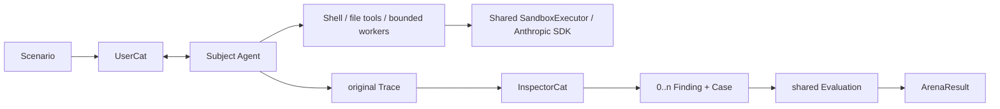
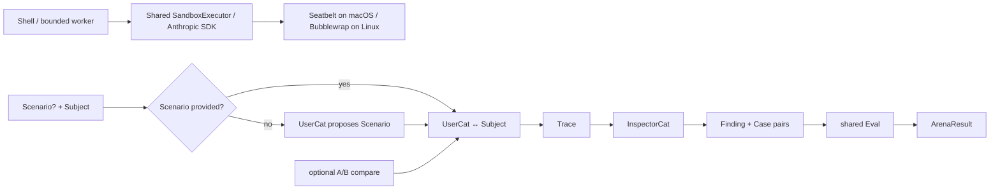

# Arena SPEC

状态：Active
最后更新：2026-07-29
适用范围：UserCat 模拟用户的 Agentic Eval 工作流。

本文是 XiaoBa-CLI `Arena` 模块的唯一架构真相源。Arena 是整条工作流的名字，不是图中的一个裁决节点。

## Problem

固定 Case 能验证已知行为，却不容易发现真实用户会触发的新问题。Arena 让 UserCat 像普通用户一样与被测 Agent 多轮互动，再把发现的问题回归为可重复执行的 Case。

Arena 不再拥有另一套 evaluator。它只负责：

1. 获得一个 Scenario。
2. 让 UserCat 与 Subject 通过真实 Agent Runtime 互动。
3. 保存与普通用户 Trace 同 schema 的原始 Trace。
4. 让 InspectorCat 把有证据的问题变成 `Finding + Case`。
5. 调用共享 Eval 验证这些 Case。

## Scope

In scope:

- Skill 或 Role Subject。
- 用户提供 Scenario，或缺省时由 UserCat 生成一个小而真实的 Scenario。
- UserCat 与 Subject 的自然多轮互动。
- InspectorCat 单次检查原始 Scenario Trace。
- 0..n 个配对的 Finding + executable Case。
- 调用 shared Evaluation，并汇总 ArenaResult。
- 可选 A/B compare；它是模式，不改变核心单 Subject 流程。

Out of scope:

- 自己实现 Replay、Verifier、Reviewer Judge、Scorecard 或 Regression。
- Candidate promotion / activation。
- 把 ReviewerCat 放在 Scenario Trace 后直接裁决。
- 对 Eval 产生的 Replay Trace 再递归 Inspector。
- SkillsBench calibration、effectiveness scorer 和多层可信度状态。
- 将 UserCat Trace 设计成与用户 Trace 不同的证据类型。

## Current Architecture

`xiaoba arena evaluate`、`xiaoba arena skill` 和 `xiaoba arena run execute/worker` 已统一调用轻量 Arena service。它支持用户给 Scenario，缺省时调用 UserCat；interaction adapter 只把标准 AgentSession Trace 交给 Inspector，不把 UserCat 自己的 package trace 当作另一种证据；存在 Case 时统一调用 shared Evaluation。

imported subject 仍通过 snapshot 和 clean runtime 隔离执行，但 clean runtime 只负责准备环境、启动 worker 和取回 `ArenaResult`。旧 scorecard worker、run index、promotion、patch regression 与专用 Reviewer replay Tool 已删除。



## Target Architecture

默认 Arena 命令直接调用轻量工作流。现有 subject snapshot 和 clean runtime 可作为 adapter 继续复用，但不能再形成第二套结果体系。



## Core Contracts

### Scenario

Scenario 是用户级使用情境：

```text
scenario_id
user_context
goal
constraints[]
turn_budget
```

它不是 Case，也不含 Oracle、隐藏评分标准或预写对话。用户可直接输入；没有输入时 UserCat 只生成这一小段 seed。

### Subject

Subject 是被探索的 Skill 或 Role 快照。Arena runtime 可以隔离挂载它，但它的 lifecycle 不属于 ArenaResult。

### Finding + Case

InspectorCat 输出严格配对：

- Finding 描述 Trace 中可引用的问题。
- Case 把问题变成能由 Replay 重新执行的输入。
- Finding 必须引用原始 Scenario Trace。
- 没有可回归问题时返回空集合，不增加“不可执行 Finding”状态。

### ArenaResult

ArenaResult 只保存 Scenario、Subject、原始 Trace refs、Finding+Case 和共享 EvaluationResult。

decision 规则：

- 无 Case：`pass`。
- 任意 Outcome `fail`：`fail`。
- 无 fail 且任意 Outcome `blocked`：`blocked`。
- 其余：`pass`。

## Stable Boundaries

- UserCat 只模拟用户，不设计 Oracle、不评审、不打分。
- UserCat 与真实用户 Trace 进入同一证据管道。
- InspectorCat 只做 `Trace → Finding + Case`，不修复、不路由、不裁决。
- ReviewerCat 只在 shared Eval 的语义 Judge 阶段出现。
- 原始 Scenario Trace 只检查一次；Replay Trace 不回流 Inspector。
- Arena 是独立发现工作流，不是 Evolution activation gate。
- A/B compare 仅保证两边使用等价 Scenario/Case 条件，不引入新的 Case 类型。

## Implementation Layout

```text
src/arena/arena-workflow.ts          lightweight workflow contracts
src/arena/arena-service.ts           production composition + ArenaResult persistence
src/arena/subject-interaction.ts     UserCat/Subject -> standard Trace
src/roles/user-cat/scenario.ts       Scenario fallback
src/roles/inspector-cat/finding-case.ts
src/eval/evaluation.ts               shared Eval
src/arena/arena-manager.ts           subject snapshot + clean-runtime adapter
src/arena/arena-runner.ts            clean-runtime process/sandbox executor
src/commands/arena.ts                one lightweight Arena command family
arena/subjects/                      isolated subject snapshots
arena/runs/                          generated run evidence
```

## Interaction With Other Modules

- Agent Runtime 执行 UserCat、Subject 和 Replay。
- Roles & Skills 提供 UserCat、InspectorCat、ReviewerCat 与 Subject。
- Observability & Evidence 保存所有普通 Trace。
- Evaluation 对 Inspector 生成的 Case 做唯一裁决。
- Evolution 可以消费 Arena 发现的 Case，但 Arena 不决定 Candidate 激活。


## Shared sandbox execution

Clean-runtime launch uses `anthropic_sdk`, a secret-free `sandbox_policy_path` JSON and the shared SandboxExecutor. Legacy native engine CLI names map to this backend; unsandboxed fallback is removed. Evaluation workers receive selected model configuration and allowed provider destinations. See `../agent-runtime/SPEC.md` for the SDK contract.
