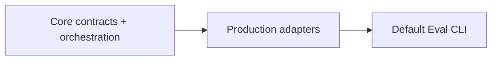

# Evaluation PLAN

状态：Active
最后更新：2026-07-29
Owner：Runtime / Evaluation maintainers

## Current Status

- Test / Eval / Trace / Case / Replay 的语义边界已确定。
- 轻量 `Case + Oracle → Replay → Trace → Verifier → ReviewerCat → Outcome` 核心已实现并测试。
- Case Replay adapter 已能驱动当前 Pet/Agent Runtime，并且只返回 fresh Trace ref；生产默认通过隔离子进程执行。
- ReviewerCat Judge adapter 使用独立只读 Session 和结构化输出。
- Outcome 只保留 `pass | fail | blocked`；EvaluationResult 只保存事实。
- BaseRuntime 预写响应已迁到 `test/scripted-runtime/**`、`src/testing/**` 和 `output/test/**`。
- 旧 Scripted Runtime Test engine 已整体移入 `src/testing/**`；`src/eval/**` 只保留真实 Agent Eval。
- 真实 CaseSet CLI 已接入；Verifier registry 保持为 `trace_exists`、`no_failed_tools` 与 `read_only_tools` 三项。
- 首个维护中的 `xiaoba-core-readonly-v1` 已建立，包含 Base、EngineerCat、ReviewerCat 三条真实 Agent Case。
- Replay 默认只读；`workspace_write` 必须显式声明并由 enforced clean runtime 承载，外部 delivery / Browser / GUI / Secretary 工具不进入 Replay。
- Arena 默认命令与 nightly Evolution 已调用同一个 Evaluation core。

## Milestones

1. 明确 Test / Eval / Replay 边界：completed。
2. 实现轻量 Evaluation core：completed。
3. 实现 ReviewerCat shared Judge adapter：completed。
4. 实现 Case Replay adapter：completed。
5. 将 Scripted Runtime Test 移出 Eval 公共语义：completed。
6. 接入最小生产 Verifier registry：completed；后续按真实 Case 需求扩展。
7. 提供真实 CaseSet CLI：completed。
8. 将旧 Eval-named Test engine 文件移出 `src/eval`：completed。
9. 建立首个维护中的真实 CaseSet：completed。
10. 建立 Replay effect isolation：completed for default read-only and macOS clean-runtime workspace-write；其他平台 fail closed。

## Next Steps

- 只在真实 Case 需要时增加新的 hard Verifier，避免搬回旧巨型 verifier registry。
- 用真实回归逐步扩充当前 CaseSet，不先造 benchmark taxonomy。
- 只在实际维护相关代码时逐步收敛 `src/testing/**` 内部旧 `Eval*` 类型名，不单独发起机械改名。

## Owners

- Shared Eval：`src/eval/evaluation.ts`
- Reviewer Judge：`src/eval/reviewer-cat-judge.ts`
- Replay：`src/replay/**`
- Scripted Runtime Test：`src/testing/**`, `test/scripted-runtime/**`

## Acceptance Criteria

- 预写模型响应永远不被报告为 Agent Eval。
- Replay 驱动真实 Agent、产生 fresh Trace，且不输出 pass/fail。
- Replay 缺省只暴露只读工具；写入模式必须在 enforced clean runtime 中执行。
- 每个 execution 只有一个 Outcome。
- Verifier hard failure 否决 Reviewer pass。
- ReviewerCat fresh、只读、结构化，且看到同 Case 的全部 runs。
- Arena 和 Evolution 调用同一个 Evaluation runner。
- Report 和可选 Gate 不产生第二份权威 Result。

## Risks / Open Questions

- `workspace_write` 的原生 clean-runtime sandbox 当前只支持 macOS；其他平台 fail closed。
- 当前维护 CaseSet 只有三条只读 Case，尚不代表广泛 Agent 能力。
- 旧 Test engine 的内部类型仍带少量 `Eval*` 名称；它们已被限制在 `src/testing/**`，后续随实际修改逐步收敛。

## Recent Verification

- `npm run build` passed。
- 清理后 `npm test` passed 556/556 across 100 suites。
- Scripted Runtime Test focused tests passed 45/45。
- Contract smoke passed 23/23。
- `npm run test:base-runtime -- --allow-fail` passed 11/11。
- `npm run test:check-scripted-runtime` passed 1 manifest / 11 cases。
- Source Candidate、Replay isolation 与 maintained CaseSet focused tests passed 22/22 across 6 suites。
- 旧 `src/eval` Test engine 路径引用检查为零，`git diff --check` passed。
