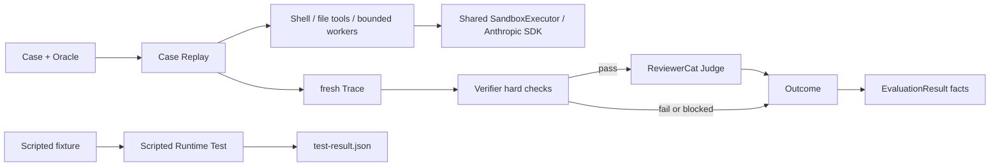
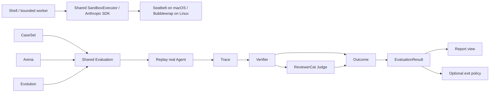

# Evaluation SPEC

状态：Active
最后更新：2026-07-29
适用范围：Test、Case Replay、Agent Eval、Verifier、ReviewerCat Judge。

本文是 XiaoBa-CLI `Evaluation` 模块的唯一架构真相源。

## Problem

工程正确性和 Agent 行为能力不是同一件事：

- Test 验证代码、Runtime、Tool、协议和安全约束是否按实现工作。
- Eval 验证真实 Agent 面对任务时能否完成，以及成功率、稳定性、安全性和成本。
- Trace 是两者共享的运行证据。
- Case 是两者可共享的可执行输入。
- Replay 只执行 Case 并产生新 Trace，不负责裁决。

任何预写模型响应或工具调用序列都只能叫 `Scripted Runtime Test`，不能作为 Agent 行为能力证据。

## Scope

In scope:

- `src/eval/evaluation.ts` 的 Case、Oracle、Outcome 和 EvaluationResult。
- `src/replay/case-replay.ts` 的真实 Runtime Replay adapter。
- `src/eval/reviewer-cat-judge.ts` 的共享语义 Judge。
- Verifier hard checks、重复运行和事实聚合。
- `src/testing/**` 与 `test/scripted-runtime/**` 的 Test 语义边界。

Out of scope:

- Trace 的持久化和脱敏，属于 Observability & Evidence。
- UserCat 场景探索，属于 Arena。
- Candidate 生成与激活，属于 Roles & Skills 的 Evolution 控制 DAG。
- 把 Report、Gate 或 Dashboard 状态作为第二套裁决。

## Current Architecture

轻量 Eval 核心已经实现。`runEvaluation` 默认每个 Case 运行三次；每次 Replay 都必须产生 fresh Trace，Verifier 硬失败直接形成 Outcome，硬检查通过后才由独立只读 ReviewerCat Session 做语义判断。状态只有 `pass | fail | blocked`。

旧的预写响应 runner 仍作为内部兼容实现存在，但公共入口已迁到 `src/testing`，命令和产物统一使用 Scripted Runtime Test 语义。`xiaoba eval run --case-set <file>` 已直接组合真实 Case Replay、最小 hard Verifier registry 和 ReviewerCat Judge；当前 registry 只内置 `trace_exists`、`no_failed_tools` 与 `read_only_tools`。首个维护中的 `eval/case-sets/xiaoba-core-readonly.json` 包含三条不预写模型响应的真实 Agent Case。

Replay 默认使用 `read_only` policy，只向被测 Agent 暴露 `read_file`、`glob` 和 `grep`。Case 可以显式声明 `workspace_write`，但该模式只有在 Arena/Evolution 提供 enforced clean runtime 时才开放工作区文件与 Shell 工具；外部消息、Browser、GUI 和 Secretary 工具不属于 Replay 能力集。



## Target Architecture

目标只保留一个 Eval 执行与裁决链。Arena 和 Evolution 只调用它，不拥有自己的 Replay、Judge、Scorecard 或 Regression 实现。



## Core Contracts

### Case

`Case` 是可执行输入，不是运行状态：

```text
case_id
task
setup?
  sandbox?: read_only | workspace_write
budget?
oracle:
  hard_verifiers[]
  semantic_criteria[]
source?:
  trace_refs[]
  finding?
```

Case 不包含预写模型响应、裁决、生命周期或 promotion 状态。

### ReplayResult

ReplayResult 只表达执行是否完成：

- `completed`：产生 fresh `trace_ref`。
- `blocked`：未能完成真实执行。

它不能返回 pass/fail。

### Outcome

一次 Case execution 只有一个权威 Outcome：

- `pass`：硬约束与语义标准均满足。
- `fail`：观察到反例或安全失败。
- `blocked`：无法形成有效判断。

Verifier hard failure 具有否决权。ReviewerCat 只判断通过硬检查的运行。

### EvaluationResult

EvaluationResult 保存 Outcomes 和成功率、稳定性、安全、延迟、token、成本等事实，不再生成 overall verdict。Report 只渲染它。

## Stable Boundaries

- ReviewerCat 每次正式 Judge 使用 fresh Session、只读 evidence、结构化输出。
- ReviewerCat 一次看到同一 Case 的全部 Replay runs，但只为硬检查通过的 run 返回 decision。
- ReviewerCat 缺失、重复或越界 decision 时对应运行 `blocked`，不能猜测。
- Historical Trace 可回归成 Case；正式 Replay 的输入仍是 Case。
- Trace 来源可标记 user、UserCat 或 replay，但 schema 与后续处理相同。
- Replay effect policy 属于 Case setup：缺省 `read_only`；`workspace_write` 必须由 enforced clean runtime 承载，否则 blocked。
- Benchmark 只是长期维护的 CaseSet，不是另一套 runner 或 result。
- Gate 若存在，只把 EvaluationResult 映射成进程退出策略。

## Implementation Layout

```text
src/eval/evaluation.ts             shared Eval contracts and orchestration
src/eval/evaluation-files.ts       CaseSet input and canonical result output
src/eval/verifier-registry.ts      minimal hard verifier registry
src/eval/reviewer-cat-judge.ts     ReviewerCat semantic Judge adapter
src/replay/case-replay.ts          Case -> real Runtime -> fresh Trace
src/replay/replay-services.ts      Replay-visible tools and effect policy
src/commands/eval.ts               real CaseSet Eval CLI
eval/case-sets/                     maintained real Agent CaseSets
src/testing/                       deterministic Test facade and implementation
test/scripted-runtime/             scripted Runtime fixtures
output/test/                       generated Test evidence
output/eval/                       generated Eval evidence
```

旧 Scripted Runtime Test engine 已物理迁入 `src/testing/**`。其内部仍保留少量 `Eval*` 兼容类型名，但不再位于 `src/eval`、不从 Eval 公共 API 导出，也不写入默认 `output/eval/**`。

## Commands

- `npm test`：工程测试。
- `npm run test:base-runtime`：预写模型动作的 Scripted Runtime Test。
- `npm run test:check-scripted-runtime`：Test fixture preflight。
- `npm run replay:trace`：历史 Trace 输入兼容入口；产生 fresh Trace。
- `xiaoba eval run --case-set <file>`：真实 Agent CaseSet Evaluation。
- `xiaoba eval run --case-set eval/case-sets/xiaoba-core-readonly.json`：维护中的只读核心 CaseSet。

## Interaction With Other Modules

- Agent Runtime 提供真实 AgentSession、ConversationRunner 和 ToolManager。
- Observability & Evidence 保存 fresh Trace 和 artifact refs。
- Roles & Skills 提供 ReviewerCat、被测 Role/Skill 和 Evolution 调用方。
- Arena 生成 Case 并调用本模块，不复制裁决链。


## Shared sandbox execution

Replay retains its read-only default and explicit workspace_write gate. Source Candidate build, ordinary tests and the native-contract phase now all execute through the shared SDK adapter on supported hosts; candidate tests no longer run directly on the host. See `../agent-runtime/SPEC.md` for the execution contract.
