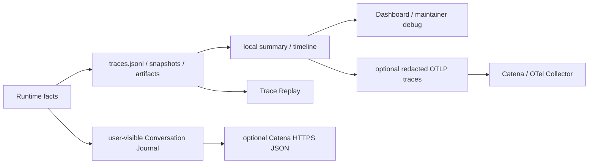

# Observability & Evidence PLAN

状态：Active
最后更新：2026-10-08
Owner：Runtime / evidence maintainers

## Current Status

- `traces.jsonl` is the faithful local runtime fact source.
- `session-log-projector` derives local summary and trace timeline from session logs.
- Context compaction emits events plus compact-after snapshots.
- Tool, artifact, delivery, provider failure and external receipt facts are represented in runtime evidence.
- Dashboard observability endpoints are read-only and return redacted projections.
- Observability does not accept benchmark source or decide pass/fail.
- Nightly evolution derives an atomic local digest from terminal trace rows with stable source refs; the digest is evidence projection only and never scores or promotes assets.
- The digest is built once by runtime and handed to InspectorCat as the first model stage; Observability still owns neither diagnosis nor routing.
- The shared session/model/tool span topology can be projected through a default-off OTLP/HTTP protobuf exporter; external strings are allowlisted, lifecycle shutdown flushes pending batches and collector failure is fail-open.
- Retention, encryption, durable in-flight state and user-controlled deletion remain incomplete.
- The XiaoBaOS-only Conversation Journal is implemented for CLI, Feishu,
  Weixin, and Pet. It records only user-visible input and successfully delivered
  text/file output, then optionally projects new rows to Catena without changing
  local delivery outcomes.

## Milestones

1. Local session JSONL fact source：completed。
2. Session-log projection and local summary：completed。
3. Context compaction evidence：completed。
4. Source-acceptance/governance removal from Observability：completed。
5. Redacted Dashboard read boundary：completed for current API。
6. Retention/delete/encryption policy：not started。
7. Durable in-flight task/action evidence：partial/not started。
8. Read-only nightly evolution digest over terminal traces：completed。
9. Optional OTLP/HTTP trace exporter：completed for session/model/tool spans；default-off、redacted、fail-open，local JSONL remains authoritative。
10. XiaoBaOS Conversation Journal + Catena HTTPS export：completed for CLI、Feishu、Weixin、Pet current-message paths。
11. Barena one-shot W3C parent propagation：completed for `xiaoba chat --message` through `TRACEPARENT`。

## File-system memory migration

- Owner: Runtime with Observability & Evidence for Markdown layout.
- Completed: bounded per-request index loading, role-owned replacement/forget,
  preservation of manual Markdown and non-resurrection after archive.
- Acceptance: a new Session instance sees saved preferences; unrelated sessions
  stay isolated; manual edits refresh; memory is absent from stored transcript.
- Next: observe session-scoped task follow-ups; cross-surface person binding is out of scope.

## Next Steps

- Move remaining direct metric writers behind session-log projection or explicit standalone mode.
- Define local retention and user-controlled deletion without altering faithful trace semantics.
- Add durable parent/child/action receipts needed for crash recovery.
- Keep raw provider payload and full pre-compaction snapshots opt-in rather than default.
- Keep Case creation and long-lived CaseSet admission outside Observability.
- Keep Conversation local-first and fail-open. Add historical backfill or a
  durable upload cursor only when a real offline-sync requirement exists; never
  reconstruct authoritative user-visible history from Trace spans.

## Owners

- Session evidence writer：`src/utils/session-turn-logger.ts`
- Projection/local summary：`src/observability/**`
- Durable roots：`logs/**`, `data/**`, `memory/**`, `output/**`
- Runtime evidence producers：`src/core/**`, `src/tools/**`, `src/roles/**`

## Acceptance Criteria

- Local summary facts resolve back to a durable session trace or explicit standalone run.
- Compaction events resolve to same-session snapshots by stable ids.
- Tool, artifact and delivery evidence remain structured and locally auditable.
- Dashboard/API projections redact sensitive preview and path/token values.
- Observability cannot accept, patch or score benchmark source.
- OTLP trace export is explicit opt-in, preserves parent/child topology, excludes prompt/tool/file previews and never changes Agent outcomes when the collector is unavailable.
- Evidence architecture changes update this PLAN and [`SPEC.md`](SPEC.md) only.

## Risks / Open Questions

- Faithful local traces may retain sensitive content longer than users expect.
- Crash recovery lacks a complete durable child/action journal.
- Historical v2/v3 logs still contain mixed naming and evidence shapes.

## Recent Verification

- 2026-10-08: build passed; file-memory/runtime/Role focused tests passed 33/33;
  repository regression passed 591/592. The sole failure remains the existing
  Evolution descendant-process timeout assertion in this cloud container.
  Coverage proves fresh Session recall, edit refresh, root consistency, bounded
  and scoped reads, correction/forget, archive exclusion, legacy Markdown upgrade,
  managed-block integrity and non-persistence of injected memory.

- `npm run build` and `npm test` 575/575 across 104 suites pass after the
  Conversation slice. Focused Journal/surface/CLI/Feishu/Weixin/Pet coverage
  passes 52/52, including concurrent sequence allocation, idempotency,
  successful-delivery filtering, invalid content, bounded export timeout, and
  Trace correlation.
- A real `ConversationJournal` wrote two ordered Pet rows locally and exported
  them through a personal API token to Catena; Catena rendered the user text,
  assistant text, file, Role, and shared 32-hex Trace ID.
- OTel focused tests cover parent/child ids, incoming W3C ancestry, resource identity, string allowlist privacy, real loopback OTLP/HTTP protobuf delivery, header decoding, invalid endpoints and unavailable-collector fail-open behavior.
- CLI option coverage verifies that one-shot chat forwards `TRACEPARENT` to `AgentSession`,
  allowing Catena to join Barena Run/Turn spans with XiaoBa session/model/tool spans.
- A real Barena run on 2026-08-12 propagated a distinct W3C parent into each XiaoBaOS
  one-shot turn. Catena retained both `xiaoba.session` and `xiaoba.model.call` beneath the
  corresponding `barena.turn` in Trace `77ef5a0aba8aaed1c85bfcb146d56502`.
- Final build plus focused CLI/observability verification passed 23/23 tests.
- Full repository tests pass 576/576 across 104 suites；`npm run build` passes.
- Deterministic harvest tests cover timestamp windows across date directories, malformed/non-terminal rows, test/replay/self-run exclusion, runtime-stamped custom replay provenance, stable observation ids and atomic reruns.
- Real harvest for `2026-07-13` scanned 124 trace files, excluded 44 synthetic/replay rows and correctly returned 0 production observations / 0 patterns.

## Proactive memory maintenance

Owner: Evidence. Completed: private Journal target registry, 256 KB incremental windows, cursor and source-boundary checks, single active-index batch write, archive-first retention, suppression, failed Event receipts and shared job/day admission. Acceptance verified: new appends are deferred, malformed proposal/failure never advances progress, concurrent edits win, archives are not automatically recalled, scoped histories never mix. Next: install cron and inspect real maintenance traces; old sessions register when next used. Risks: boundary hashes assume append-only history, semantic paraphrases need Agent judgment, interrupted locks require process inspection. Verification: build, focused 39/39 and isolated Pet 18/18 passed; full regression retry passed 605/606; only the previously known Evolution descendant-process SIGKILL assertion fails in this cloud container. The initial run also hit the known Node 24 test IPC flake; isolated Pet passed 18/18 and that failure disappeared on the full retry.

## Shared scheduled events

Owner: Evidence. Completed: schedule config in data/scheduler, daily Event receipts in data/events, memory source progress remains separate; old memory .attempt files are no longer used. Scheduled failure/running state is retained for inspection, manual retry uses a fresh runtime Event. Acceptance: progress never advances on failed memory apply; no duplicate daily execution across restarts/DST; failed Evolution does not block Memory. Focused 45/46; full regression 615/616, with only the existing cloud descendant-process SIGKILL assertion failing.

Scope decision: continuity and memory remain scoped by sessionKey. Cross-surface person linking is explicitly out of scope; future follow-up work reuses that boundary.

## Session timed wakeups

Owner: Evidence. Completed: private atomic reminder records, owner-scoped capacity, per-record mutation/delivery locks, revision-based session.wakeup.due Events, no blind failed/interrupted replay, bounded Tool listing. Verified invalid time/ID rejection, immutable owner, restart restoration, cancellation/reschedule, concurrent scans, failed delivery and explicit retry. Next: record-retention policy and optional management UI; crashes need process/remote-delivery inspection before recovery. Build and focused 47/47 passed; full regression 630/631 passed; the sole failure remains the pre-existing cloud Evolution descendant-process SIGKILL assertion.

## Agent-owned app connections

Owner: Evidence. Completed: Agent config version 1, private atomic writes/locks, environment references only, no session-owned credentials, bounded/redacted public outputs and existing ToolResult/trace integration. The private Agent credential source is implemented below; next is subscription progress evidence when those subscriptions exist.

Verification: TypeScript build and focused native connector / Feishu boundary / role-tool tests 39/39 passed, including real AgentSession confirmed-write execution with mocked official HTTP. Full regression 650/651 passed; the only failure remains the pre-existing cloud Evolution descendant-process SIGKILL assertion. Live app accounts are not yet verified.

## Dashboard connection management

Owner: Evidence. Completed: Agent-owned private credential file, strict finite schema/size bounds, directory 0700/file 0600, exclusive write lock, atomic rename, write-only API and file-first/environment-fallback credential provider. New and running runtimes share saved authorization; config still stores references/enabled state only. Changed Google client discards old refresh authorization. Offline refresh token is persisted; OAuth access token/code are not. The local credential file is not encryption or a hostile-tenant sandbox.

Verified save/read/restart behavior, private file permissions, malformed-state denial, secret-free status/config responses, cancellation/expiry/replay/client-change/disconnect races and existing transcript redaction. Build and focused 34/34 passed, Chromium UI flows passed with simulated providers, full regression 658/659 passed (existing cloud Evolution process-group assertion only). Next: real account verification and optional OS credential storage when needed; no new chat credential tool or subscription store.

Dashboard simplification: completed. Three authorization-only cards reuse existing Skills/Store components and the shared modal/config fields; no requester/scope/Feishu/control panel remains. Token connection and Google callback verify accounts automatically. All configured/enabled app operations are available by default to valid main sessions; retired grants are ignored/removed on the next write. Google OAuth covers all implemented mail operations through gmail.modify. Write confirmation and existing role/child boundaries remain intact.

Verification: build and focused 50/50 passed, including cross-surface default reads/writes, old-config migration, retired API absence and exact write-confirmation tests. Real Chromium validated shared computed card styles, token/OAuth connection, all-operation defaults, disconnect, mobile modal and Electron renderer external authorization with mocked providers and no page errors. Full regression 658/659 passed; the sole failure remains the pre-existing cloud Evolution descendant-process SIGKILL assertion. Real provider credentials/consent and native OS browser launch remain user-host checks.
