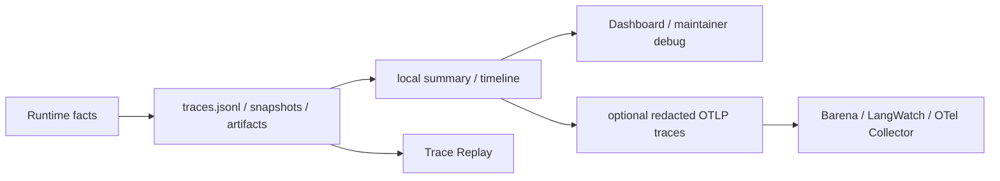

# Observability & Evidence PLAN

状态：Active
最后更新：2026-07-29
Owner：Runtime / evidence maintainers

## Current Status

- `traces.jsonl` is the faithful local runtime fact source.
- `session-log-projector` derives local summary and trace timeline from session logs.
- Context compaction emits events plus compact-after snapshots.
- Tool, artifact, delivery, provider failure and external receipt facts are represented in runtime evidence.
- Dashboard observability endpoints are read-only and return redacted projections.
- Observability does not accept benchmark source or decide pass/fail.
- Nightly evolution derives an atomic local digest from terminal trace rows with stable source refs; the digest is evidence projection only and never scores or promotes assets.
- The digest is built once by runtime and handed to InspectorCat as the first model stage; Observability still owns neither diagnosis nor routing.
- The shared session/model/tool span topology can be projected through a default-off OTLP/HTTP protobuf exporter; external strings are allowlisted, lifecycle shutdown flushes pending batches and collector failure is fail-open.
- Retention, encryption, durable in-flight state and user-controlled deletion remain incomplete.

## Milestones

1. Local session JSONL fact source：completed。
2. Session-log projection and local summary：completed。
3. Context compaction evidence：completed。
4. Source-acceptance/governance removal from Observability：completed。
5. Redacted Dashboard read boundary：completed for current API。
6. Retention/delete/encryption policy：not started。
7. Durable in-flight task/action evidence：partial/not started。
8. Read-only nightly evolution digest over terminal traces：completed。
9. Optional OTLP/HTTP trace exporter：completed for session/model/tool spans；default-off、redacted、fail-open，local JSONL remains authoritative。

## Next Steps

- Move remaining direct metric writers behind session-log projection or explicit standalone mode.
- Define local retention and user-controlled deletion without altering faithful trace semantics.
- Add durable parent/child/action receipts needed for crash recovery.
- Keep raw provider payload and full pre-compaction snapshots opt-in rather than default.
- Keep Case creation and long-lived CaseSet admission outside Observability.

## Owners

- Session evidence writer：`src/utils/session-turn-logger.ts`
- Projection/local summary：`src/observability/**`
- Durable roots：`logs/**`, `data/**`, `memory/**`, `output/**`
- Runtime evidence producers：`src/core/**`, `src/tools/**`, `src/roles/**`

## Acceptance Criteria

- Local summary facts resolve back to a durable session trace or explicit standalone run.
- Compaction events resolve to same-session snapshots by stable ids.
- Tool, artifact and delivery evidence remain structured and locally auditable.
- Dashboard/API projections redact sensitive preview and path/token values.
- Observability cannot accept, patch or score benchmark source.
- OTLP trace export is explicit opt-in, preserves parent/child topology, excludes prompt/tool/file previews and never changes Agent outcomes when the collector is unavailable.
- Evidence architecture changes update this PLAN and [`SPEC.md`](SPEC.md) only.

## Risks / Open Questions

- Faithful local traces may retain sensitive content longer than users expect.
- Crash recovery lacks a complete durable child/action journal.
- Historical v2/v3 logs still contain mixed naming and evidence shapes.

## Recent Verification

- OTel focused tests cover parent/child ids, incoming W3C ancestry, resource identity, string allowlist privacy, real loopback OTLP/HTTP protobuf delivery, header decoding, invalid endpoints and unavailable-collector fail-open behavior.
- Full repository tests pass 556/556 across 100 suites；`npm run build` passes.
- Deterministic harvest tests cover timestamp windows across date directories, malformed/non-terminal rows, test/replay/self-run exclusion, runtime-stamped custom replay provenance, stable observation ids and atomic reruns.
- Real harvest for `2026-07-13` scanned 124 trace files, excluded 44 synthetic/replay rows and correctly returned 0 production observations / 0 patterns.
