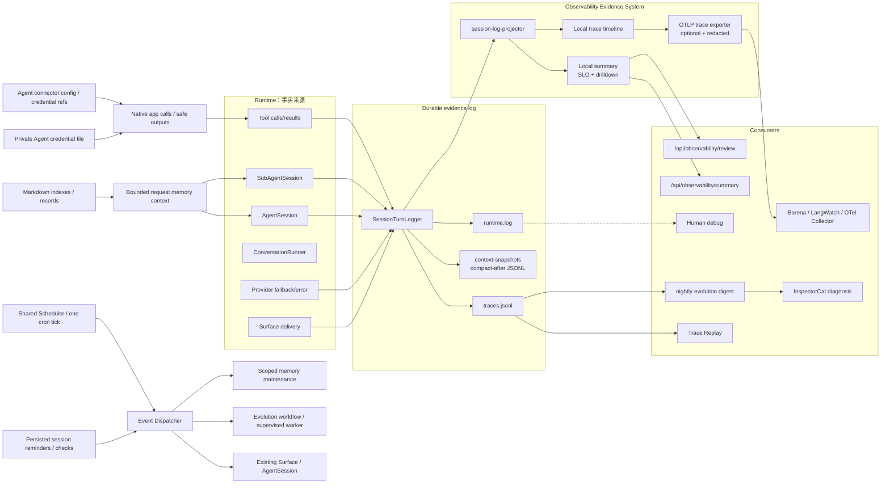
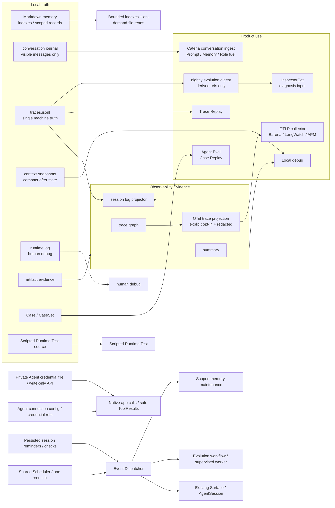

# Observability & Evidence SPEC

状态：Active
最后更新：2026-10-08

本文是顶层架构模块中的 **Observability & Evidence / 观测证据层** spec。它以本地 trace JSONL、durable state 和 artifact evidence 为事实源；当前实现可显式启用一个脱敏 OTLP trace 投影，但不会在本地 trace/log 写入前做清洗。

## Problem

XiaoBa 需要一套轻的观测证据系统：本地 trace JSONL 是 faithful local runtime 事实源，observability 只负责把 trace 事实投影成 local summary 和 trace drilldown，不能再长出第二套评测流水线。

术语边界：

- `session` 是长期会话，可以包含多条 trace。
- `trace` 是一次用户请求到本次 `ConversationRunner` while loop 截止的闭环，是本地 summary、dashboard drilldown 和 eval evidence 的最小用户意图单元。
- `turn` 只表示 `ConversationRunner` while loop 的一次推进。session-log-v2 中的 `entry_type="turn"` / `turn_id` / `turn` 是兼容命名；session-log-v3 新日志使用 `entry_type="trace"` / `trace_id` / `trace_index`。
- `event` 是 trace 内的离散事实，默认嵌在 `traces.jsonl` 主记录中；`runtime.log` 只做人类可读流水。

## Scope

In scope:

- 以 `SessionTurnLogger` / `logs/sessions/<surface>/<date>/<session_id>/traces.jsonl` 为本地 durable evidence source。
- 以 `data/conversations/<surface>/*.jsonl` 保存用户实际可见的 append-only Conversation Journal，并通过独立、可选、fail-open 的 Catena HTTPS 导出器同步；Conversation 不走 OTLP。
- `session-log-projector` 将 trace / embedded runtime_event 投影为 local summary。
- 本地 span/metric summary helpers，用于 standalone runner 或测试路径。
- 默认开启的 local in-process summary，优先从 session log 投影产生。
- Dashboard developer API：只读 summary / review state。
- 可选、默认关闭的 OTLP/HTTP trace exporter；它只投影脱敏 runtime span，不改变本地 evidence 写入和评测语义。

Out of scope:

- Benchmark admission、pass/fail、release decision。
- Benchmark source acceptance、source edit lifecycle、signed review artifacts or queue-based curation workflow。
- 原始 prompt、tool args、provider payload、file content 和 raw traceparent 的外部导出。
- metrics/logs 外部导出、外部 APM 后端部署与告警体系。
- benchmark source admission；需要进入 benchmark source 时，由对应 benchmark owner 重新整理 case。

## Current Architecture



Current implementation:

- `src/utils/session-turn-logger.ts` owns durable trace evidence, writes `logs/sessions/<surface>/<date>/<session_id>/traces.jsonl` and human runtime text to sibling `runtime.log`, and invokes `src/observability/session-log-projector.ts` after trace append.
- Context compression is first-class evidence: `context_compaction` runtime events are embedded in the next trace row, and successful compactions append a compact-after snapshot to sibling `context-snapshots/<session_id>.jsonl`; the event's `snapshot_ref` points at the matching snapshot line by `snapshot_id`.
- `src/observability/session-log-projector.ts` projects trace、embedded runtime_event、provider_error、delivery evidence and token facts into local summary.
- `src/observability/index.ts` owns local summary storage and local trace/span helpers；`src/observability/otel-trace-exporter.ts` bridges the same runtime span topology into an optional OTLP/HTTP protobuf exporter.
- Export is default-off and fail-open. The external attribute projection is allowlist-based for strings, keeps bounded scalar topology/status/count facts, and excludes prompt/tool/file previews plus free-form error messages.
- CLI、Feishu、Weixin、Pet and Dashboard graceful shutdown paths flush the exporter；normal one-shot processes also flush it on `beforeExit`.
- `AgentSession` records session lifecycle facts through `SessionTurnLogger`; its `ConversationRunner` is configured `mirror_only` so local summary does not double count runtime metrics.
- Standalone `ConversationRunner` can still record local metrics directly because it has no owning session log.
- `GET /api/observability/summary` returns aggregate and local trace facts derived from local logs, with raw prompt/tool preview attributes removed and sensitive freeform values such as paths/tokens redacted at the Dashboard API boundary.
- `GET /api/observability/review` returns readonly local observability state; it does not generate candidates, continuity reports, or benchmark source.
- `test:check-scripted-runtime` guards deterministic Test fixture references; observability has no Test/Eval source acceptance path.
- `src/roles/evolution-cat/evolution-observer.ts` reads terminal rows from all local session/subagent `traces.jsonl`, filters by row timestamp, excludes self-run/test/replay evidence, and atomically derives `output/evolution/sleep/<date>/digest.json` with stable trace refs. Runtime builds it once and hands it to InspectorCat as the first model stage; the digest is a bounded projection, not a new truth source or evaluation result.

## File-system memory

记忆以 Markdown 为真相源，不使用向量数据库。`memory/MEMORY.md` 是当前工作区
明确共享的项目索引；`memory/sessions/<hash>/MEMORY.md` 保留现有隔离的会话
记忆合同。每次执行读取有界索引，详情通过已有 read_file / glob / grep 按需获取。
记忆是低于当前请求的历史上下文，不授予工具权限；不把它复制到恢复 transcript。
EvolutionCat 保持 remember 的写入所有权，支持按 record ID 替换与遗忘；被替换或
遗忘的旧记录不能因归档旧 transcript 重新出现。写入保护手写内容，使用原子替换
和独占锁。当前以 sessionKey 为身份与记忆范围，不做跨入口同一人绑定；语义冲突判定与自动事件跟进仍是后续工作。

## Target Architecture



Target rules:

- Observability is evidence, not governance.
- Conversation Journal and Trace are separate evidence classes: Conversation records what the user saw; Trace records how the Runtime executed. They may share `trace_id` but neither is reconstructed from the other.
- Local runtime facts enter observability through `traces.jsonl` projection when a session log exists; the local trace log is raw local evidence before persistence.
- Context compression must leave a structured `context_compaction` event in `traces.jsonl`; successful compactions must store the compact-after messages as local snapshot evidence next to the owning session log. These snapshots are evidence/restoration anchors, not default prompt material for replay.
- Direct runtime metric recording is allowed only for standalone runners or explicit local-summary helper paths.
- A Trace-derived Case must be created explicitly by InspectorCat or another Evaluation caller; observability does not propose, accept, score, or patch Case source.
- A nightly evolution digest is a bounded, local, read-only projection over terminal trace rows. It keeps stable source refs and may summarize user/tool/artifact facts, but it is not a second trace truth and cannot create, accept, score, publish or promote a candidate.
- Harvest filters by each trace row timestamp rather than only the enclosing date directory, so long-lived sessions crossing midnight remain correct. Evolution sleep traces, replay/eval traces and deterministic zero-model-call harness rows are excluded from future mining; Trace Replay always appends runtime-owned replay provenance even when its caller supplies a custom session key.
- Test owns runtime/contract correctness decisions.
- Shared Evaluation owns Case Replay, Verifier and ReviewerCat semantic judgment.
- Dashboard stays read-only for observability summary/review state; network-facing summary responses default to a redacted projection even when the in-process local summary retains explicit local preview facts.
- OTLP trace export is an optional lossy projection, never a second evidence truth. It exports span topology and bounded scalar attributes only; prompt/tool/file previews, raw traceparent and free-form error text stay local.
- Export failure is fail-open for Agent execution and must be visible through exporter health state without changing runtime outcomes.
- Metrics and logs remain local in the first OTel milestone; expanding those signals requires a separate privacy and cardinality review.

### Memory file contract

```text
memory/MEMORY.md                       # optional, explicitly shared project index
memory/<topic>.md                      # manually maintained linked project details
memory/sessions/<session-key-hash>/
  MEMORY.md                           # existing scoped records and manual notes
  <topic>.md                          # optional linked details
```

- Runtime 每次读取两份已知索引，每份最多读 24 KB、注入正文 4000 字符。
  不缓存内容、不自动展开链接、不枚举其他 session。文件不存在时无额外上下文；
  读取失败不阻塞当前请求。这里是有界索引读取，不是语义检索。
- `memory/MEMORY.md` 由用户或现有文件工具明确维护，系统不会把个人事实
  自动写入共享项目索引。详情仍受已有文件工具与 Role 的权限边界控制。
- 新增的机器记录只在 `xiaoba:records:start/end` Markdown 注释区内维护，
  区外手写文字、标题、链接保留。旧格式的四个标准 record sections 在第一次
  更新时迁入该区；自由文字仍保留。损坏或重复的 managed markers 拒绝写入。
- record 保留 ID、分类、来源、confidence、firstSeenAt、updatedAt。正文可读，
  元数据在行尾注释；已有版本 1 / session-person / on_demand frontmatter 兼容。
  `on_demand` 表示索引在请求时读取，完整详情仍按需读取，不在 restore 时整体加载。
- EvolutionCat `remember(content, kind?, replaces?)` 根据可信父 Session 定位
  文件；`replaces` 必须存在。`remember(action="forget", record_id)` 删除指定
  记录；其他 Role 不新增写入 Tool。所有操作沿用 canonical ToolResult/artifact。
- 被替换/遗忘的 ID 在同一 Markdown 的 `xiaoba:excluded` 注释中保留，归档
  不再提取相同 ID；不保留删除正文。显式重新 remember 可以撤销该 ID 的排除。
  不同表述的语义等价记录不自动合并，需 Agent 明确识别并处理。
- 文件原子替换、mode 0600、按文件独占目录锁避免两个 writer 丢更新；遗留锁
  报告 MEMORY_BUSY_OR_INTERRUPTED，不能擅自重写。手动编辑也应避开正在写入。
- 遗忘改变未来的记忆读取，不修改忠实的历史聊天或 Trace。当前 Session key
  是隔离边界；跨平台同一人绑定明确不在当前目标内，person/project 细粒度授权仍未实现。

## Contracts

Stable public evidence/Test commands:

- `npm run replay:trace`
- `npm run test:base-runtime`
- `npm run test:check-scripted-runtime`

Stable OTel configuration:

- `XIAOBA_OBSERVABILITY_ENABLED=true` explicitly enables external trace export; unset/false performs no network export.
- `XIAOBA_OBSERVABILITY_TRACES_EXPORTER=otlp` is the only supported external signal exporter; `OTEL_TRACES_EXPORTER=otlp` is accepted as the standard fallback.
- `OTEL_EXPORTER_OTLP_TRACES_ENDPOINT` overrides `OTEL_EXPORTER_OTLP_ENDPOINT`; the shared endpoint receives `/v1/traces` automatically.
- `OTEL_EXPORTER_OTLP_TRACES_HEADERS` overrides duplicate shared `OTEL_EXPORTER_OTLP_HEADERS` keys. Header values use standard URL encoding.
- `OTEL_SERVICE_NAME` and standard OTLP timeout variables are accepted; `XIAOBA_OBSERVABILITY_SERVICE_NAME` remains the XiaoBa-specific service-name override.
- `OTEL_SDK_DISABLED=true` disables the exporter even when the XiaoBa opt-in flag is set.
- One-shot `xiaoba chat --message` accepts an incoming W3C parent from the `TRACEPARENT`
  environment variable and forwards it into `AgentSession`. This lets a local Barena turn own
  the XiaoBa session/model/tool subtree without changing XiaoBa's local evidence semantics.

Stable generated roots:

- `output/replay/**`
- `output/test/**`
- `output/eval/**`

Local invariants:

- OTLP trace export must be explicitly enabled; unset configuration performs no network export.
- `traces.jsonl` remains the authoritative evidence source even when OTLP export is enabled.
- External spans preserve W3C trace ancestry but contain only the exporter-safe attribute projection.
- Local summary preserves scalar local attributes, including prompt/tool previews when explicitly recorded, as local in-process evidence. Dashboard API responses redact preview attributes by default.
- Local `traces.jsonl` keeps runtime facts as local evidence; benchmark curation rewrites raw traces into runnable eval cases.
- `context_compaction` events and `context-snapshots/<session_id>.jsonl#<snapshot_id>` refs must agree by `event_id` / `snapshot_id`; consumers should resolve snapshot refs relative to the owning session log directory.

Durable evidence layout:

```text
data/conversations/<surface>/<conversation-hash>.jsonl
logs/sessions/<surface>/<date>/<session-id>/
  traces.jsonl
  runtime.log
  context-snapshots/<session-id>.jsonl
data/chat/sessions/**
memory/**
output/replay/**
output/test/**
output/eval/**
```

`traces.jsonl` is the machine-readable runtime fact source; `runtime.log` is human debug text; snapshots are compact-after recovery/evidence anchors; generated replay/eval outputs are derived artifacts and never replace the source trace.

Conversation export configuration is intentionally vendor-specific because no OTel signal defines authoritative user-visible chat history:

- `XIAOBA_CONVERSATION_RECORDING_ENABLED` controls local Journal recording and defaults on outside tests.
- `CATENA_BASE_URL` plus `CATENA_API_KEY` enables best-effort HTTPS export to `/v1/ingest/conversations`.
- `XIAOBA_CONVERSATION_AGENT_ID` optionally identifies one deployed XiaoBaOS Agent; otherwise the OTel service name or `xiaobaos` is used.

## Nightly memory maintenance contract

- Successful local Conversation Journal recording registers a private surface/session mapping in `data/memory/targets/*.json`. Existing history becomes eligible when that session next records a message; no inference of identities from hashed filenames.
- `data/memory/maintenance/<target-hash>.json` stores byte offset, the SHA-256 of the last 4 KB at that boundary, and completed local calendar day. Source is append-only, only complete JSONL lines are consumed, up to 256 KB per target per run. The boundary detects truncation and boundary edits; it does not authenticate edits elsewhere in old history. A changed/truncated source fails closed without resetting progress. Appends during planning remain for the next run.
- Every scoped window emits `memory.maintenance.window` to `data/events`. Proposals are limited to 30 actions. New/replaced/forgotten records require referenced user message IDs from the window; assistant assertions are not evidence. Runtime checks these references and shapes, while semantic relevance and expiration remain Agent judgments.
- Actions: remember, replace, archive, forget. All actions validate before active-index replacement; a changed index aborts the stale proposal. Source metadata includes evidence IDs and reason; tool writes can carry source/time/scope and medium confidence. No new record silently evicts stable facts at capacity.
- `memory/sessions/<hash>/ARCHIVE.md` retains readable inactive records, original metadata, archive time and reason. Archive is written before the active index, so an interrupted batch can temporarily retain the record in both places rather than lose it. Runtime advertises its path, but never automatically loads archive contents. Archived/forgotten exact normalized facts are excluded from automatic reinsertion; an explicit remember may re-enable them. Semantic paraphrases still require Agent judgment.
- Cursor advances after successful apply only. The shared Scheduler uses the durable job/day Event as the daily attempt receipt, including failures, to prevent a minute-by-minute model retry loop. Old `.json.attempt` files are no longer read or written. Failed Events and normal SubAgent traces remain inspectable. `memory maintain` explicitly retries the unprocessed window with a fresh Event; normal completed windows are not reconsumed. Crash locks are retained and require checking the old process before removal.
- `memory schedule install [--hour 3 --minute 17 --timezone Asia/Shanghai]` registers memory in the shared workspace configuration and migrates this workspace's old cron blocks to one tick on Linux/macOS. A minute tick checks the configured IANA timezone and runs once per day after that time, including catch-up after host downtime. It preserves other jobs; `status`/`remove` inspect/remove only the owned block. Cron must be available and running, and AI configuration must be accessible to that process. This does not install or enable code self-evolution.
- Manual command: `xiaoba memory maintain`; scheduled command: `xiaoba memory maintain --scheduled`. Code installation alone does not install cron. No cross-surface person linking or history deletion is introduced.

Scheduled and manual job Events live in `data/events`, with existing pending/running/handled/failed status. Schedule configuration in `data/scheduler/jobs.json` determines eligibility, while memory cursors determine incremental source progress; neither is a second runtime restore transcript. A failed job stays inspectable until an explicit new manual run or a later daily slot. No automatic recovery of interrupted work is introduced.

## Session timed wakeups

`data/reminders/<uuid>.json` stores revision, UTC dueAt, purpose, source (`user|agent`), mode (`remind|check`), trusted sessionKey/surface/channelId, status, timestamps and bounded failure text. Files use atomic rename with mode 0600; the directory and exclusive mkdir locks use 0700. There is a cap of 100 pending/running records per surface/session. Tool list returns active records plus the most recent 20 terminal records. Retention and a management UI are future work.

State is `pending -> running -> completed|failed`, or `pending|failed -> cancelled`. Update is permitted only for pending/failed, requires future time, increments revision and returns to pending; owner and target are immutable. Agent-created records must use check mode. Per-record locks span claim, Event admission and delivery, serializing update/cancel/parallel scans. The consumer rereads current state/time before claiming, rejecting cancelled/rescheduled snapshots.

Each revision emits `session.wakeup.due`, timer source `session-scheduler`, sourceEventId `<uuid>:<revision>`, and the original session target, using shared EventDispatcher/FileEventStore. Missing routes and busy sessions do not admit Events. Delivery exceptions persist failed reminder and Event evidence; subsequent scans never automatically replay failed/running work. Explicitly updating a failed reminder creates a fresh revision/Event. Interrupted locks/running records require process and delivery inspection before manual recovery; this provides duplicate prevention, not an exactly-once remote delivery guarantee.

## Agent-owned app connections

Agent Connector config lives in data/connectors/config.json with atomic private writes. It stores enabled state, credential environment references, never credential values or account ownership per session. Existing ToolResult/trace evidence records calls; provider authentication headers and OAuth refresh responses are excluded from public outputs. App output limits and safe error classification apply before ToolResult production.


Config version 1 contains connections keyed by app (enabled, credentialRefs) only. Legacy requesters (surface, sessionKey, app, operations) are validated for backward reading, then discarded; all main sessions have default access. Private writes use directory 0700, file 0600, atomic rename and exclusive mkdir lock. Invalid schema is rejected without overwriting the previous config. No new per-session credential files or account memory scopes are added; OAuth access tokens remain in process memory. Native transport and adapters remove the active authentication token from returned string values, including decoded bodies/files, before ToolResult production. Other app content remains ordinary externally sourced evidence; no subscription cursor/store has been introduced.


Implemented Dashboard credential storage: `data/connectors/credentials.json` stores Agent-owned app secrets separately from public connection config, with strict finite fields, private directory/file permissions, bounded reads, exclusive write lock and atomic rename. This is a local private file, not encryption or an OS sandbox. API responses contain only configured booleans; existing trace/model/evidence paths must never receive OAuth authorization codes, client secrets, refresh tokens or access tokens. Disconnect removes saved credentials and disables the connection; environment-backed credentials stay outside this file.
