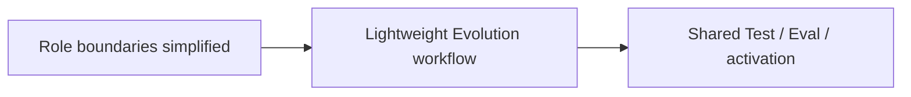

# Roles & Skills PLAN

状态：Active
最后更新：2026-10-08
Owner：Policy maintainers

## Current Status

- Base 是唯一 user-facing Main Agent。
- EvolutionCat 的 remember 已支持按 ID 替换与遗忘；写入权限仍 role-scoped，Runtime 提供有界文件记忆读取。
- 默认发行物包含八个 Role 和零个 Base Skill。
- EngineerCat、BrowserCat、GuiCat、SecretaryCat 负责执行接管。
- SecretaryCat App 执行已抽出为共享 FeishuConnector；Tool schema、确认、receipt 和 profile 选择保持兼容。后续其他 driver 迁移跟随 Surface 集成 PLAN。
- GuiCat typed desktop adapter 继续限定在窄 macOS GUI driver 边界内。
- UserCat、InspectorCat、ReviewerCat、EvolutionCat 是共享 Assurance & Evolution 角色。
- UserCat 已移除两个规划型 local Skills；只保留兼容 trace Tool，并新增 Scenario proposer。
- InspectorCat 已删除 shadow task 子系统与四个多余 Skills；现在只做 Finding+Case。
- ReviewerCat 已删除三个专用评测 Tools；现在是共享只读 Judge。
- EvolutionCat 的运行时资产和 control workflow 已瘦身，`evolution sleep` 已切为默认入口。
- Role/Skill Candidate 已接入 shared Test、shared Eval 与原子 next-Session activation。
- code Finding 已接入显式 EngineerCat Source Candidate adapter；候选在隔离源码副本中完成完整 Test + Eval，再事务性激活 source + dist 并于下一进程生效。
- EngineerCat 已接入唯一 `codex_run` Tool，复用官方 SDK 的 start/resume，并保留原生 coding fallback；未恢复 job manager/supervisor。
- 旧 nightly typed DAG、patch workspace/regression、manual promote CLI 与专用 Reviewer replay Tool 已删除。
- runtime Candidate lifecycle、Dashboard Promote/Unblock API/UI 与 `CapabilityStatus` 类型已删除。
- 发行目录中的 Role/Skill 一律作为已安装 package 加载；旧 `status` 元数据被忽略。
- 八个默认 Role 的视觉资源已收敛到共享程序化 XiaoBa；Pet/Chat、Dashboard Role 卡片、当前角色徽标和侧栏品牌统一消费 Surface role theme。默认九色固定，用户安装或创建的 Role 由 Surface inventory 分配器自动获得不重复颜色，不改变角色职责或工具权限。
- Role publish 的自定义 pet 约定已收敛为程序化 manifest，不再发布或校验 spritesheet。

## Milestones

1. Base + eight-role topology：completed。
2. Base zero-default-Skill：completed。
3. UserCat Scenario-only boundary：completed。
4. InspectorCat Finding+Case boundary：completed。
5. ReviewerCat shared Judge boundary：completed。
6. Lightweight Evolution control DAG：completed at orchestration boundary。
7. 删除 dead Inspector/Reviewer assets：completed。
8. 替换旧 nightly Evolution entry：completed。
9. 移除 manual promotion 和 Candidate lifecycle UI/loader：completed。
10. 生产级 next-Session atomic activation adapter：completed for Role/Skill。
11. EngineerCat Source Candidate adapter：completed for code Findings and next-process activation。
12. EngineerCat Codex execution adapter：completed；official SDK behind one role Tool, native fallback retained。
13. Shared default-role visual identity：completed；默认 Role 统一选择 `xiaoba`，Pet/Chat 与 Dashboard 头像颜色均由 Surface manifest 解析。
14. Procedural-only pet publishing：completed；RoleHub pet entry 只引用 `grok-cat-v1` manifest。
15. Unique installed-role visual identity：completed；用户创建或安装 Role 无需维护颜色字段，Surface 会基于完整 inventory 分配不重复 body color。

## Next Steps

- 按真实需求决定是否增加 Memory Candidate adapter。

## Owners

- Role assets：`roles/**`
- Runtime role adapters：`src/roles/**`
- Shared Reviewer Judge：`src/eval/reviewer-cat-judge.ts`
- Skill runtime：`skills/**`, `src/skills/**`

## Acceptance Criteria

- 只有 Base 面向用户并派遣 Role。
- 所有 Role 使用同一个 XiaoBa Agent loop。
- UserCat 只模拟用户或生成缺省 Scenario。
- InspectorCat 只输出 evidence-backed Finding+Case。
- ReviewerCat formal Judge fresh、只读、结构化。
- EngineerCat 只负责 code Candidate；EvolutionCat 只负责 Role/Skill/Memory Candidate。
- Evolution 只调用 shared Test + Eval，不拥有重复实现。
- pass Role/Skill Candidate 只对新 Session 激活；pass code Candidate 只对下一进程激活；其他结果不改变当前版本。
- 不引入 RouterCat、Recovery Role 或通用任务框架。
- 八个默认 Role 共用 `xiaoba` pet identity；颜色差异不改变 role prompt、tools、permissions 或 session semantics。
- 用户创建或安装的新 Role 无需复制 pet 或声明颜色；Surface 分配的 body color 必须与当前已安装 Role inventory 中的全部颜色不同。

## Risks / Open Questions

- Source Candidate 的完整 Test 依赖 enforced native sandbox；统一 SDK 支持 macOS/Linux；当前 Linux 实测通过，macOS 发行构建待验收。
- 自动激活必须保留原版本，以便失败时回滚，但不应演化成新的 lifecycle subsystem。
- BrowserCat/GuiCat/SecretaryCat 的外部 driver 可用性仍是独立运维风险。

## Recent Verification

- 2026-10-08: build passed; file-memory/runtime/Role focused tests passed 33/33;
  repository regression passed 591/592. The sole failure remains the existing
  Evolution descendant-process timeout assertion in this cloud container.
  Coverage proves fresh Session recall, edit refresh, root consistency, bounded
  and scoped reads, correction/forget, archive exclusion, legacy Markdown upgrade,
  managed-block integrity and non-persistence of injected memory.

- 2026-10-07: extracted Connector and existing SecretaryCat/Feishu integration tests pass within the 56/56 focused suite; confirmation, profile selection and cancellation remain covered.

- `npm test` passed 584/584 across 105 suites。
- EngineerCat 相关 focused tests passed 31/31 across 5 suites；真实官方 SDK read-only start/resume smoke 保持同一 thread id，且没有文件改动或外部工具调用；macOS arm64 packaged adapter resume 也通过。
- 真实 EngineerCat production-path E2E 经共享 Agent loop 新建 Codex thread，并在下一用户轮指定返回的 `thread_id` 成功续接；角色仍只暴露一个 Codex Tool。
- Role/Skill 生命周期清理 focused tests passed 42/42 across 9 suites。
- Shared Arena/Evolution core focused tests passed 45/45 across 8 suites。
- Lightweight Evolution workflow tests passed 4/4。
- Source Candidate、Replay isolation 与 maintained CaseSet focused tests passed 22/22 across 6 suites。
- 真实 Source Candidate 验收完成完整 build、普通仓库测试与独立 native-sandbox contract phase，结果为 pass；未激活生产源码。
- ReviewerCat Judge tests passed 3/3。
- Inspector Finding+Case tests passed 4/4。
- UserCat Scenario tests passed 3/3。
- `npm run build` passed。
- Dashboard/Pet focused tests passed 35/35；coverage includes default-role identity、4096 collision-free custom-role slots、explicit collision reassignment、canonical-key collision rejection、shared procedural avatars and removal of legacy PNG mappings。Playwright verified 14/14 unique live Role canvas colors with zero renderer errors。Procedural-only Pet coverage includes `grok-cat-v1` publishing contracts and rejection of legacy sprite manifests。Exact-hash Electron migration updates previously shipped built-in configs without overwriting user-modified role files.

## Proactive memory maintenance

Owner: EvolutionCat / Base. Completed: proactive dispatch rules, evidence/confidence on remember, deterministic archive and nightly proposal contract. Stable facts do not age out; uncertain semantic judgments remain model-owned. Next: assess precision against real personal conversations before tuning thresholds. Verification: 39/39 focused tests, including trusted-parent archive and source/confidence roundtrip.

## Shared scheduled events

Owner: Role maintainers. Completed: Evolution and memory consumers keep existing role responsibilities while common Scheduler/Event infrastructure owns triggering. Legacy schedule classes are compatibility facades with no separate cron/time implementation. Evolution installation supports Linux/macOS and execution requires the shared SDK sandbox. Consumer/CLI focused coverage passed; full regression 615/616, with only the existing cloud descendant-process SIGKILL assertion failing.

## Session timer responsibility

Owner: Base. Completed: prompt guidance for explicit reminders, autonomous checks, timezone resolution, successful-write confirmation and purposeful follow-up end conditions. Children report timer needs to the parent and cannot schedule directly; narrow role allowlists retain their policy. Acceptance: actual tool persistence/owner denial and quiet shared-loop checks verified; build and focused 47/47 passed. Next: evaluate proactive scheduling frequency with real conversations; no new role or generic task framework.

## Agent-owned app connections

Owner: Base / Roles. Completed: prompt guidance for Agent-owned accounts, schema discovery, exact write proposals and external-content distrust; SecretaryCat and eight role boundaries unchanged. Children cannot call new native connectors. Next: observe connector use and consider explicit constrained delegation; do not expand role allowlists implicitly.

Verification: TypeScript build and focused native connector / Feishu boundary / role-tool tests 39/39 passed, including real AgentSession confirmed-write execution with mocked official HTTP. Full regression 650/651 passed; the only failure remains the pre-existing cloud Evolution descendant-process SIGKILL assertion. Live app accounts are not yet verified.

## Unified sandbox execution

Owner: Runtime / Role maintainers. Completed: bounded SubAgent file/Shell policies and candidate execution reuse the shared SDK; default writes now stay inside the task workspace. Linux/macOS scheduling no longer has a hard-coded macOS check, while execution still requires working isolation. Role inventory/confirmation/external Codex contracts remain unchanged. Verification and platform limits are in `../agent-runtime/PLAN.md`.
