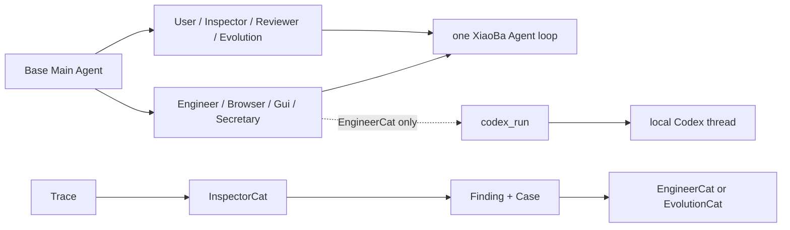
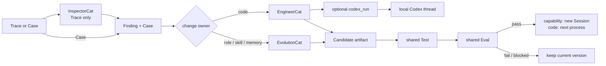

# Roles & Skills SPEC

状态：Active
最后更新：2026-08-03
适用范围：Base、八个默认 Role、Role-local Skills、共享 review roles 和 Evolution。

本文是 XiaoBa-CLI `Roles & Skills` 模块的唯一架构真相源。

## Problem

XiaoBa 需要专业化分工，但不能为每种能力复制 Agent loop、状态机或调度系统。Role 只定义责任、prompt、可见 Tools 和可选 Skills；所有 Role 都复用同一个 XiaoBa Agent Runtime。

持续改进侧也必须保持简单：

- UserCat 模拟用户。
- InspectorCat 从 Trace 提取 Finding + Case。
- ReviewerCat 是共享 Agentic Judge。
- EngineerCat 修改代码。
- EvolutionCat 生成 Role、Skill 或 Memory Candidate。
- EvolutionCat 遇到 code Finding 时只返回一次性委派决定，由 EngineerCat 生成 Source Candidate。
- 控制 DAG 调用共享 Test + Eval，再按 capability 新 Session / code 下一进程边界激活通过的 Candidate。

## Scope

In scope:

- Base Main Agent 和八个默认 Role。
- `role.json`、role prompt、role-local `SKILL.md`。
- Role tool allowlist、confirmation gate 和 alias。
- UserCat、InspectorCat、ReviewerCat 的共享 adapter。
- Evolution 的最小控制 DAG 与 Candidate ownership。

Out of scope:

- XiaoBa 自建或复制第二套 Chat/Agent/MCP loop；EngineerCat 可以通过窄 Tool adapter 委托给已安装的外部 Codex executor。
- RouterCat、Recovery Role 或通用任务框架。
- 每个 Role 独立的 architecture docs。
- Evolution 自有 Replay、Judge、Scorecard、Regression 或 promotion system。
- 把 Candidate 设计成长期 runtime lifecycle 状态机。

## Current Architecture

默认发行物包含八个 Role、零个 Base Skill。所有角色使用 AgentSession / ConversationRunner / ToolManager。

持续改进角色已完成 prompt 与 role-local Skill 瘦身：

- UserCat 没有 role-local Skill；保留 `user_trace_run` 兼容 Tool，并新增 Scenario proposer。
- InspectorCat 只保留 `log-review`，新增只读 Finding+Case adapter；旧 shadow task 服务已删除。
- ReviewerCat 是共享只读 Judge；四个专用评测 Tool 均已删除。
- EvolutionCat 的 prompt 与 `self-evolution` Skill 已收敛到 Candidate 生成；`evolution sleep` 已进入轻量 control workflow。
- 当前自动 Candidate adapter 支持 Role/Skill 与 code：Role/Skill 由 EvolutionCat 生成；code 通过一次性 `delegate_code` 路由到隔离源码副本中的 EngineerCat。
- EngineerCat 现在拥有一个 role-scoped `codex_run`：官方 SDK 负责 Codex thread start/resume，XiaoBa 只负责固定工作区、只读/可写模式、中止和结构化证据。原生 coding tools 保留为小修改和降级路径；Source Candidate builder 显式隐藏该 Tool。

旧 nightly typed DAG、manual promote CLI 与 capability lifecycle 已删除。发行目录里的 Role/Skill package 都可被 Runtime 发现；Candidate 只存在于 Evolution run 的隔离目录，旧 package 内的 `status` 字段不再参与解析。



## Target Architecture

Role 只拥有策略与工件生成；控制 DAG 只编排已经存在的 Test、Eval 和激活动作。



## Stable Role Architecture

### User-facing and execution roles

- Base Main Agent：唯一用户界面与 dispatcher。
- EngineerCat：代码实现和修复；原生 coding tools 处理小修改和降级，实质性任务可委托给 role-scoped `codex_run`。
- BrowserCat：浏览器接管。
- GuiCat：本地桌面 GUI 接管。
- SecretaryCat：飞书工作流；`FeishuCat` 只是 alias。

### Shared assurance roles

- UserCat：像用户一样输入，不写 Oracle、不检查 evidence、不裁决。
- InspectorCat：只把 Trace 变成 0..n `Finding + Case`。
- ReviewerCat：共享 Agentic Judge；读取 Case、Oracle、Verifier results 和全部 relevant Traces，返回结构化 Outcome decisions。
- EvolutionCat：只生成 Role、Skill 或 Memory Candidate，并拥有 deterministic `remember`。

ReviewerCat 和 InspectorCat 不是 Arena 私有角色。Arena、Eval 和 Evolution 可按上述固定职责复用它们。

## Evolution Contract

Evolution 是一条控制 DAG，不是平台：

- 入口是 Trace 或 Case。
- Trace 先交给 InspectorCat；Case 直接进入 Candidate 生成。
- 修复必须有 executable Case。
- code Candidate 归 EngineerCat。
- Role、Skill、Memory Candidate 归 EvolutionCat。
- Candidate 依次通过共享 Test 和共享 Eval。
- 只有全部 pass 才原子激活：Role/Skill 只影响之后创建的 Session，code 只影响下一进程。
- fail、blocked 或 activation error 保持当前版本不变。
- 一次 run 不递归，不把新 Replay Trace 再送回 Inspector。

Candidate 是本次变更的 immutable artifact 描述，不是 `candidate/active/blocked` 状态机。显式 publish Skill 可以保留为用户主动导出流程，但不参与自动验收。

当前生产实现把 Role/Skill Candidate 写入隔离目录，执行 deterministic Candidate Test 和 shared Eval，通过后原子替换对应 package，并在失败时恢复原版本。code Finding 先由 EvolutionCat 做一次性 ownership 判定，再由 EngineerCat 在 secret-free 源码副本中生成 immutable Source Candidate；候选副本执行完整 TypeScript build、仓库 Test 和 shared Eval，通过后事务性替换 source + dist。已经运行的 Session 不重载 capability；Role/Skill 新版本只由之后创建的 Session 解析，code 新版本只由下一进程加载。

## Role Package Contract

```text
roles/<role-name>/
  role.json
  prompts/<prompt-file>.md
  skills/<skill-name>/SKILL.md   # optional
```

- `role.json` 声明 role identity、aliases、prompt、tool policy 和 confirmation gate。
- prompt 与 Skill 是运行时 source asset，不承载架构历史。
- Native role tools 位于 `src/roles/**`，统一经过 ToolManager。
- Base 默认携带零个 Skill；独立 Skill 必须显式安装。
- 发行目录不保存 capability lifecycle；移除 package 是唯一停用动作。

## Default Inventory

| Group | Roles |
| --- | --- |
| User-facing | Base Main Agent |
| Execution | EngineerCat, BrowserCat, GuiCat, SecretaryCat |
| Assurance & Evolution | UserCat, InspectorCat, ReviewerCat, EvolutionCat |

## Implementation Layout

```text
roles/**                                   runtime role assets
src/roles/**                               role adapters and tools
src/roles/user-cat/scenario.ts             Scenario fallback
src/roles/inspector-cat/finding-case.ts    shared Inspector adapter
src/eval/reviewer-cat-judge.ts             shared Reviewer adapter
src/roles/evolution-cat/evolution-workflow.ts
src/roles/evolution-cat/source-candidate.ts
src/testing/source-candidate-test.ts
skills/**                                  explicit standalone Skills
```

## Interaction With Other Modules

- Agent Runtime 执行所有角色的同一个 loop。
- Surface 只面向 Base，Role takeover 仍由 Base 派遣。
- Observability & Evidence 提供角色共享的 Trace。
- Evaluation 提供唯一 Test/Eval 验收链。
- Arena 复用 UserCat、InspectorCat 和 ReviewerCat，不拥有这些角色。
