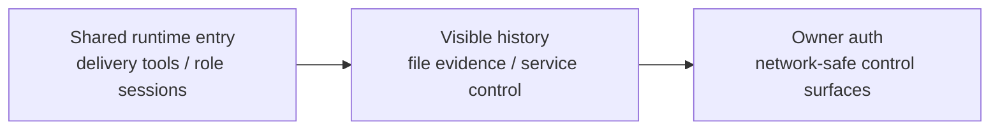

# Surface PLAN

状态：Active
最后更新：2026-07-29
Owner：Surface maintainers

## Current Status

- CLI、Feishu、Weixin、Pet、Dashboard 和 Electron 进入共享 AgentSession。
- CLI 使用 direct final reply；channel-backed surfaces 通过 `send_text` / `send_file` 交付。
- `prompts/surface.md` 是 channel delivery prompt 的唯一运行时来源。
- Pet/Dashboard role-scoped session、visible history、SSE replay 和 subagent completion callback 已实现。
- Feishu/Pet runtime smoke 已覆盖文本、文件和 external receipt 基本形态。
- Feishu Surface App ID 已作为 canonical application identity；SecretaryCat 按同 App ID 显式选择官方 `lark-cli` profile，不修改全局 active profile。
- macOS Electron packaging maps the optional `@steipete/peekaboo@3.8.0` binary to GuiCat's fixed `resources/drivers/peekaboo/peekaboo` path.
- Dashboard、Pet 和 Bridge 的网络认证与 Owner 授权仍未闭合。
- `evolution sleep` 与 schedule 已进入轻量 Evolution control；manual promote CLI 已删除。
- Dashboard capability lifecycle API/UI 已删除；Role/Skill 卡片只保留选择、安装和删除 package。

## Milestones

1. Shared entrypoint contract：completed。
2. Surface-only delivery tools：completed。
3. Shared channel prompt：completed。
4. Pet/Dashboard role-scoped sessions and visible history：completed for current paths。
5. Feishu/Pet text and file runtime smoke：completed for current fixtures。
6. Feishu Surface / SecretaryCat shared application identity：completed。
7. GuiCat macOS optional driver packaging：completed for local unsigned/ad-hoc build and artifact inspection。
8. Production auth and Owner permission boundary：not started。
9. Real external upload/download and cross-process recovery E2E：not started。
10. Evolution nightly CLI/schedule entry：completed for lightweight control workflow、cross-platform manual sleep and macOS cron。
11. Nightly worker timeout and owned-lock cleanup：completed。
12. Dashboard three-state lifecycle removal：completed。
13. Lightweight Evolution trigger and activation status：completed for CLI capability new-Session / code next-process activation evidence。

## Next Steps

- Add authenticated principal and Owner identity at surface normalization.
- Default local HTTP/control surfaces to loopback and fail closed before remote exposure.
- Bind consequential confirmations to actor, action payload and expiry.
- Extend real file delivery evidence only where platform receipts are available.
- Keep Electron/Dashboard packaging details in this module instead of creating `desktop` architecture docs.

## Owners

- CLI：`src/commands/**`
- Feishu / Weixin：`src/feishu/**`, `src/weixin/**`
- Pet / Dashboard：`src/pet/**`, `src/dashboard/**`, `desktop/dashboard/**`
- Electron / package assets：`desktop/electron/**`, `desktop/build-resources/**`

## Acceptance Criteria

- Every maintained surface declares `surface`, session key and user-visible output semantics.
- CLI does not expose channel delivery tools.
- Channel delivery tools appear only with real callbacks and explicit surface context.
- Role-scoped Pet/Dashboard sessions isolate skills, tools, history and SSE replay.
- Dashboard does not create a second Candidate lifecycle or promotion policy.
- Passing Candidates activate through the runtime-owned capability new-Session / code next-process boundary；Surface only reports the result.
- Feishu Surface and SecretaryCat use the same App ID whenever Surface credentials are configured; per-command profile selection does not mutate global `lark-cli` state.
- Network-exposed control paths have authentication, Owner authorization and command/path validation.
- Surface implementation changes update this PLAN and [`SPEC.md`](SPEC.md), not a separate desktop/test document.

## Risks / Open Questions

- Current local control APIs are useful but not ready for untrusted networks.
- Platform file receipts and identity semantics differ across Feishu, Weixin and local surfaces.
- Signed/notarized release artifacts still need their own release-time verification; the local ad-hoc `.app` check does not prove distribution signing.

## Recent Verification

- `npm test` passed 556/556 across 100 suites；`npm run build` passed。
- Surface diagrams reflect the lightweight Evolution CLI and shared Test/Eval activation path.
- `electron-builder --mac --dir --publish never` passed with the platform-specific optional driver mapping.
- The packaged Peekaboo binary is executable at `Contents/Resources/drivers/peekaboo/peekaboo` and reports version 3.8.0.
- GuiCat resolved the packaged resources path and returned `ready=true` with the role-local Skill present in the app resources.
- Evolution sleep command tests cover lightweight workflow invocation, deterministic harvest, project-scoped cron idempotency, worker process-group timeout and PID-owned lock cleanup.
- Dashboard tests verify lifecycle mutation routes are absent and cards expose only package selection/deletion。
- Arena-internal Pet tests prove `requiredActiveSkillName` cannot be supplied through HTTP/tool args and fails closed when missing; this adapter can be reused by the lightweight Arena migration.
