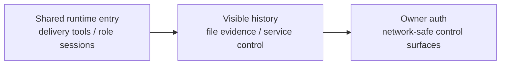

# Surface PLAN

状态：Active
最后更新：2026-10-08
Owner：Surface maintainers

## Current Status

- CLI、Feishu、Weixin、Pet、Dashboard 和 Electron 进入共享 AgentSession。
- CLI 使用 direct final reply；channel-backed surfaces 通过 `send_text` / `send_file` 交付。
- `prompts/surface.md` 是 channel delivery prompt 的唯一运行时来源。
- Pet/Dashboard role-scoped session、visible history、SSE replay 和 subagent completion callback 已实现。
- Feishu/Pet runtime smoke 已覆盖文本、文件和 external receipt 基本形态。
- Feishu Surface App ID 已作为 canonical application identity；SecretaryCat 按同 App ID 显式选择官方 `lark-cli` profile，不修改全局 active profile。
- macOS Electron packaging maps the optional `@steipete/peekaboo@3.8.0` binary to GuiCat's fixed `resources/drivers/peekaboo/peekaboo` path.
- Windows Electron packaging runs on a native Windows x64 GitHub runner so native Node dependencies are rebuilt for the target platform instead of being copied from macOS；the release gate runs a focused desktop Surface profile, verifies packaged roles/rendering contracts, and launches the unpacked Dashboard for a real HTTP readiness smoke.
- Dashboard、Pet 和 Bridge 的网络认证与 Owner 授权仍未闭合。
- `evolution sleep` 与 schedule 已进入轻量 Evolution control；manual promote CLI 已删除。
- Dashboard capability lifecycle API/UI 已删除；Role/Skill 卡片只保留选择、安装和删除 package。
- 共享 Conversation Journal / Catena 导出已接入 CLI、Feishu、Weixin 和
  Pet；Surface 只提供可见输入/成功交付语义，不各自维护第二套聊天存储。
- Pet Surface 只保留程序化小恶魔猫 renderer、role theme manifest 与共享 Canvas player；Pet API 下发完整 Role inventory，默认九色保持固定，自定义 Role 由共享分配器获得当前 inventory 内不重复的 body color。Dashboard Role 卡片、当前角色徽标和侧栏品牌也使用同一 renderer、inventory 和 theme map 的静态首帧。旧 renderer、资源端点、内置旧宠物、像素猫 PNG 和静态角色头像映射均已删除。

## Milestones

1. Shared entrypoint contract：completed。
2. Surface-only delivery tools：completed。
3. Shared channel prompt：completed。
4. Pet/Dashboard role-scoped sessions and visible history：completed for current paths。
5. Feishu/Pet text and file runtime smoke：completed for current fixtures。
6. Feishu Surface / SecretaryCat shared application identity：completed。
7. GuiCat macOS optional driver packaging：completed for local unsigned/ad-hoc build and artifact inspection。
8. Production auth and Owner permission boundary：not started。
9. Real external upload/download and cross-process recovery E2E：not started。
10. Evolution nightly CLI/schedule entry：completed for lightweight workflow and Linux/macOS shared Scheduler with SDK execution。
11. Nightly worker timeout and owned-lock cleanup：completed。
12. Dashboard three-state lifecycle removal：completed。
13. Lightweight Evolution trigger and activation status：completed for CLI capability new-Session / code next-process activation evidence。
14. Shared visible Conversation Journal：completed for current CLI、Feishu、Weixin、Pet text/file paths；Catena export remains optional and fail-open。
15. Procedural XiaoBa visual system and role themes：completed；Pet/Chat 动画与 Dashboard 头像共用 renderer；Base 黑金、八个默认 Role 一角色一色。
16. Remove spritesheet compatibility：completed；legacy renderer、资源端点、内置旧宠物资产和对应发布/测试约定已删除。
17. Remove legacy Dashboard avatars：completed；Role 卡片、当前角色徽标和侧栏品牌不再读取像素猫 PNG 或静态角色映射。
18. Unique custom-role colors：completed；默认九色保持固定，自定义 Role 由完整已安装 inventory 统一分配不重复颜色，并供 Dashboard、Pet 与 Chat 共用；显式撞色会重分配，容量耗尽 fail closed。
19. Native Windows desktop packaging：completed for the v0.2.2 Preview；native x64 dependencies、84/84 Surface release tests、packaged contract inspection、Dashboard launch smoke、NSIS generation and checksum verification passed on the Windows runner。

## Surface / Connector / Event migration

- Owner: Surface maintainers, with Roles & Skills owners for Tool adapters.
- Completed: common Event contract and file-backed admission for Feishu, Weixin
  and Pet; first Connector extraction for Feishu, preserving Role tools and lark-cli behavior.
- Completed: standalone Event contract, Surface adapter and public barrel;
  EventStore separates file/lock concerns from Dispatcher. Injected storage,
  mutation-safe snapshots and fail-closed corrupt records have focused coverage.
- Acceptance: Feishu, Weixin and Pet messages use common event admission; duplicate
  events do not repeat effects; failed/interrupted handlers remain inspectable;
  role confirmation, profile selection and delivery receipts retain their contracts.
- Partial: Feishu busy-message queue remains in memory; `handled` is adapter
  completion, not business completion. Interrupted/failed records are inspectable
  but no retry/resolution UI or record-retention policy is provided.
- Completed: shared daily and one-shot session timer producers use Event admission.
- Future: ordinary CLI user-message admission, app-change/completion producers and authenticated
  Owner routing. No new Agent loop or general task framework.

## Next Steps

- Add authenticated principal and Owner identity at surface normalization.
- Default local HTTP/control surfaces to loopback and fail closed before remote exposure.
- Bind consequential confirmations to actor, action payload and expiry.
- Extend real file delivery evidence only where platform receipts are available.
- Keep Electron/Dashboard packaging details in this module instead of creating `desktop` architecture docs.

## Owners

- Event / Connector integration：`src/events/**`、`src/connectors/**`
- CLI：`src/commands/**`
- Feishu / Weixin：`src/feishu/**`, `src/weixin/**`
- Pet / Dashboard：`src/pet/**`, `src/dashboard/**`, `desktop/dashboard/**`
- Electron / package assets：`desktop/electron/**`, `desktop/build-resources/**`

## Acceptance Criteria

- Every maintained surface declares `surface`, session key and user-visible output semantics.
- CLI does not expose channel delivery tools.
- Channel delivery tools appear only with real callbacks and explicit surface context.
- Role-scoped Pet/Dashboard sessions isolate skills, tools, history and SSE replay.
- Dashboard does not create a second Candidate lifecycle or promotion policy.
- Passing Candidates activate through the runtime-owned capability new-Session / code next-process boundary；Surface only reports the result.
- Feishu Surface and SecretaryCat use the same App ID whenever Surface credentials are configured; per-command profile selection does not mutate global `lark-cli` state.
- Network-exposed control paths have authentication, Owner authorization and command/path validation.
- Surface implementation changes update this PLAN and [`SPEC.md`](SPEC.md), not a separate desktop/test document.
- Pet Surface 只接受 `renderer: "grok-cat-v1"`；role theme 只改变颜色，缺失或未知 renderer fail closed，且不存在二进制动画资源端点。
- Dashboard 的 Role 卡片、当前角色徽标和侧栏品牌不再加载旧像素猫 PNG，全部使用共享程序化 XiaoBa 的静态首帧。
- Base 与八个默认 Role 保留固定 body color；所有已安装自定义 Role 在 Dashboard、Pet 与 Chat 中使用同一份确定性 theme map，body color 在当前 inventory 内不得重复。

## Risks / Open Questions

- Current local control APIs are useful but not ready for untrusted networks.
- Platform file receipts and identity semantics differ across Feishu, Weixin and local surfaces.
- Signed/notarized release artifacts still need their own release-time verification; the local ad-hoc `.app` check does not prove distribution signing.
- 自定义 Role palette 当前支持 4096 个自动分配槽位；超过容量时 Surface 会明确拒绝分配，不会通过复用颜色降级。

## Recent Verification

- 2026-10-08: `npm run build` passed; standard tsx-run focused integration passed
  59/59 and repository regression passed 583/584. The sole regression failure
  remains the pre-existing Evolution process-group timeout test in this cloud
  container. New tests cover injectable storage, runtime completion envelopes,
  producer/consumer mutation isolation and fail-closed malformed state. Existing
  concurrency/restart deduplication, locks, profile/Role gates and delivery pass.
- Scripted base runtime 11/11 and contract smoke 23/23 passed on 2026-10-07.

- Conversation-focused tests pass 52/52 across Journal, shared surface wrapper,
  AgentSession, CLI, Feishu, Weixin, and Pet. A real Catena round trip preserved
  the two-message order and displayed only user-visible text/file content.
- v0.2.2 macOS release gate passed `npm run build`、569/569 repository tests across 105 suites、23/23 contract smoke cases and 11/11 scripted runtime cases；the arm64 DMG mounted read-only, passed deep code-signature validation, and contained Peekaboo 3.8.0 plus all eight default Roles。
- v0.2.2 Windows run [33139372263](https://github.com/fightheyyy/xiaobaOS/actions/runs/33139372263) passed 84/84 desktop Surface tests, rebuilt native dependencies for Electron x64, verified all eight default Roles plus the procedural renderer and unique-color guard, rejected legacy bitmap sprites, launched the packaged x64 app, observed Dashboard HTTP readiness, built the NSIS installer, and reproduced SHA-256 `cadd63cf2fc1ea0a373faa941aa310466159d6fc9c2bb49c86b2f7f09dd4da58` after artifact download。
- Surface diagrams reflect the lightweight Evolution CLI and shared Test/Eval activation path.
- `electron-builder --mac --dir --publish never` passed with the platform-specific optional driver mapping.
- The packaged Peekaboo binary is executable at `Contents/Resources/drivers/peekaboo/peekaboo` and reports version 3.8.0.
- GuiCat resolved the packaged resources path and returned `ready=true` with the role-local Skill present in the app resources.
- Evolution sleep command tests cover lightweight workflow invocation, deterministic harvest, project-scoped cron idempotency, worker process-group timeout and PID-owned lock cleanup.
- Dashboard tests verify lifecycle mutation routes are absent and cards expose only package selection/deletion。
- Arena-internal Pet tests prove `requiredActiveSkillName` cannot be supplied through HTTP/tool args and fails closed when missing; this adapter can be reused by the lightweight Arena migration.
- Dashboard/Pet focused tests passed 35/35 across four suites；coverage proves deterministic allocation、4096 custom-role colors without collision、explicit collision reassignment、canonical-key collision rejection、inventory delivery、shared renderer wiring and removal of legacy avatar paths。Playwright verified the real Roles page with 14 installed Role canvases、14 unique dominant body colors and zero renderer errors；the contact sheet is `output/playwright/xiaoba-role-colors-contact-sheet.png`。Procedural-only Pet coverage continues to prove only XiaoBa is bundled、legacy sprite manifests are ignored、the sprite endpoint is absent and replay fixtures use `grok-cat-v1`。

## Shared scheduled events

Owner: Surface. Completed: shared daily calendar, job configuration, one cron tick, both named Event routes, migration/compatibility CLI. Tests cover sibling preservation/removal, legacy import, unrelated workspace preservation, config rollback, malformed cron refusal, restarts, DST and end-to-end CLI. Next: run schedule install on the user host to migrate existing cron; code upgrade alone does not change crontab. Operational risks: cron availability, AI environment, and inspecting interrupted Events/config locks. Full regression: 615/616 passed; the sole failure is the existing cloud descendant-process SIGKILL assertion.

## Session timed wakeups

Owner: Surface. Completed: original Feishu/Weixin/Pet/CLI routes, one shared due scanner called from live polling and schedule tick, offline/busy deferral, Weixin state hydration and Pet visible-history replay. Verified original IM destinations and token restoration, Pet HTTP history, concurrent scans and CLI failures. Acceptance: no separate cron per reminder, no cross-session mutation or new Agent loop. Limits: original service must be running; reopening the same CLI catches up. Next: observe live delivery on the user host. Build and focused 47/47 passed; full regression 630/631 passed; the sole failure remains the pre-existing cloud Evolution descendant-process SIGKILL assertion.

## Agent-owned app connections

Owner: Surface. Completed: three official native API adapters, fixed-origin bounded HTTP, cursor pagination, safe errors, Gmail single-flight refresh, injectable AgentCredentials, generic registry integration and connector list/describe/configure/verify CLI. Next: real-account verification on the user host, then app subscriptions and authenticated remote administration. Those require existing Google OAuth/client configuration and deliberate operation scopes. No live credentials were present in this cloud instance.

Verification: TypeScript build and focused native connector / Feishu boundary / role-tool tests 39/39 passed, including real AgentSession confirmed-write execution with mocked official HTTP. Full regression 650/651 passed; the only failure remains the pre-existing cloud Evolution descendant-process SIGKILL assertion. Live app accounts are not yet verified.

## Dashboard connection management

Owner: Surface. Completed: sidebar page/navigation, three connection cards, write-only token/client forms, Google OAuth with state/PKCE/expiry and callback, account verification, enable/disable/disconnect, three authorization-only cards. Routes enforce socket loopback + Host/port + same-origin + explicit JSON mutation header; OAuth callback allows cross-site navigation only with valid state. Pending exchanges are invalidated on disconnect/config changes. Electron opens Google in the system browser; normal browser authorization redirects directly.

Verification: TypeScript build and focused API/native connector/config/navigation tests 34/34 passed. Real Chromium exercised token save, account verification, simulated Google authorization/callback, disconnect, desktop/mobile layouts (including expanded Gmail settings) and Electron renderer external-auth behavior, with zero page errors. Native OS browser launch and real Google consent were not exercised in this cloud. Full regression 658/659 passed; sole failure remains the pre-existing cloud Evolution SIGKILL descendant assertion. Next: verify real Agent accounts; authenticated remote admin and subscriptions remain out of scope.

Dashboard simplification: completed. Three authorization-only cards reuse existing Skills/Store components and the shared modal/config fields; no requester/scope/Feishu/control panel remains. Token connection and Google callback verify accounts automatically. All configured/enabled app operations are available by default to valid main sessions; retired grants are ignored/removed on the next write. Google OAuth covers all implemented mail operations through gmail.modify. Write confirmation and existing role/child boundaries remain intact.

Verification: build and focused 50/50 passed, including cross-surface default reads/writes, old-config migration, retired API absence and exact write-confirmation tests. Real Chromium validated shared computed card styles, token/OAuth connection, all-operation defaults, disconnect, mobile modal and Electron renderer external authorization with mocked providers and no page errors. Full regression 658/659 passed; the sole failure remains the pre-existing cloud Evolution descendant-process SIGKILL assertion. Real provider credentials/consent and native OS browser launch remain user-host checks.

Shared sandbox integration: Runtime owns the SDK executor; Surface exposes `xiaoba sandbox check` and Linux/macOS Evolution schedule installation. Execution still blocks when dependencies/isolation are unavailable. Verification is recorded in the Runtime PLAN.

Connector write continuity: implemented. Durable call receipts, Agent-wide identical-uncertain-write blocking and local operator reconciliation; focused integration 98/98 passed (serial final integration) including killed-process receipt retention. App-side outcome reconciliation still needs a real account when a production response is lost.

Gmail change producer: implemented. Opt-in Gmail history polling through existing Event admission and persisted session checks; account/cursor continuity, pagination, duplicate admission and offline delivery have automatic coverage (focused integration 98/98 final integration). Activation requires an authorized real account and an explicit target session. GitHub/Notion change subscriptions are not implemented.
