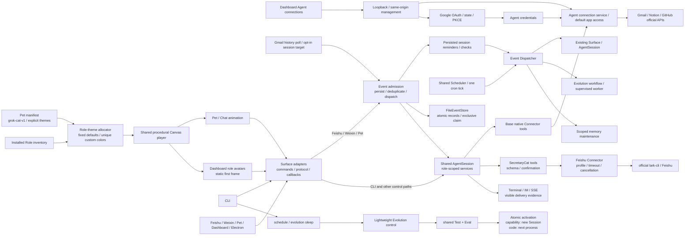
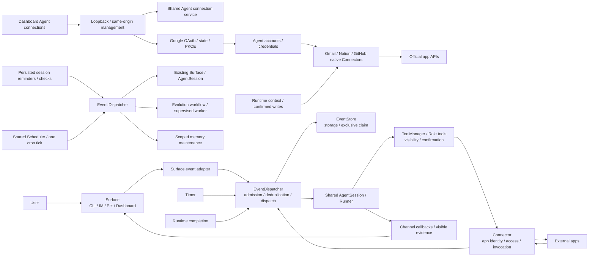

# Surfaces SPEC

状态：Active
最后更新：2026-10-08
适用范围：XiaoBa 的用户入口层，包括 `src/commands`、`src/feishu`、`src/weixin`、`src/pet`、`src/dashboard`、`src/events`、`src/connectors` 和 `desktop`。

本文件是顶层架构模块之一的入口层 spec，也是 Dashboard、Electron 和 packaging 资源的唯一架构文档。

## Problem

Surfaces 把不同用户入口统一接到同一套 local-first agent harness。CLI、Feishu、Weixin、Pet、Dashboard 和 Electron 桌面壳的协议、鉴权、事件形态和用户可见输出不同，但它们不能各自实现一套 agent loop。

入口层要解决的问题是：

- 把平台消息解析成 runtime 可消费的 user turn。
- 显式声明 `surface`、session key 和 channel callbacks。
- 将用户可见文本、文件和错误交付回对应平台。
- 保持平台适配和 agent harness 的责任边界清楚。

## Scope

In scope:

- CLI 命令入口：`src/commands/**`。
- IM 平台入口：`src/feishu/**`、`src/weixin/**`。
- Pet 和 Dashboard 入口：`src/pet/**`、`src/dashboard/**`、`desktop/dashboard/**`。
- Electron 桌面壳和桌面打包资源：`desktop/electron/**`、`desktop/build-resources/**`。
- 入口级 session key、channel callbacks、文件上传下载、SSE、service control 和配置入口。
- 集成边界：`src/events/**` 负责外部输入事件，`src/connectors/**` 负责 App 调用；它们是独立代码层，由本模块维护，不新增顶层文档模块。

Out of scope:

- Provider 调用和 transcript 修复，属于 `docs/agent-runtime/SPEC.md`。
- Role/skill 策略，属于 `docs/roles-skills/SPEC.md`。
- trace、visible history、memory、artifact 的观测证据和持久化 schema，属于 [`../observability-evidence/SPEC.md`](../observability-evidence/SPEC.md)。
- Unit、integration、deterministic smoke、Replay 和 Live Agent Eval 的语义，属于 [`../evaluation/SPEC.md`](../evaluation/SPEC.md)。

## Current Architecture

当前入口层已经收敛到共享 `AgentSession`，但各入口仍分别维护平台协议、文件语义和服务控制。CLI 的 `evolution sleep` 与 schedule 已进入轻量 Evolution control；manual `evolution promote` 已删除。Channel delivery 的 canonical prompt 集中在 `prompts/surface.md`。Pet/Dashboard 的 role-scoped session key 已绑定到对应 SkillManager / ToolManager，并在 Chat 与桌宠间共享历史和 SSE replay。Pet manifest 与共享 Canvas player 只支持程序化 `grok-cat-v1`；内置 `xiaoba` 使用一体化小恶魔猫轮廓、状态驱动眼睛和 role theme。Pet API 同时提供完整已安装 Role inventory；共享确定性分配器保留默认九色，并为自定义 Role 分配当前 inventory 内不重复的 body color，显式撞色也会重新分配，容量耗尽则 fail closed。Pet/Chat 使用动画播放，Dashboard 的 Role 卡片、当前角色徽标和侧栏品牌使用同一 renderer、inventory 和 theme map 的静态首帧；旧 renderer、spritesheet API、内置旧宠物资产、像素猫 PNG 和静态角色头像映射均已删除。Dashboard 只展示、选择、安装或删除当前 Role/Skill package，不再维护 capability lifecycle。macOS Electron 只打包 GuiCat 的固定 Peekaboo driver。入口级文本、文件和 external receipt 由 deterministic Test 覆盖。



## Target Architecture

目标是让所有入口都显式实现同一套 surface contract：平台层只做输入解析、鉴权、文件处理和交付回调，agent loop、role/skill、tool、state/evidence 都由下游模块统一承担。

Pet 与 Dashboard 角色头像的目标渲染路径保持单一：pet manifest 声明程序化 renderer 与可选的 role theme；已安装 Role inventory 与 manifest theme 一起进入共享的确定性唯一配色分配器，再由共享 Canvas player 消费既有 PetState，并为 Role 卡片、当前角色徽标和侧栏品牌绘制静态首帧。Base 与八个默认 Role 保留固定配色；用户安装或创建的 Role 必须在当前 inventory 内获得未占用的 body color，显式自定义色撞色时也必须重新分配，规范化后的 role key 冲突或配色空间耗尽时 fail closed，不能回退成 Base 黑金。Surface 只支持 `grok-cat-v1`，不保留 spritesheet renderer、旧静态像素猫映射、资源路由或页面级重复动画实现。



## Surface / Connector / Event boundaries

The approved target separates user interaction (Surface), Agent-to-app access
(Connector), and triggers (Event), within the existing module set. Surface owns
UI, message parsing, session targeting and delivery callbacks. Connector owns
app identity, credential/profile selection and bounded invocation; Role tools
continue to own model schemas and action confirmation. Event owns normalized
message, schedule and app-change envelopes, admission, deduplication and dispatch
to existing sessions. An event receipt is not proof of business-task completion.
Platform callbacks and credential values must not be persisted in event payloads.
Interrupted side effects require review rather than automatic replay.

### Event abstraction direction

Event 的公共入口是 `src/events/index.ts`。核心 `AgentEvent` 不依赖 Surface、
Connector 或 AgentSession 实现；Surface adapter 将平台归一化输入转成事件。
source 支持 `surface / connector / timer / runtime`，以便后续接入任务完成触发。
`EventDispatcher` 只拥有路由、幂等与状态转换，透过 `EventStore` 接口读写记录
并独占领取；默认 `FileEventStore` 拥有文件布局、原子写入和跨进程锁。
消费者 handler 负责调用既有 Session，保留现有 channel 和 send tools 语义。
本次仅抽象这些边界；不增加 scheduler、跟进事项、重试或独立 Agent loop。

### Implemented integration contracts

- `AgentEvent`：`id / type / source / target / occurredAt / payload`；source 支持
  `surface / connector / timer / runtime`，target 显式指定 session。它不同于 Trace 内的观测 event。
- 平台有 event ID 时，幂等键由 source kind、实例 identity、type、session 和
  平台 ID 共同生成；没有平台 ID 时生成 UUID，不根据文本内容去重。
- `src/events/index.ts` 提供统一公共导出；核心 event.ts 不导入 Surface 或 Runtime 实现。
  `surface-adapter.ts` 负责平台映射，`store.ts` 定义存储契约，`file-event-store.ts` 提供默认后端。
- `EventDispatcher` 可接受 `EventStore`、原有目录参数或默认 FileEventStore；
  Store 提供 `read / write / list / withEventLock`，Dispatcher 拥有状态转换。
  当前存储接口采用同步读写，适用于本地文件或同步存储；网络存储需要后续扩展。
- `EventDispatcher.dispatch(event, handler?)` 使用传入 handler 或已注册的 type
  handler；handler 继续调用既有 Session，不创建第二个 Agent loop。
  Event envelope 在接收时校验，payload 必须是可 JSON 序列化的数据。接收与交付
  handler 各使用独立快照，生产者或消费者的异步修改不改变原始落盘内容。
- 默认 records 在 `data/events/`；微信使用其 stateDir 下的 `events/`。
  记录原子替换、mode 0600；按事件独占目录锁防止两个进程重复领取。
  状态为 `pending → running → handled / failed`，同 ID 不同内容拒绝执行。
  `list(status?)` 可检查状态。损坏记录、未知状态或存储 ID 不匹配时 fail closed，
  不将其视为新事件。`running`、`failed` 或遗留锁不自动重放。
- Surface event 落盘仅包含输入文本、payload 类型及路由 identity；平台 context
  token、媒体密钥、回调和 traceparent 不落盘。它不是完整附件重放记录。
- `handled` 表示入口 handler 返回；飞书忙时入队沿用原有内存队列，因此不是
  业务完成标志，也不保证排队消息在进程崩溃后恢复。
- `Connector<Request, Result, Options>` 声明 app identity、capabilities 和 invoke；
  FeishuConnector 是首个实现，复用官方 lark-cli 的 profile、隔离环境、超时、
  取消和脱敏规则。capabilities 只用于描述，不授予 Role 权限。
  旧 DefaultLarkCliRunner 导出保留为别名，所有 SecretaryCat 工具共用注入实例。
- CLI、真实 timer/App subscription、Browser/GUI driver 的 Connector 迁移和
  失败事件的人工处置入口尚未接入。

## Contracts

- 每个入口必须显式传入 `surface`，不能从 session key 反推入口类型。
- 每个入口的用户输入和实际可见交付必须进入共享 Conversation Journal；未交付 final text、thinking 和 tool internals 不得写入该 Journal。
- Feishu Surface 配置的 App ID 是 XiaoBa 飞书能力的 canonical application identity。SecretaryCat 使用官方 `lark-cli` 时必须选择 App ID 相同的 profile；`bot` 和 `user` 是同一应用下的 actor identity。XiaoBa 不复制凭据存储，也不隐式切换 `lark-cli` 的全局 active profile。
- 每个入口的 raw event / route payload 应能归一化为稳定 surface event：surface、event type、event id、session key、channel id、user id、user message、payload type 和必要 metadata。
- Pet/Dashboard 的 `pet:<petId>:role-<role>` session key，以及 `pet:<petId>:role-<role>:<safe-suffix>` 这类带附加隔离后缀的 session key，必须创建或复用对应角色的 scoped services；`/skills`、skill 激活、tool allowlist、visible history 和 SSE replay 都必须按归一化后的 session key 隔离，`role-base` 归一到默认 `pet:<petId>`。
- Pet manifest 必须声明 `renderer: "grok-cat-v1"`，并可声明 `roleThemes`。共享 player 消费同一组 PetState 和事件映射；role theme 只改变视觉颜色，不改变 role 权限、session key 或 runtime 行为。缺失或未知 renderer 必须 fail closed；Surface 不提供 spritesheet renderer 或资源端点。
- Dashboard 的 Role 卡片、当前角色徽标和侧栏品牌必须由同一 `grok-cat-v1` renderer 绘制；Base 与八个默认 Role 使用固定 role theme，用户安装或创建的 Role 必须基于完整已安装 inventory 获得确定性且不与任何当前 Role 重复的 body color；显式 theme 撞色必须重新分配，规范化后的 role key 冲突或分配空间耗尽时 fail closed，不得回退到 Base 黑金或读取旧像素猫 PNG / 角色专属静态映射。
- Arena 可在进程内构造 PetChannel 时设置不可由 HTTP body 覆盖的 `requiredActiveSkillName`；它必须在每条 queued Pet message 前重新激活同一个 subject Skill，缺失时 fail closed。普通 Pet / Dashboard / Base / CLI 不设置该字段，行为保持不变。
- CLI 的正常用户可见输出是 direct final reply；CLI 不应向模型暴露 `send_text` / `send_file`。
- Feishu、Weixin、Pet 和 Dashboard 这类 channel-backed surface 的正常用户可见输出是 `send_text` / `send_file` 或等价 channel callback；direct final reply 默认只进入 provider/session trace，不外发给用户。
- Channel delivery prompt 的 canonical source 是 `prompts/surface.md`；surface system message 和 role prompt 只能读取或 include 这份规则，不应复制维护另一份完整文本。
- Channel final reply fallback 是显式 opt-in：入口只有传入 `deliveryFallbackFinalReply=true` 时，`ConversationRunner` 才能把 final text 合成为 synthetic `send_text` 交付证据；默认关闭。
- 当 `AgentSession.handleMessage` 返回 `finalResponseVisible=true` 且带有 `text` 时，channel adapter 必须把该文本通过当前 channel callback 交付给用户；这是 runtime 显式标记的可见结果，不等同于默认关闭的 final reply fallback。
- `send_text` / `send_file` 属于 surface tool，只能在入口显式传入 channel-backed `surface` 且提供真实 `channel` callbacks 时注入；slash command 激活 skill 后继续进入 agent loop 时也必须保留同一组 `surface` / `channel`。
- 入口 runtime smoke 必须捕获 request/response artifacts、IM reply 或 SSE events、session key、channel id、visible delivery count、file delivery count 和 file names。
- 真实入口 E2E 若覆盖 auth、upload/download、long task queue、session restore/resume 或跨平台用户路径，必须进入 ReviewerCat / role benchmark 边界，而不是扩张 runtime harness。
- 平台层只负责鉴权、消息解析、文件上传下载、callback 和服务控制，不复制 `ConversationRunner`。
- 新增入口必须定义 session key 规则、用户可见输出语义、文件处理、TTL/cleanup/wakeup 行为。
- Platform-specific optional drivers 必须只进入对应平台的安装包，并落在 role adapter 已声明的固定资源路径；不得把 driver-side Agent/MCP 一并暴露给 runtime。
- Dashboard/Pet 这类本地 HTTP surface 在扩大网络暴露前必须先有 auth、permission 和 command/path validation。
- Dashboard 不拥有 Candidate lifecycle 或裁决动作；它只展示当前 package，Evolution activation evidence 仍由原始只读产物提供。
- Candidate 通过 shared Test + Eval 后由 Evolution 调用 runtime-owned atomic activation；Role/Skill 只影响新 Session，code 只影响下一进程，Surface 不参与裁决。

## Interaction With Other Modules

- 调用 `docs/agent-runtime/SPEC.md` 定义的 `AgentSession` 和 runner，不直接调用 provider。
- 使用 `docs/roles-skills/SPEC.md` 定义的 role/skill policy，不自行拼接角色运行时。
- 将可观测输出写入 [`../observability-evidence/SPEC.md`](../observability-evidence/SPEC.md) 定义的 trace、visible history 或 artifact evidence。
- 入口级 deterministic contract smoke 由 `test/contract-smoke/suites` 维护；Feishu 和 Pet 的入口 Runtime 最小闭环由 `test:surface-runtime` 覆盖，文件与 receipt shape 由 `test:surface-runtime-file` 覆盖。预写响应的 BaseRuntime 覆盖由 `test:base-runtime` 执行，不属于 Agent Eval。

## Shared daily Scheduler

`src/events/scheduler.ts` owns daily time calculation, named Event admission, a private workspace schedule configuration and one cron installer. `src/commands/schedule.ts` registers the two consumers; this is a narrow daily trigger layer, not a general task system or another Agent loop.

- `data/scheduler/jobs.json`: version 1 with `jobs: [{id: "memory" | "evolution", hour, minute, timezone}]`. New schedules default to 03:17 Asia/Shanghai. Jobs can have distinct times/timezones.
- One workspace-marked `xiaoba-scheduler:<project-hash>` cron invokes `schedule tick` every minute. The tick checks each job's local date/time, catches up after its due time, and uses a stable job/day Event ID. A restart, repeated DST hour or time edit cannot re-run the same local daily slot. Previous failed/running/handled/pending records are not automatically retried.
- `evolution.sleep.due` invokes the existing supervised worker, whose internal `--worker` entry does not recursively admit an Event. `memory.maintenance.due` invokes the scoped maintenance service, which emits `memory.maintenance.window` for per-session windows and retains cursors. Worker failures/blocked execution produce failed Events; one consumer's failure does not prevent the other due consumer.
- `schedule install --jobs memory,evolution [--hour 3 --minute 17 --timezone Asia/Shanghai]`, `schedule status`, `schedule remove [--jobs ...]`, and `schedule tick` are the common CLI. Default installation enables memory and evolution on Linux/macOS; actual execution requires a working shared Anthropic Sandbox Runtime SDK. No sandbox restrictions are relaxed.
- Existing `evolution schedule` and `memory schedule` classes/commands are facades. Installing/removing a job preserves its sibling, imports legacy workspace-owned cron blocks and removes both old blocks in favor of the shared tick. Evolution legacy time is imported using the host timezone; Memory retains its explicitly configured timezone. Other workspace markers and unrelated cron lines are preserved. Removal keeps the shared tick until the final job is removed.
- Migration happens when schedule install/remove is invoked, not merely by upgrading code. `schedule install` adds/enables the selected jobs; compatibility commands still affect only their named job. `status` reports `migrationRequired` for legacy installations. Configuration mutations use an exclusive lock, atomic writes and rollback if crontab rejects a change; damaged owned cron blocks fail closed. Cron availability and host installation remain operational prerequisites.
- Manual `evolution sleep` and `memory maintain` create runtime Events with fresh identities, so explicitly retrying a failed job is possible. `memory maintain --scheduled` remains a compatibility producer with the same shared daily identity. `--harvest-only` remains deterministic inspection; `--worker` is the internal consumer execution boundary.

## Session timed wakeups

- `schedule_reminder` is a Base tool with `create/list/update/cancel`. Trusted ToolExecutionContext fixes sessionKey, surface and channelId; arguments cannot select another person or destination. Child agents cannot use it.
- Due scanning is shared by `schedule tick` and a one-second, non-overlapping, unref polling wake source in live CLI/Feishu/Weixin/Pet services. Both call the same `tickSessionReminders` and Event admission path; this is not a second business scheduler. One-shot creation needs no separate cron installation.
- Routes exist only in the original live Surface process. A separate cron process cannot call its in-memory channel; unavailable or busy sessions stay pending until that Surface scans again. CLI needs the same session reopened. Feishu/Weixin reuse the saved channel and Weixin restores context tokens before starting. Pet writes to durable visible history/SSE, so a disconnected UI can replay it.
- `remind` directly delivers the saved message through the normal channel. `check` invokes the original session and uses existing `send_text/send_file` delivery; it may remain quiet. No synthetic received-user message is added to ConversationJournal. Update/cancel return actual persisted results; only a successful create permits confirmation.
- Times must be future ISO timestamps with explicit offset or Z, including valid calendar date/time. Base resolves relative dates from the current clock; a fresh per-request transient clock is Asia/Shanghai, with UTC also supplied. Ambiguous intended times need clarification. Past due records catch up after downtime; repeated schedules and escalation policies are out of scope.

## Agent-owned app connections

Implemented Agent-owned Connector boundary: native Gmail/Notion/GitHub adapters over a shared authenticated HTTP boundary with fixed provider origins, typed finite operations, pagination and structured errors. An Agent-wide service owns connection state and environment-backed credentials; default app access only authorize use and never transfer account ownership. Local connector CLI provides status/configuration/verification without per-session operation grants. Dashboard connection management is implemented below; app-change subscriptions remain a subsequent milestone. Feishu retains its existing CLI contract.


Native `AppConnector` declares finite operation descriptors (name, read/write effect, JSON schema), configured state and invoke(request, options). `AgentConnectorService` registers these through the existing generic ConnectorRegistry and owns connection enablement, AgentCredentials and default full operation access for valid main sessions. Local CLI management uses the same service; chat receives neither configure nor credential tools. Fixed HTTPS origins are github.com REST (api.github.com), api.notion.com and gmail.googleapis.com; Google refresh uses oauth2.googleapis.com. Native adapters map validated arguments to declared paths/fields and never accept arbitrary URLs or auth headers.

GitHub REST version is 2022-11-28; Notion version is 2025-09-03 with separate database metadata and data source querying; Gmail targets users/me. Pagination is explicit via page numbers or opaque cursors, not authenticated follow-up URLs. Responses are limited to 1 MB, requests 256 KB, default timeout 15 seconds (maximum 120); parent cancellation is propagated. Provider error bodies are excluded, errors expose stable codes/retryability, and write outcomes are never automatically retried. Notion POST search/query are reads for retry classification. Gmail plain-text MIME headers are validated/folded; mail bodies and GitHub decoded file contents are bounded and authentication echoes redacted after decoding. Gmail refresh is single-flight with expiry caching; cancelling one waiter does not cancel shared refresh.

Current app coverage: GitHub repositories/issues/PR/files/Actions reads plus issue creation/comment/update and PR creation; Notion account/search/page/blocks/database/data-source reads plus page create/update and block append; Gmail profile/search/message/thread/labels/drafts reads plus draft create/send, message send and label modification. Gmail attachment bytes, recursive Notion Markdown conversion, GitHub merge/delete, app subscriptions are not implemented. Scope/credential setup is documented in roles/README.md.


## Dashboard connection management

Implemented revision: keep only Gmail, Notion and GitHub authorization cards. Reuse the existing Skills/Store card, section heading, buttons, config inputs and shared modal visual system; authorization fields live in the modal, not expanded dashboards. Remove the requester-permission panel, operation checkboxes, Feishu link, extra enable/verify controls and administrative copy from this page. Google OAuth requests gmail.modify, covering all implemented Gmail operations, without scope selection. GitHub/Notion tokens use their provider-granted capabilities.

Agent-owned connections are usable by default in every valid main session across CLI/Feishu/Weixin/Pet. No per-session app operation grants or permission-management API/CLI remain. Existing legacy requester config can be read but does not restrict the connection, and is omitted on the next config write. Credential availability, connection disabled state, operation schema, role boundaries, child denial and confirmed-write payload binding remain enforced. The UI change must actually enable default operation access rather than merely hide grant settings.

Local management still validates loopback socket/Host/port, same-origin mutations and the explicit JSON admin header. Gmail still uses state, PKCE, expiry, private offline credentials and cancellation/client-change invalidation. Account verification accompanies token connection and successful Google callback. Disconnect disables the connection and deletes saved local credentials. Real OAuth client setup and provider authorization are prerequisites, not replaced by a local all-operation default.


GET `/api/connectors` returns three connection states and Gmail client readiness only. Authorization uses write-only `PUT /:app/credentials`, read-only `POST /:app/verify`, `DELETE /:app/credentials` to disconnect, and Gmail OAuth start/callback. Gmail OAuth start accepts an empty body and requests gmail.modify; there is no application scope picker. `PUT /:app/access` and CLI `connector access` are removed. The private schema accepts legacy requesters only to read prior config, strips them from the runtime contract and subsequent writes, and never applies old restrictions.

The main page contains three shared skill-card components; token/OAuth fields are in the existing modal/config-row layout. Token connection saves and verifies the account in one flow; successful Google callback verifies the mailbox automatically. Other pages retain their existing visual system and behavior. Remote management is still out of scope.


Sandbox readiness CLI: `xiaoba sandbox check` runs an isolated SDK probe and exits nonzero when unavailable. Scheduler supports both daily consumers on Linux/macOS; missing isolation blocks execution. The canonical execution contract is in `../agent-runtime/SPEC.md`.

## Connector write continuity

Writes claim an Agent-local receipt in `data/connectors/actions` before app invocation. Trusted request + ToolManager call identity scopes replay to the same session/surface/app; argument fingerprints are canonical hashes, not stored payloads. A succeeded call returns its stored app result. Any identical Agent app write with running/uncertain evidence is blocked, including calls from another session. Definite HTTP rejection is distinguished from transport/lost-response uncertainty. Process crashes leave a running claim; there is no blind auto-retry. Local `connector receipts` exposes metadata only; `connector review <id> --checked` permits a new confirmed action after external reconciliation, and refuses running claims owned by live/unknown hosts. Old action IDs never execute again. This provides conservative at-most-one attempt for a call, not exactly-once app semantics.

## Gmail change admission

An opt-in local Gmail watch names exactly one original session/surface/channel. The shared polling/schedule tick reads Gmail history (messageAdded, INBOX), baselines existing mail on first activation, and admits deterministic connector Events containing message IDs only. Each Event creates an existing persisted session check; the Agent retrieves details through its existing read tool, judges relevance, and can remain quiet. Neither mail content nor the generated wakeup supplies user confirmation. History/page cursor and account fingerprint are persisted; cursors advance only after durable admission. Expired history or changed account blocks until explicit local watch reset; no silent gap skipping. This is polling without a public webhook/PubSub service. GitHub/Notion change producers remain future work.

Local commands (no credentials in arguments):

```bash
xiaoba connector receipts
xiaoba connector review <receipt-id> --checked
xiaoba connector watch-gmail --surface pet --session <existing-session-key> --channel <original-channel-id>
xiaoba connector watch-status
```

The original Surface service must run to consume checks; shared schedule tick can admit mail while it is offline. `watch-gmail --reset` deliberately establishes a fresh history baseline after an account/cursor gap, without replaying old mail. Do not substitute an invented session/channel when enabling a real mailbox.
